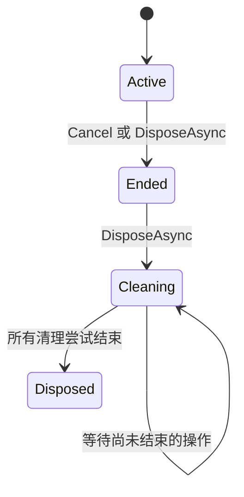
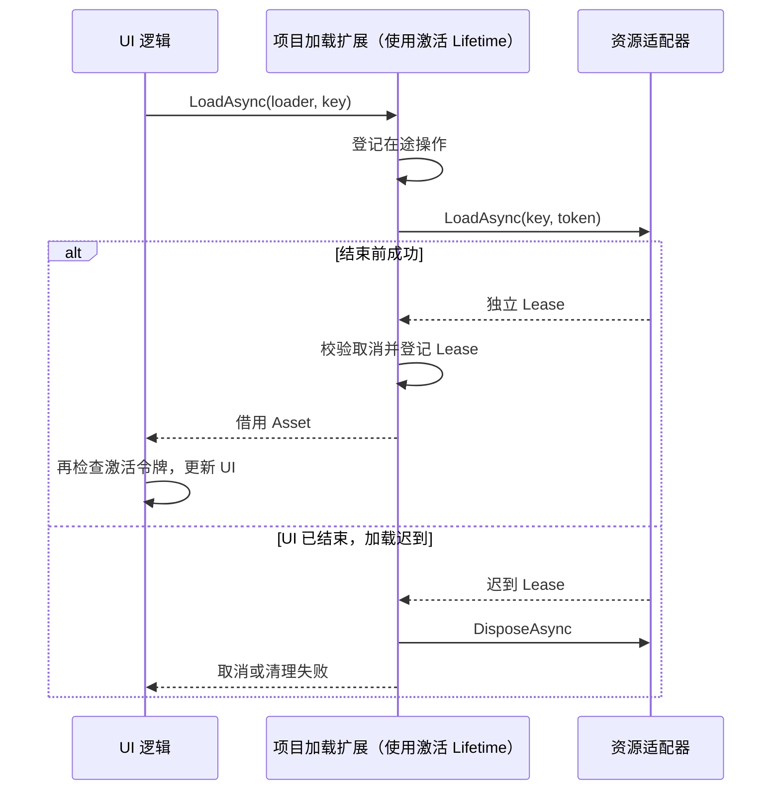

# MUI 代码架构与实现边界

更新：2026-09-21。首页依赖图与职责表描述当前代码；后续按功能追加的实现记录可能包含当时的待办，验收结论以 [实现状态](IMPLEMENTATION-STATUS.md) 为准，不把代码存在等同于已完成运行验收。

## 1. 依赖架构图

导航的隐藏候选准备集中在 `Navigator.Preparation.cs`：Open 与 Replace 共用类型化同步/异步准备函数，沿用调用方已持有的事务和队列许可。准备函数仅负责模型创建、凭证接管、版本/取消检查和绑定准备；提交显示、守卫及失败回收仍由外层事务管理。同步路径在加载 Prefab 前检查模型/Presenter 的异步需求。共享依赖声明、准备及持有关系由 `Routing/RouteDependency*`、`Navigator.Dependencies.*` 和 `Internal/NavigationOwnership*` 协调；它们管理 UI 实例的共同持有与提交，不承担跨系统业务事务。

箭头表示“依赖”，虚线表示编译期生成。一个 UPM 包内按依赖边界拆程序集，不按每个文件夹创建程序集。

```mermaid
flowchart TB
    Business["项目 UI：ViewModel / Presenter"] --> Core["MUI.Core\n状态、Lifetime、表现契约"]
    Business --> Navigation["MUI.Navigation\nRoute、覆盖与焦点、预加载、ViewInstance"]
    Navigation --> Core
    Navigation --> Resources["MUI.Resources\n提供方契约、Lease、视图预加载托管"]
    Resources --> Core
    ChildViews["MUI.ChildViews\n子视图、父子生命周期、准备与提交"] --> Core
    ChildViews --> Resources
    UGUI["MUI.UGUI\nView、Element、UIHost"] --> Core
    UGUI --> Navigation
    UGUI --> Resources
    UGUI --> ChildViews
    Tabs["MUI.Tabs\n选择状态、同步与异步内容协调"] --> ChildViews
    Tabs --> Core
    UGUITabs["MUI.UGUI.Tabs"] --> UGUI
    UGUITabs --> Tabs
    UGUITabs --> ChildViews
    UGUITabs --> Resources
    TabsEditor["MUI.UGUI.Tabs.Editor"] --> UGUITabs
    TabsEditor --> Editor
    Dialogs["MUI.Dialogs\n标准确认状态、有界对话框服务"] --> Navigation
    Dialogs --> Core
    UGUIDialogs["MUI.UGUI.Dialogs"] --> UGUI
    UGUIDialogs --> Dialogs
    DialogsEditor["MUI.UGUI.Dialogs.Editor"] --> UGUIDialogs
    DialogsEditor --> Editor
    Themes["MUI.Themes\n类型化 Token、主题切换"] --> Core
    UGUIThemes["MUI.UGUI.Themes\nUGUI 主题与偏好绑定"] --> Themes
    UGUIThemes --> Core
    TMP["MUI.TMP（可选）\nTMP 文本、输入框、下拉适配器"] --> UGUI
    TMP --> TMPPackage["Unity.TextMeshPro"]
    TMPThemes["MUI.TMP.Themes（可选）\nTMP 主题字号绑定"] --> Themes
    TMPThemes --> Core
    TMPThemes --> TMPPackage
    Loading["MUI.Loading\n操作令牌、进度汇总、延迟显示"] --> Core
    UGUILoading["MUI.UGUI.Loading"] --> UGUI
    UGUILoading --> Loading
    LoadingEditor["MUI.UGUI.Loading.Editor"] --> UGUILoading
    LoadingEditor --> Editor
    DragDrop["MUI.DragDrop\n拖放会话、类型化提交与收尾"] --> Core
    UGUIDragDrop["MUI.UGUI.DragDrop"] --> UGUI
    UGUIDragDrop --> DragDrop
    DragDropEditor["MUI.UGUI.DragDrop.Editor"] --> UGUIDragDrop
    DragDropEditor --> Editor
    Notifications["MUI.Notifications\n有界队列、去重、优先级、过期"] --> Core
    UGUINotifications["MUI.UGUI.Notifications"] --> UGUI
    UGUINotifications --> Notifications
    NotificationsEditor["MUI.UGUI.Notifications.Editor"] --> UGUINotifications
    NotificationsEditor --> Editor
    Editor["MUI.Editor\n命名、向导、资产校验"] --> UGUI
    TMPEditor["MUI.TMP.Editor（可选）\nTMP 结构校验"] --> Editor
    TMPEditor --> TMP
    Localization["MUI.Localization\n文本目录、参数、语言切换"] --> Core
    BuiltinResources["项目接入示例\n资源后端与 JSON 文本读取"] --> Resources
    BuiltinResources --> Localization
    BuiltinResources --> UGUI
    Generator["Generators~\nRoslyn 生成器与分析器"] -. "生成 BindingContext / Route / Registry" .-> Business
```



当前已有 Core、Resources、Navigation、ChildViews、标准模块、基础 UGUI/Editor，以及独立的模块渲染适配、编辑器扩展、项目资源接入示例、可选 TMP、增量生成器和示例。Navigation 已实现同步/异步生命周期、覆盖与焦点、关闭守卫、缓存及共享依赖协调；是否完成全部交付要求仍须逐条验收。实际功能与验证范围持续记录在 [实现状态](IMPLEMENTATION-STATUS.md)，不以空程序集或 NotImplementedException 代表完成。

关键约束：

- Core、Resources 不引用 UnityEngine，不引用特定资源库；Resources 单向依赖 Core。
- `IView`、Element 查询契约、BindingContext 已放在 Core；类型化 Presenter 契约也已放在 Core，不把 Unity Transform 或导航实现带入底层。
- Navigator 管策略与所有权；内部 ViewInstance 协调钩子与绑定。二者不直接加载 Addressables，也不直接控制 Button。
- ChildViews 不依赖 Navigation；子视图不进入页面历史、不取得顶层焦点。Core 的 IChildViewHost 能力让驱动器建立父子激活，uGUI View 把有效门控传给子 Scope，并通过 NestedViewElement 收集声明式子项准备状态；父提交时递归提交子绑定，避免提前执行反向写入。
- IInputView.InputStateChanged 通知导航重新选择有效焦点；IFocusView 只暴露原生焦点能力，UGUI/View.Focus 实现选择记忆与回退。Navigator.Pump 维护帧级选择约束，不把 EventSystem 引入导航程序集。
- Core 的 InputGate 记录输入禁用来源，IInputView 暴露有效输入；ActivationContext.BlockInput 托管到激活 Lifetime。UGUI 应用门控，生成绑定的命令入口读取能力契约，无需依赖 Navigation。
- Navigation 的 Navigator.Back 独立处理返回候选和 BackBehavior；IBackHandler 是导航可选业务能力，Presenter 基类不强制依赖它。关闭守卫由 ICloseGuard 与可注入的 ICloseConfirmationService 协调；标准确认页由 Dialogs 模块及 uGUI 适配提供；UIHost 提供返回请求及同帧消费入口；平台按键与设备事件由项目接线。
- Core 的 IModalView 只声明屏障能力；Navigation 计算覆盖/焦点策略，UGUI 创建射线屏障，避免导航层引用 Image 或 Canvas。
- uGUI 实现表现契约。UIHost 是组合入口，连接导航、资源适配器、主线程与帧驱动。
- `View.Resources` 接收项目借用的同步或异步资源加载器，激活时通过内部 `ViewResourceContext` 传给自身绑定边界内的图形控件。控件仅在 Source 首次写入时创建激活级资源槽；直接对象绑定不创建槽。未显式配置的嵌套 View 默认借用最近父 View 的活动加载器，但创建自己的激活资源上下文；可用 InheritParentResources 关闭继承。继承基于 Transform 层级，不等同于宿主级自动注入。资源持有与退场时序见 [资源槽](RESOURCE-SLOTS.md)。
- 运行时常驻 Prefab 提供方及项目示例中的加载提供方通过可选 `configureView` 在创建事务内统一配置新实例；回调位于 View 初始化与原生激活之前，失败沿已有创建回滚处理。项目可借此统一指定资源加载器，缓存复用无需重新配置。此入口是同步配置回调，不承担业务准备、异步等待或加载器所有权。
- 业务 VM 可以通过绑定声明引用 Element 契约，符合 FUI 主线；不因此把业务 VM 宣称为无 UI 依赖的领域对象。
- Generator 是编译期工具，不是运行时程序集；生成代码调用显式工厂，避免运行时全程序集反射扫描。
- Editor 单向引用 Runtime；可选适配器依赖资源契约，资源契约不反向识别适配器类型。

### 框架与项目职责核对

| 范围 | 框架保留 | 项目负责 |
|---|---|---|
| 资源 | 提供方契约、显示位置替换、视图实例创建和凭证归还 | 实际加载/卸载、合并请求、共享计数、下载、资源预算 |
| 生命周期 | 取消、跟踪 UI 操作、清理已登记凭证 | 任意资源加载接线及业务任务策略 |
| 导航与 Tab | 界面切换、模态、输入、结果、共享界面持有关系及自身实例缓存 | 业务流程、跨拥有者参数冲突决策、跨系统事务、低内存决策 |
| 列表 | 集合变更通知、分组/树展开、虚拟化及分页来源契约 | 请求接口、游标、数据缓存和分页策略 |
| 主题与本地化 | 应用现成目录、文本格式化及控件刷新 | 目录加载、语言选择持久化、字体/图集与资源生存期 |
| Loading / Notifications / Dialogs | 进度提示、屏幕通知展示、模态确认 | 实际工作执行、服务端推送、业务确认规则 |
| DragDrop | 指针捕获、拖放交互、结果反馈 | 背包/道具规则、服务端请求、业务提交及补偿 |
| 偏好与 Automation | 显示偏好值、控件查询与本地交互 | 存档/迁移、远程工具服务及权限策略 |
| 生成器与编辑器 | 绑定、类型接线、命名和视图制作工具 | 业务服务构造、DI 容器和项目启动编排 |

项目接入示例位于 `Samples~`，不属于默认导入的 Runtime。`ResourceSlot` 是 uGUI 的内部显示实现；`LifetimeResourceExtensions` 是项目加载示例，两者均不是框架公开资源管理服务。

代码格式与命名规则见 [代码规范](CODE-STYLE.md)。UGUI 列表相关实现集中在 `Runtime/Rendering/UGUI/Lists`：普通回收列表、虚拟列表及其模板/布局/状态类型放在一起。`VirtualListElement.cs` 保留配置和数据快照入口，`.Refresh.cs` 负责刷新调度和条目准备，其余 partial 文件按生命周期、同步路径、选择、测量等职责组织。

## 2. 目录与职责

```text
MUI/                                  UPM 包根目录
├── package.json
├── Runtime/
│   ├── Core/                         [已建立] MUI.Core.asmdef
│   │   ├── Lifetimes/                Lifetime：取消、任务归属、资源清理
│   │   ├── Collections/              ObservableList、事务编辑器、只读批次通知
│   │   ├── Observables/              ObservableObject、ViewModel
│   │   ├── Presentation/             Presenter、类型化激活上下文、可选异步能力
│   │   ├── Views/                    IView、IElement、边界与索引
│   │   ├── Input/                    InputGate：按来源禁用、令牌释放与诊断
│   │   ├── Commands/                 异步命令、策略、来源上下文与结果
│   │   ├── Diagnostics/              隔离的错误报告入口
│   │   ├── Binding/                  BindingContext、Builder、Manifest、Registry
│   │   └── Attributes/               生成声明与编辑器元数据
│   ├── Resources/                    [已建立] MUI.Resources.asmdef
│   │   ├── Leases/                   资源持有凭证、一次性异步释放
│   │   ├── Loading/                  控件加载接入契约、失败清理协议、视图预加载托管
│   │   └── Views/                    ViewResource、IViewProvider、IViewLease
│   ├── Navigation/                   [已建立] Route、Navigator、结果与内部实例协调
│   ├── ChildViews/                   [已建立] Template、Handle、Scope、Slot；独立于导航
│   ├── Rendering/UGUI/               [已建立] View、Element、基础控件、UIHost、Prefab Provider
│   ├── Rendering/UGUI.Loading/       [可选适配] LoadingElement
│   ├── Rendering/UGUI.Notifications/ [可选适配] NotificationElement
│   ├── Rendering/UGUI.Dialogs/       [可选适配] 标准确认框绑定与路由
│   ├── Rendering/UGUI.Tabs/          [可选适配] TabBar 与异步内容区域
│   ├── Rendering/UGUI.DragDrop/      [可选适配] 拖拽源、目标与指针视觉
│   ├── Rendering/UGUI.Themes/        [可选适配] 原生 UGUI 主题与偏好绑定
│   ├── Rendering/TMP/                [可选] TMP 文本、输入框、下拉
│   ├── Rendering/TMP.Themes/         [可选适配] TMP 主题字号绑定
│   └── Modules/                      [已建立] 按标准功能拆分纯托管程序集
│       ├── Tabs/                     同步与异步 Tab 控制器、快照、结果
│       ├── Dialogs/                  类型化确认与串行对话框服务
│       ├── Localization/             语言目录、复数规则与切换
│       ├── Themes/                   主题 Token、订阅与用户字号
│       ├── Loading/                  操作令牌、汇总进度与显示延迟
│       ├── Notifications/            通知队列、去重、优先级与过期
│       └── DragDrop/                 语义载荷、单次提交、关联取消与收尾
├── Editor/                           [已建立] 绑定校验/Inspector、挂载与命名预览、页面创建向导
├── Generators~/                      [已建立] 独立 Roslyn 增量生成工程
├── Analyzers/                        [已建立] 发布 DLL 与 RoslynAnalyzer 标签
├── Samples~/                         [项目示例] Settings、Navigation、ResourceIntegration 等
├── Tools~/Build/                     [已建立] 核心、Unity 适配、Editor 与示例的离线编译入口
└── docs/                             设计与当前实现说明
```

不建立 `Managers`、`Helpers`、`Common` 等无明确边界的收纳目录。类型按职责定位，一般一个公开类型一个文件；辅助实现保持私有，避免为文件数量拆出过多接口。

## 3. 本批实际交付

| 类型 | 职责 | 明确不承担 |
|---|---|---|
| `ObservableObject` | 属性变化通知、比较后赋值 | 自动生成属性、线程派发 |
| `ViewModel` | 表现状态的基类 | 持有某次 ViewHandle、自动销毁共享模型 |
| `Lifetime` | 登记任务与资源；取消；逆序清理；共享清理完成结果 | 导航、缓存、DI、强杀 Task、自动主线程切换 |
| `IResourceLease<T>` | 单份可释放资源持有 | 全局缓存或强制卸载 |
| `ResourceLease<T>` | 释放回调至多一次；多个释放调用共享结果 | 隐式引用计数、失败后的自动重试 |
| `IResourceLoader` | 资源适配器边界，每次成功返回独立持有 | View 初始化、Presenter 生命周期 |
| 项目示例 `LifetimeResourceExtensions` | 项目加载操作结束后转交凭证，归还迟到结果 | 不属于 Runtime；框架 Lifetime 仅托管凭证 |

`ResourceLease` 是通用资源凭证；`IViewLease` 和 `IViewProvider` 已独立实现于 Resources/Views，普通图片加载接口不承担 Prefab 初始化职责。uGUI 内部的 `ResourceSlot<T>` 负责单个显示位置的动态资源替换，业务使用对象属性或 Source 绑定，接入约束见 [资源槽](RESOURCE-SLOTS.md)。

## 4. Lifetime 的执行协议



- `Own` 接收异步资源；`OwnDisposable` 接收同步资源；`OnDispose` / `OnDisposeAsync` 登记同步/异步清理回调。登记成功才转移所有权，登记被拒绝时调用者仍负责释放。
- 同一 Lifetime 内不能重复登记同一个对象。跨 Lifetime 的独占所有权由调用方遵守；共享资源应取得各自独立的 Lease。
- `RunAsync` 在调用业务委托前登记任务。调用者必须 await 并处理其错误，不把这个入口当作 fire-and-forget。
- `Cancel` 立即标记结束、拒绝新工作，再发出取消信号；此时资源仍由 Lifetime 持有。
- `DisposeAsync` 发出取消，等待在途操作收敛，然后逆序释放资源。一个资源释放失败仍继续其他释放，最后聚合清理错误。
- 多次 `DisposeAsync` 返回同一个 Task 支撑的完成结果，不重复消费一次性的 ValueTask 源，也不重复执行清理。
- 不合作任务可以使 DisposeAsync 持续等待；基础层不伪造完成、不提前将对象归池。导航层已实现关闭超时报告、待清理实例隔离与容量限制；实际清理完成前仍持有实例与资源。
- 被该 Lifetime 跟踪的任务或清理回调不能 await 同一个 Lifetime 的 DisposeAsync，也不能构造相互持有的 Lifetime 环。上层实例协调器负责驱动结束，不能由所管理的工作等待自己。

两级 Lifetime 仍是设计主线：实例 Lifetime 跨缓存保留，每次打开创建激活 Lifetime。当前 ViewInstance 已驱动实例和激活两级的打开、取消、缓存复开及最终清理；子视图 Scope 负责向下传播父级取消和清理边界。复杂嵌套组合仍需运行验收，不假定嵌套 Own 会自动传播所有业务取消语义。

## 5. 异步资源加载与迟到清理



以下扩展位于 `Samples~/ResourceIntegration`，需由项目导入或自行实现；框架不提供任意资源的通用加载入口：

```csharp
using MUI.Samples.ResourceIntegration;

var icon = await activationLifetime.LoadAsync<Sprite>(resourceLoader, iconKey);
activationLifetime.Token.ThrowIfCancellationRequested();
// 在主线程把 icon 交给表现层；不要手动卸载这个借用资源。
```

必须在 await 后检查：结果登记之后，等待方恢复执行之前，UI 仍可能被关闭。Element 内部资源槽已封装这段检查及“同一显示位置只有最新请求可提交”的规则；项目通用加载示例只保护 Lifetime，不处理显示位置的替换。

调用者的额外 CancellationToken 只控制这次加载；成功登记后再取消，不自动撤销已归 Lifetime 持有的资源。需要提前替换或释放资源时通过 Element 的 Source 替换，不能借用返回的 Asset 私自释放共享资源。

适配器加载失败时负责自己的部分构造资源；成功交出 Lease 后由接收方负责。资源有效性还需要适配器检查：纯 C# 泛型层只能检查托管 null，Unity 适配器必须使用 Unity 对象的 `== null` 检查原生销毁状态。

## 6. 线程、清理和错误边界

Lifetime 和 ResourceLease 用锁保护登记与一次性释放的内部状态，但不提供 Unity 主线程调度。涉及 Unity 对象的加载、赋值、Cancel 回调和 DisposeAsync 必须由 UI 主线程调用，适配器负责正确回到主线程。异步实现保留调用上下文，不主动切到线程池。

框架结束信号与清理完成分开：`IsEnded` 表示已经拒绝新工作，`IsDisposed` 表示所有清理尝试结束。后者不等于清理全部成功；必须 await DisposeAsync 判断错误。普通操作错误通过 RunAsync 返回，不作为 DisposeAsync 的业务错误重复上报；取消回调和已登记资源的释放错误由 DisposeAsync 聚合报告。迟到 Lease 释放失败通过原加载任务报告，调用方不能遗忘该任务。

已登记资源保持引用直到任务收敛，防止尚在执行的 UI 工作访问已归池对象。视觉隐藏、解绑以及独立模态屏障的释放属于后续 ViewInstance/uGUI 层，不等待业务清理才能放行下层输入。

## 7. 编译与后续接入

当前包最低版本声明为 Unity 2022.3，纯托管层使用 C# 8 / .NET Standard 2.1。已通过 Unity 2022.3.62f3 的实际导入与编译；设置页已完成 Play mode 自动演示，完整故障场景与 IL2CPP 验证仍待完成。

```sh
dotnet build 'Tools~/Build/MUI.Resources.csproj' --configuration Release --disable-build-servers -m:1
```

基础构建工程直接编译 Runtime 源码，不维护第二份实现。NuGet 源为空，基础构建只使用本地 SDK 引用包。Tools~ 不被 Unity 当作资产导入。

历史设计阶段的实现顺序：

1. 实现 View/Element 契约、BindingContext、类型化 Presenter 上下文，再贯通设置页和生成绑定。
2. 实现 Route/ViewProvider/ViewInstance，接入两级 Lifetime，再实现 Navigator 的同步/异步准备与提交。
3. 接入项目侧资源适配器及框架内的控件资源槽、页面实例缓存，并落实取消、超时和隔离监管。
4. 实现 Tab、列表、编辑器生产工具，逐条验证总设计的垂直链路。

当前工作树已包含上述表现链路、完整同步/异步导航、子视图、Tab、列表/Grid、标准交互模块和编辑器扩展；生成器、uGUI 与编辑器通过离线编译。命令并发、多投影、原生输入、视觉布局、资源回滚和设备/IL2CPP 仍需按实现状态文档逐项运行验收，不能用源码存在替代运行证据。

## 8. 已落地的表现链路

生成器输出 ObservableProperty、BindingContext、Manifest、BindingFactory 和程序集级显式 Initialize 入口。注册幂等且拒绝工厂冲突；运行时不扫描程序集。Editor 通过工厂元数据发现 Manifest，只读取生成契约，不实例化业务 VM。

BindingContext.Bind 建立订阅并初始化当前 View，CommitSourceWrites 才应用暂存的 OneWayToSource 写入并开放反向同步。换绑会先解绑再建立候选，失败恢复原关系；这不承诺撤销业务 setter 的外部副作用。命令绑定已接入：UnbindAsync 同步撤销监听和请求取消，再等待本投影命令收敛。同步 Rebind 不阻塞等待命令，存在在途任务时须使用 RebindAsync。

View 在自己的边界内初始化 Element，遇到子 View 或 IElementBoundary 停止向下索引。宿主门控使用 CanvasGroup 保持布局可测量；模态屏障仍将由导航宿主独立实现。Element 的原生事件只初始化一次，最终释放时注销。

## 集合数据与后续列表渲染边界

Core/Collections 提供 ObservableList 和 IReadOnlyObservableList，负责有版本的结构变更，不创建 View、不释放条目 VM，也不决定选择/滚动位置。ObservableListEditor 是短生命周期事务入口；ListChangeSet 是提交后的只读结构通知。后续列表渲染器消费这份契约，按稳定 ItemKey 维护投影、选择和滚动锚点，不把这些表现状态写回集合基础层。

```csharp
var items = new ObservableList<string>(itemKey: key => key);
items.Edit(edit =>
{
    edit.AddRange(new[] { "wood", "stone", "iron" });
    edit.Move(0, edit.Count - 1);
});
```

项目条目 VM 可用稳定 Id 作为键；也可以省略 itemKey，作为允许重复值的普通集合。

一次 Edit 使用候选结构，回调和键校验成功后一次提交，一次 Changed 通知；任一步失败不改变原结构、版本和通知次数。单项便捷方法使用相同事务路径。通知中的变更按顺序应用；Move 的 OldIndex 为移动前位置，Index 为移除后最终位置。Reset 携带完整前后条目，Update 表示刷新该项，不自动监听每个条目的 PropertyChanged。

键选择器必须返回非 null、稳定且唯一的键，可指定键比较器；最终批次校验允许一个批次内暂时重复、最终唯一。条目对象不会深拷贝，直接修改条目字段不在结构事务的回滚范围内，禁止原地修改在列条目的身份键。通知数组只读但条目自身仍可能可变。

集合操作在创建线程进行；通知期间拒绝修改同一个集合，避免其他观察者收到与当前结构不一致的旧批次。单个观察者异常通过 UIErrors 隔离并继续通知其他观察者。Edit 回调返回后编辑器失效，不能保存后跨帧或跨 await 使用。异步数据应先取得结果，再在 UI 线程提交同步 Edit。

单项 Add 使用原地追加和持久稳定键 HashSet，在良好哈希分布下集合自身成本为摊销 O(1)；先完成键校验、通知对象构造和容量扩展，再提交条目与版本。重复键或键提取异常不改变集合内容与版本。Edit 成功后同时替换集合与键索引，失败保留旧索引；键和比较器必须保持稳定，不支持条目加入后原地修改身份键。枚举期间不可修改集合，也不保证枚举器持有历史快照。

独立 Move 仅移动两个索引之间的条目，不复制集合或重建键索引；独立 NotifyUpdated 只构造单条通知并递增版本，集合自身为 O(1)。两者不重新验证身份键，条目的键仍须保持不可变。Edit 内的对应操作继续服从整批事务规则。其他结构事务仍复制一次 List 并扫描完整结果，成本为 O(n)，不是零分配实现。大量条目仍优先使用 AddRange/Reset 或单次 Edit，减少通知及订阅者处理次数；虚拟列表现在对版本连续、数量一致的纯尾部 Add 批次增量扩展快照和键索引；只检查新增条目，不扫描旧集合。单条 Update 和键不变的 Replace 也会核对旧对象、新对象和源集合版本后原位替换快照项，保留键索引、选择与锚点；仅当命中可见范围时使物化范围失效。键变化、混合变更、版本不连续或错误恢复仍读取完整快照。Update 不代替条目 VM 自己的 PropertyChanged 通知，同一个 VM 不强制重建绑定。追加不移动原键索引或选择，屏外追加也不强制重建已有可见单元；通知及布局更新仍有成本。集合及渲染器的单项追加优化仅完成编译检查，未执行 Unity 运行、分配或吞吐测量。后续还需优化其他单项路径、渲染器增量处理与通知分配。VirtualListElement 已有视口物化、节点复用、键锚点恢复、单选、显式变高、可见条目测量与多模板实现；这些功能的完整运行及性能验收仍未完成。

## 虚拟列表与网格

### 当前接入选择

| 场景 | 入口 | 关键边界 |
|---|---|---|
| 少量奖励或固定道具项 | RecyclingListElement.Items | 原生 LayoutGroup 排布全部条目，按位置复用，借用 ViewModel；无键选择与锚点恢复 |
| 大量道具与多列背包 | VirtualListElement.Items / Columns | 稳定键、视口物化、容量限制；内容节点由列表独占布局，不使用 LayoutGroup |
| 高度由数据决定 | VirtualListItem.Height | 显式高度优先，同一网格行采用最高项 |
| 文字等原生布局决定高度 | ConfigureHeightMeasurement / InvalidateHeightMeasurements | 只测量可见活动项，字体或内容布局变化后需明确使测量失效 |
| 不同条目外观 | ConfigureTemplates / VirtualListItem.TemplateKey | 命名 View 模板；模板键改变时不能把旧模板实例直接换绑成新模板 |
| 分页来源 | IPagedListSource / LoadNextPageAsync | 与本地物化状态分开；完全同步模式不启用异步分页 |
| 单选与屏外定位 | SelectedKey / ScrollToKey / ScrollToKeyAsync | 定位可选聚焦，但不会自动改变选择；同步与异步入口按宿主模式使用 |
| 失败后重试 | Refresh（普通列表）、Retry / RetryAsync（虚拟列表） | 刷新不是整批画面事务，失败可能保留部分已完成条目 |

此表描述当前源码接口，不是运行验收清单。当前版本的列表交互、资源清理和性能仍需在 Unity 中验证，下面保留的早期演示数字不替代该验证。

`UGUI/Lists/VirtualListElement` 是父 View 的 Element 边界。内部按视口与 overscan 计算所需索引范围，只为该范围创建 `NestedViewElement + View` 条目；实际绑定/命令生命周期沿用 ChildViews，避免列表再实现一套绑定和资源释放逻辑。`UGUI/Lists/VirtualListItem` 持有稳定 Key 和借用的 ViewModel，列表不销毁 VM。

```csharp
[ObservableProperty]
[Bind("Inventory", nameof(VirtualListElement.Items))]
private IReadOnlyObservableList<VirtualListItem> inventory;
```

初始化前在 Inspector 配置 ScrollRect、viewport、空 content 和 inactive View 模板，也可调用 Configure。模板必须位于同一边界且在 content 之外；content 不允许 LayoutGroup/ContentSizeFitter。列表拥有 content 的垂直长度和条目位置，宿主需设置 RectMask2D/Mask 实现裁剪。当前源码支持垂直单列/等宽网格、固定行高、条目显式 Height、可见条目首选高度测量，以及默认模板和按 TemplateKey 选择的命名模板。普通小列表使用独立 RecyclingListElement，不需要滚动容器或高度索引。

Items 更新消费集合通知，并校验非空/唯一键；以原首个可见键及行内偏移恢复滚动锚点，键删除后回退到邻近索引并限制有效滚动范围。Reset 也按该规则处理。版本连续且结构匹配的纯尾部 Add、单项 Update/同键 Replace 已有增量路径；更新项高度改变或需要重新测量时回退完整路径，Move/Remove/Reset、混合批次、版本断档及错误恢复也读取完整快照。不能声称任意集合刷新成本都只随变更项增长。

滚动热路径先比较可见范围，无范围/数据/视口尺寸变化时不创建刷新任务。范围变化后保留相同 Key 的条目，将离开范围的旧绑定清空并等待清理，再复用空闲原生节点；超过新工作集的空闲节点销毁，避免常驻历史峰值。清理期间通过一个在途刷新和最新脏状态收敛请求，不无限创建并行池条目。默认容量 128，视口需求超过容量会明确拒绝。

框架只为可见区借用条目 VM，异步命令在旧投影关闭时取消并排空；池不在旧绑定尚未清理时换用同一原生节点。条目采用 NestedViewElement 的同步准备契约，异步任务主要出现在旧绑定排空；不合作的旧任务仍可能阻塞刷新，隔离与超时预算未完成。PendingChange 用于宿主观察，不应在正被回收的条目来源命令内等待自身回收。

VirtualListElement.Lifetime 在父激活释放阶段解除集合/分页订阅，清空条目快照、测量缓存、键索引、选择键与单元键，以及旧请求和作用域引用。清理先使来源代际失效，再分别退订，两种来源的退订异常收集后交给父 Lifetime；已结束激活的集合通知不再触碰布局。此过程不重建 content、不修改原生选择样式或销毁池节点，保持退场画面协议；子条目继续由 ChildViewScope 排空，NestedViewElement 同期清除其模型引用。取消本身只停止活动，最终引用清理发生在 Dispose，而非仅 Cancel。现阶段只有离线编译和源码检查证据，真实缓存复开、退场画面和内存回收仍需 Unity 验收。

早期版本运行记录：100/10000 条数据在 260 高视口、行高 40、overscan=1 时初始均 8 个原生条目；跳转到索引 500 后 9 个，原有 8 个节点 ID 全部保留；头部插入后首个可见键不变，索引变为 501；清空并经过下一帧后原生条目数为 0。

现有源码已包括动态高度、多模板、分页状态、SelectedKey 单选及按键定位。尚未完成的工作包含这些能力与新生命周期修复的联合运行验收、条目资源异步代际专项验收、真实拖动/惯性、完整方向导航接入，以及内存/CPU/GC 和目标平台验证；增量更新也尚未覆盖所有变更类型。上面的历史数据只说明当时的基础虚拟化行为，不能证明当前全部列表能力运行通过。

### 网格布局边界

UGUI/Lists/VirtualGridLayout 计算行数、总高度、索引偏移和视口范围，不操作 Unity 节点，也不参与绑定生命周期。固定高度直接计算；变高通过 VirtualRowIndex 查询行高与累计偏移，同一行采用最高条目的高度。单列是 Columns=1 的同一布局；overscan 始终以行计。末行不足一整行时只物化实际存在的条目，总高度仍计入末行。

VirtualListElement 的 Configure 最后一个参数 columnCount 可设置初始列数，也可绑定/设置 Columns 动态调整。列宽由 content 宽度均分，每项 RectTransform 的水平 anchor 按列分区；模板内部也须使用适合窄列的拉伸布局，框架不改写业务文字/图片尺寸。Columns 调整会重新计算原首个可见条目所在行与行内滚动偏移；该条目可能不再位于新行第一列，不能把锚点保持误解为数组索引不变。

视口高度变化重新计算物化范围，宽度变化由水平 anchors 自动适配。列数不能小于 1、超过配置容量或使当前视口需求超容量；总内容高度检查 float 溢出。布局范围计算不分配集合，刷新/绑定路径仍有分配，未完成整体零分配验收。

早期版本 Unity 示例记录：100 条与 10001 条数据在三列下均物化 24 个条目，总高度 133360；200 宽内容的单元格实际宽度约 66.67；切回单列后原生条目缩至 8，视口高度从 260 缩至 80 后原生条目缩至 3。尚未提供水平列表、独立列间距/行间距、跨列单元格或动态列数自适应策略。

### 列表状态与重试

VirtualListElement.State.cs 独立处理 Status/Error、状态节点、重试和父取消通知。Status 为 Inactive/Empty/Loading/Ready/Error；Loading 指本地条目物化或旧绑定排空，Ready 指当前范围已处理，均不代表页面一定可见/可点击，也不代表远程分页请求完成。

可通过 ConfigureStates 或 Inspector 指定加载、空态、错误节点。节点须为列表边界内独立后代，不得包含 ScrollRect、嵌套彼此或放在 content/模板中。框架只切换节点显隐，文案、样式和重试按钮由项目制作。Status/Error 通过 Element.PropertyChanged 暴露，可用于项目自己的状态表现。

物化错误进入 Error，保存异常，停止帧更新与滚动事件触发的自动刷新；RetryAsync 重新读取当前源、校验键并重新物化。重试期间的重复调用共享当前操作。新的有效集合变更也能恢复；仅修复视口尺寸不会悄悄重新尝试。空数据成功清理后进入 Empty。已发生的部分条目更新不做整屏事务回滚，错误时可能保留部分有效条目；不能声称失败保留完整旧画面。

纯同步模式通过 Retry 直接重试，失败抛给调用者；准备错误也由父准备检查传播，使父打开回滚。同步条目命令内修改集合可推迟到后续 LateUpdate，但不创建任务。异步物化错误通过 PendingChange 和诊断报告，RetryAsync 的故障任务由调用者观察。列表状态不代替远程数据加载、分页游标或业务重试策略，也没有为不合作条目任务实现超时隔离。

父取消可能来自后台线程，状态节点更新会投递回初始化时捕获的 UI SynchronizationContext，并检查原激活身份，避免旧回调改写新激活；最终销毁撤销注册。没有 UI 上下文的宿主需在 UI 线程完成销毁。Unity 运行曾发现定时取消直接修改节点的问题，修正后同一导航取消/清理流程退出码为 0。

已验证容量超出后 Error/错误节点可见；修复视口并经过一帧仍保留同一失败操作；显式重试后 Ready/Error 清空/3 个条目；清空后 Empty/空态节点可见。条目异步失败、连续失败、父重激活与观察者重入仍需进一步故障验收。

### 列表通知重入与操作发布

刷新入口先建立并公布 PendingChange，再进入 Lifetime 跟踪的物化操作和 Loading 通知。Loading 观察者调用 RetryAsync 得到正在执行的同一任务，不再误取上一轮已完成任务。Ready/Empty 通知期间若观察者直接更新 Items，刷新循环处理最新脏状态后才完成共享任务。

在途刷新会在每轮及绑定等待后检查 Error，避免新的源校验错误被旧流程的 Ready 覆盖。几何预检查失败同样保存失败任务并进入 Error，不留在自动按帧重试的 Ready 状态。仍只保留一个刷新操作，不为每次状态回调创建新的并行加载链。

Unity 示例验证 Loading 回调得到当前且未完成的任务；Ready 回调将源替换为空集合，最终共享任务完成时为 Empty/0 个条目。错误与通知修改的全部组合仍需继续故障验收，不能把这一条成功重入场景视为全面证明。

### 按键滚动与屏外焦点

VirtualListElement.Reveal.cs 处理 ScrollToKeyAsync，与物化刷新和状态表现分离。集合快照维护 Key→Index 字典；定位按键查询，目标行完整可见时保持当前位置，否则移动到可见区域，并等待本地条目物化。`focus: true` 在下一次 UI 调度后选择该条目内首个启用且可交互的 Selectable。

```csharp
var outcome = await inventory.ScrollToKeyAsync(itemId, focus: true, cancellationToken: token);
```

结果显式区分 Ready、NotFound、Superseded、Inactive、Cancelled、InputBlocked、NoSelectable、Failed。Ready 只表示这次滚动/可选原生选择完成，不代表业务条目被选中；基础单选键与可选高亮已接入代码，完整方向导航仍未完成；本轮单选运行验证被执行权限拦截。

新请求覆盖旧聚焦意图；集合版本变化会淘汰旧意图，即使目标键仍存在，也由调用方按新数据重新请求。原生选中回调执行后再次检查版本和激活，避免同步换源/关闭被当作成功。不存在键或预先取消不改变滚动位置，也不淘汰原有效请求。

取消等待不撤销已经发生的滚动，也不取消共享物化操作；取消/父失活可结束本次等待，物化资源仍由父 Lifetime 管理。目标被门控禁用时 InputBlocked，不绕过父模态/业务门控。无 EventSystem 或处于选中重入时同样拒绝聚焦。新请求和集合更新按版本淘汰旧结果，不承诺不合作条目清理的超时收敛。

Unity 示例已验证从万条数据定位并实际选中 Item 9000（仍仅 9 个条目）；连续聚焦 old=Superseded/latest=Ready；通知更新后旧意图 Superseded；预先取消保持 offset；父输入阻塞返回 InputBlocked；缺失键 NotFound。尚未验证完整手柄方向操作、无 Selectable、父重激活与选中回调故障组合。

### 列表单选与选择样式

小型奖励/道具集合可使用独立的 RecyclingListElement，其主文件负责来源订阅、父激活及同步/异步驱动，Pool partial 负责位置复用与原生节点所有权。条目直接复用 NestedViewElement 的准备、换绑和清理协议；内容尺寸由项目配置的原生 LayoutGroup 决定，不建立虚拟高度索引或控制滚动。模板为非激活的 NestedViewElement 包装节点，内部仍是普通 View，模型仅借用。内容与模板必须位于列表边界内且互不包含，编辑器在不初始化控件的前提下检查引用、容量和模板子 View。

两类列表内部通过 IChildViewElement.Preparation 协调异步条目准备，避免误用面向业务的 PendingChange 自身等待保护。公开 PendingChange 检查当前调用链是否来自池内条目；虚拟列表的 RetryAsync/ScrollToKeyAsync 也拒绝这类业务循环等待。同步模式在条目命令内收到集合变化时只标记待刷新，下一次 LateUpdate 直接同步协调，不启动任务；同步准备检查将该待刷新状态报告为尚未完成。此协议允许按钮修改集合后直接返回，但不承诺命令尚在执行时自身节点就已销毁；列表未启用时延后至恢复帧驱动。

集合变化按完整快照协调，回调重入提交新快照后丢弃旧轮后续工作；同步及异步执行器都有收敛次数上限。空闲条目解绑后隐藏留池，池最多达到配置容量；父激活结束退订来源，最终释放销毁池。它不提供整批原子提交或键身份复用，失败由 Error 和准备边界暴露，修正后 Refresh 重试。Navigation 示例包含 RewardsViewModel 的生成绑定与 SynchronousRecyclingListDemo；当前仅离线编译/源码证据，不代表 Unity 原生布局、异步清理及复用运行验收完成。

VirtualListElement.Selection.cs 管理 SelectedKey/SelectedIndex、条目根按钮监听及高亮更新。SelectedKey 支持生成器双向绑定；null 表示无选择，非 null 必须存在于当前快照。聚焦/滚动不会自动改变业务选择，项目可独立决定这两种状态的关系。

```csharp
[ObservableProperty]
[Bind("Inventory", nameof(VirtualListElement.SelectedKey), bindingMode: BindingMode.TwoWay)]
private object selectedItemKey;
```

集合移动、插入和 Reset 都按键协调：键保留则保留选择并更新 SelectedIndex；键缺失则清空并通过属性通知回写 VM。列表不自动选择邻居。绑定初始选择应在 Items 初始化之后，非法初始键按契约拒绝，不能静默映射到另一个下标。

默认只给条目 View 根节点上的 Button 添加选择监听，不接管内部任意业务按钮；Inspector 的 Select On Item Click 可以关闭这一行为。监听读取 Cell 当前键，并检查活动父级、有效输入、Button 状态和已显示 VM 与当前快照是否一致，避免复用后旧状态触发选择。监听在池收缩和列表释放时显式撤销。

条目根节点可配置 VirtualListItemSelection，指向独立的后代高亮节点；列表设置其 Selected，并切换节点显隐。该组件不写 VM，不参与键盘焦点；模板可自行制作边框、底色等视觉内容。多选、范围选择、禁选项策略及高级选择事件仍未实现。

.NET 编译通过，生成产物确认 SelectedItemKey 与 SelectedKey 使用 TwoWay 和双向 setter。已补充 VM→高亮、点击→VM、头部插入键保持、Reset 缺失清空的 Unity 示例，但本轮 Unity 启动被自动审批拒绝（当前环境禁止 require_escalated），这些运行结果尚未验证，不能沿用之前场景的通过状态。

### 属性绑定的源重入

BindingBuilder.Property 原先在 updating 期间忽略所有通知，因此目标 setter/状态回调再次修改同一 VM 属性时，新的源值可能永远没有写入目标。现在源通知设置待刷新标记，当前写入结束后重新读源；同一轮中相同值的回声跳过，不同值继续应用。同步不收敛超过 32 次会明确抛错，不无限占用 UI 线程。

反向更新仍抑制框架自身目标写入产生的回声。TwoWay 写入 VM 后会正向读取其最终值，确保 VM setter 的钳制/修正同步到控件，即使 setter 因最终值未变而没有再发 PropertyChanged。OneWayToSource 不读取源，也不新增正向写入。解绑后不继续处理待刷新值。

导航示例增加了经生成绑定的 VM 重入场景：列表 Ready 回调把 VM.Items 换为空集合，检查最终 VM、Element 和物化工作集一致。原来直接修改 Element 的重入示例保留，两个场景验证不同层级。当前完成 Navigation/Settings 编译，Unity 运行验证仍受此前自动审批的执行权限限制，不将这轮修改标为运行通过。

## 按需页面 Tick

Core/Presentation 定义 IViewTick 与 ILowFrequencyViewTick；Presenter 选择其中一种接口即可参与导航 Tick，静态页面不进入 Tick 注册表。Navigator.Tick 管理活动实例和可复用遍历快照；UIHost.Update 先 Pump，再传入 Time.unscaledDeltaTime。自定义宿主只应提供一个时钟驱动，不要同时从 MonoBehaviour 再调用同一 Presenter。

```csharp
public sealed class CountdownPresenter : Presenter<CountdownViewModel, Unit, Unit>, ILowFrequencyViewTick
{
    public float TickInterval => 0.25f;
    public void OnLowFrequencyTick(float intervalSeconds)
    {
        // 从项目时钟和绝对截止时间计算剩余时间，再更新 ViewModel。
    }
}
```

TickInterval 在实例创建时捕获，必须有限且大于 0；同时实现两种 Tick 接口会拒绝。框架的弱引用所有权登记拒绝同一 Tick Presenter 同时被多个导航实例驱动，归属在实例清理时释放。外部直接调用接口不受该登记保护，属于项目必须遵守的驱动边界。

低频计时使用 double 保存余数，单帧最多执行 RoutePolicy.MaxTickCatchUp 次（默认 4，范围 1–32）。超过上限的完整欠账丢弃，保留不足一个间隔的余数；每次回调参数为 TickInterval。该机制不用于“每次减一”的权威倒计时，长帧恢复应以绝对截止时间重新计算。

RoutePolicy.TickPause 为独立标记：None 默认继续，Covered 在真实覆盖时暂停，Hidden 在有效隐藏时暂停，可组合。隐藏判断先使用导航宿主状态，再读取可选 IVisibilityView；uGUI 包括局部 Visible 与 activeInHierarchy。暂停期间不累积时间，既有余数保留；不会解绑或取消其他业务任务，输入禁用也不自动等于 Tick 暂停。

提交打开时登记，关闭开始立即移除。回调前再次验证当前 Handle/实例身份和有效激活，回调关闭自己或其他页面不会破坏快照，也不会再次调用已关闭条目。回调进入导航重入保护，可 RequestClose/PostOpen；异常通过 UIErrors 隔离，其他页面继续更新。

顶层和子视图 Presenter 已接入代码；低频时钟专项精度与长帧验收、回调故障运行验收及性能分配测量仍待补齐。示例已加入覆盖暂停、余数、补帧上限、关闭后停止更新；编译通过，Unity 运行仍因此前自动审批权限限制未执行，不能宣称时钟运行验证完成。

### 子视图 Tick 传递与注册

IChildTickHost 将子树驱动能力放在 Core 视图契约；View.Tick 将导航传入的非缩放增量转交给 ChildViewScope.Tick。Scope 按活动投影维护 Tick 列表和可复用快照，不对全部静态节点逐帧扫描。

投影只有进入 Active 且父绑定已提交后才参与 Tick。子树从无 Tick 变为有 Tick（或反向变化）时，经 Scope.TickActivityChanged → View.ChildTickActivityChanged → 上层投影/导航逐级更新注册；即使顶层 Presenter 没有 Tick，动态新增的有 Tick 子视图也能得到驱动。顶层、每一级 Scope 都有重入保护，不另挂条目 MonoBehaviour.Update。

ChildViewTemplate 可指定 pauseTickWhenHidden 和 maxTickCatchUp；父 Route 的暂停作用于整棵子树，子模板还能独立控制有效隐藏时是否暂停。输入禁用不自动暂停。每级子树每帧只接收一次原始增量，子 Presenter 自己计算低频节拍，不把父低频补帧次数传成子帧数。

Core 的 ViewTickTiming 共用频率校验、余数和补帧限制，ViewTickOwnership 共用目标归属，避免同一 Tick Presenter 同时用于顶层与子视图。已调度的整间隔若在回调中关闭或暂停，不再补发；保留的小数余数用于后续活动帧。

关闭立即撤销 Tick 注册，清理后撤销子视图通知监听；遍历中关闭自己的投影不会继续执行其后续 Tick。默认 NestedViewElement/虚拟列表只创建 EmptyPresenter，不会自动执行 VM 上同名方法；业务 Tick 通过显式 ChildViewTemplate 的 Presenter 接入，后续多模板列表工厂还需暴露该能力。

已补充静态父页面驱动 ThingItem、隐藏暂停、恢复以及 Tick 内关闭后的撤销示例；Navigation 编译通过。Unity 运行仍受既有自动审批限制，因此未宣称多层树、低频子项或实际复用场景已验收。

### 输入令牌的活动记录回收

ActivationContext.BlockInput 现在通过 Core/Input/ActivationInputBlockers 管理。每个激活第一次使用时只向 Lifetime 登记该管理器；每个未释放令牌拥有一条链表记录，提前释放即 O(1) 移除并清除其引用，重复 Dispose 无副作用。InputBlockerCount 表示当前上下文未释放令牌数，不包含其他上下文或直接在 View.InputGate 上创建的令牌。

激活结束时管理器逆序释放仍活动的令牌；管理器作为一个整体位于第一次登记时的清理顺序中，不再把每个后续输入令牌与其他资源逐项交错登记。输入门控因此可以保持到其他较晚资源完成清理，不会因为一次短操作结束就释放别的来源。

Gate.Block 会同步通知观察者。若观察者结束了当前激活，返回后再次检查 Lifetime，立即释放尚未登记的底层令牌；释放先移除所有权记录再通知 Gate，防止回调重入清理造成重复释放。主线程校验和最终清理错误聚合保持不变。

示例补充在两个长期令牌存续时创建并释放 1000 个短令牌，期望上下文和 Gate 最后均只记录原来的两个来源。编译通过；该运行路径尚未因 Unity 执行权限恢复而得到验证，不把结构上的记录移除等同于真机内存验收。

## 安全区布局

UGUI/Layout/SafeAreaFitter 是布局组件，不增加导航策略或业务 VM 依赖。将它放在屏幕空间根 Canvas 的直接子 RectTransform 上，再把 UIHost.viewRoot 或项目 ViewProvider 的实例父节点指向该区域；全屏背景可以保留在区域外。

组件读取 Screen.safeArea 与 Canvas.pixelRect，取屏幕像素交集后换算归一化 anchorMin/anchorMax，offset 归零；因此不需要把像素 inset 除以固定设计分辨率。可独立选择适配水平或垂直轴。LateUpdate 比较安全区/视口及可选键盘区域，处理旋转、窗口或相机视口变化；数值未变时不重写布局或重复发送 Applied。

SetSafeAreaOverride/ClearSafeAreaOverride 用于项目预览或外部平台提供的矩形覆盖，不改变系统 Screen.safeArea。覆写数据要求有限、非负尺寸，允许超出视口，最终会裁剪；零尺寸 Canvas 视口暂不应用。AppliedScreenRect/Applied 暴露应用轴设置和键盘避让后的实际屏幕像素区域，通知异常隔离；通知内设置新覆盖值会在后续刷新处理，不递归改布局。

支持主显示器的 ScreenSpaceOverlay/ScreenSpaceCamera，拒绝 WorldSpace、非根 Canvas 子层级、多显示器和相机 RenderTexture；这些场景需要不同的坐标适配，不能用主屏安全区直接套用。组件驱动自己的锚点/位置/尺寸，禁止其他布局组件同时写同一 RectTransform。禁用后清除 driven 标记，保留最后布局值；本组件不自动恢复作者最初的锚点。

`AvoidKeyboard` 默认关闭，启用后读取 `TouchScreenKeyboard.area` 或项目注入的 `SetKeyboardAreaOverride`，裁剪出键盘四周最大的可用矩形。面积相同时优先上方、下方、左侧、右侧；只调整已启用的适配轴。底部键盘通常抬高下边界，浮动键盘可能改变可用区域的位置或宽度。没有剩余空间时对应尺寸归零，不伪造可见区域。组件不会自动滚动到输入框、切换焦点、打开或关闭键盘。

覆盖坐标以屏幕左下角为原点，空矩形表示键盘收起，ClearKeyboardAreaOverride 恢复 Unity 来源；平台提供方负责在旋转/窗口改变后更新覆盖值。Unity 2022.3 文档明确 [Android 的 TouchScreenKeyboard.area 返回零矩形](https://docs.unity3d.com/2022.3/Documentation/ScriptReference/TouchScreenKeyboard-area.html)，因此 Android 需要项目的平台适配层注入区域；不能据此宣称所有平台均可自动取得键盘高度。系统已调整窗口时，应使用与当前 Canvas 视口一致的坐标，避免重复扣除键盘高度。

任意旋转容器、折叠屏多区域安全形状未实现。Navigation 示例包含 inset、越界裁剪、底部/浮动键盘及收起恢复。离线编译不证明设备键盘坐标、视觉布局、旋转与输入焦点行为已通过验收。

## 类型化导航生命周期事件

INavigator.LifecycleChanged 发布 NavigationEvent：Kind 为 OpenCommitted/CloseCommitted/Closed，携带 Route、Handle、Sequence、CommitVersion，以及可选 DismissReason/CloseOutcome。事件快照不携带 View、ViewModel 或任意 object[] 参数。

OpenCommitted 在打开的内部状态提交后记录、绑定激活前分发，不保证已显示/可交互；后续绑定失败仍可能补偿关闭。CloseCommitted 在状态进入 Closing、从活动/历史/Tick 目录移除后记录，关闭仍可能等待异步清理。Closed 在清理结果写入终态账本后发布，CloseOutcome 明确成功/失败与 CleanupStatus。准备阶段回滚也有关闭事件，但没有 OpenCommitted。

CommitVersion 在打开提交或关闭提交时更新；Closed 沿用该次关闭版本。Sequence 是事件记录顺序，订阅晚、无订阅期间或溢出可能造成序号间隙，不作为完整历史日志。框架不保存已分发事件；日志持久化由项目实现。

分发使用最多 256 条的有界队列，回调引发其他实例关闭时追加事件，不递归打乱订阅者分发顺序。溢出增加 DroppedLifecycleEventCount，并在排空时通过 UIErrors 报告，不回滚已经提交的导航。订阅列表在每条事件开始分发时读取，每个同步订阅者异常隔离。业务异步工作应自行观察任务，不能把 async void 异常视为该同步隔离契约的一部分。

事件回调处于导航重入上下文；普通打开被拒绝，需要后续导航时使用 PostOpen。不能同步等待该事件来源的关闭或同宿主 Shutdown。事件只报告事实，不是关闭守卫或结果确认点。宿主完成 Shutdown 后清空事件队列和订阅引用。

OpenCommitted 观察者通过已持有的 ActivationContext.RequestClose 结束来源后，导航会再次检查实例是否有效，跳过绑定激活。首次反向写入也可能同步请求关闭：BindingContext 允许在 CommitSourceWrites 中解绑，BindingSession 立即失效、停止剩余初始写入和 Ready 通知；导航不再提交子激活。提交回调随后抛错时，不覆盖已经进入解绑或完成清理的绑定状态。Bind/Rebind 的重入限制继续保留。外部 UnbindAsync 会使正在进行的换绑失效；旧命令排空、新绑定构建、源提交和旧绑定恢复各边界重新检查，不在关闭后继续恢复。BuildBindings 内请求解绑时共享一个延迟清理任务，等同步构建回调结束后回收所有已登记绑定；调用方必须等待该任务才能释放 View。恢复失败也会解绑残留订阅并聚合清理错误。这些关闭重入修复仅完成编译检查，尚无 Unity 运行验收证据。

Navigation 示例已加入三个阶段的类型化日志，编译通过。回调异常、队列溢出及跨实例嵌套关闭的 Unity 运行验收仍未执行，受既有自动审批权限限制；未将这些实现细节当成已验证行为。

## 原生下拉选择

DropdownElement 复用 uGUI Dropdown，不增加导航实例。Value 是原生整数索引，可通过 TwoWay 绑定；Options 是 IReadOnlyList<string>，通过 OneWay 绑定提供文本选项，赋值时复制并关闭旧弹出列表、刷新标题、将现有索引裁剪到新范围。空列表沿用原生 Dropdown 的值语义，不能把索引当成稳定业务 ID。需要稳定业务键时由 VM 映射，图文选项、多选和搜索另需扩展。

Value/Interactable/Options 的 Inspector/生成绑定使用方式与其他 Element 相同；静态选项可直接在原生 Dropdown Inspector 编辑，此时不用绑定 Options。文本 Options 赋值会替换 Inspector 中的图片选项。Options getter 返回只读文本快照，修改传入集合不会自动更新控件，需要重新赋值或发出属性变更。选项顺序与选中值需要同时变更时，业务先更新 Options 再写入最终 Value。

原生选择事件经过 CanReceiveInput；门控变为禁用时在 LateUpdate 关闭原生弹出列表，组件禁用、释放或替换选项时也请求关闭。它仍使用原生 Dropdown 的弹出 Canvas 和淡出时序，不代表已经实现全局 Overlay 排序、事件级焦点陷阱或同帧屏障连续性；业务直接调用原生 Show 不受本适配器控制。当前完成 Unity 2022.3 引用程序集编译，未执行 Unity 下拉列表交互验收。

### Prefab 作者侧校验补充

绑定清单逐项提供“定位控件”，复用 ViewContractValidator 的 Collect 边界及名称/类型匹配规则。点击时读取当前层级，唯一匹配直接 Ping，零匹配与多匹配分别报告缺失和歧义，多匹配保留全部对象供逐项高亮；不改变 Inspector 选择，不自动修名或挂载组件。查询结果是点击时的快照，层级变化或切换契约后清空；组件配置变化后应重新点击定位。旧版无源码位置清单也可使用此入口。

选定契约后，View Inspector 的“绑定声明与源码”折叠区按清单展示模型成员和目标控件，并提供“打开声明”。生成器分别记录 Bind/BindCommand 特性的源码文件和一基行号，仅在 UNITY_EDITOR 分支写入路径常量；BindingEntry 保留旧构造入口，手写或旧版清单没有位置时给出提示。Assets/Packages 脚本通过 AssetDatabase 打开，本地源码通过 Unity 外部编辑器入口打开；文件移动后提示重新编译，不猜测同名脚本。此功能不创建业务模型，不执行绑定或修改资产。离线编辑器及默认分支均需编译验证，实际 Inspector 点击与外部编辑器跳转仍待 Unity 验收。

View Inspector 发现多个生成契约时，默认停留在“请选择 ViewModel 契约”，不根据字母顺序或节点名猜测绑定模型。未选择时禁用绑定校验、隐藏资源键清单，结构校验仍可使用；无障碍校验只检查无需契约的部分。只有一个契约时自动选择。切换契约会清除旧的契约或无障碍校验结果。

View Inspector 的 Validate Binding Contract 现在同时检查属性写入冲突：不同源绑定实际命中同一 Element 属性时报告冲突；同一个 VM 属性由多个 TwoWay/OneWayToSource 输入绑定回写时也报告冲突。检查以匹配后的 Element 身份为准，避免派生类型与基类声明掩盖重复写入。此诊断不替业务决定优先级。运行时 BindingSession.Writers 同时维护本次绑定的正向目标和反向源登记，生成及手写 BindingBuilder.Property 都会检查；冲突在新增订阅和该条首次同步前抛错，由 BindingContext 统一解绑此前已建立的绑定。目标按实际 Element 引用和属性名判定，解绑清除登记，换绑使用新会话。检查范围是单个 BindingContext 的属性绑定及命令交互属性写入，不覆盖跨 View 共享 VM 或任意业务 setter；此前首次同步造成的业务副作用也不自动回滚。生成期已经统一检查 TwoWay/OneWayToSource 的反向写入冲突，MUI001 指明源属性及两个输入目标；一个输入加多个 OneWay 显示仍合法。正向目标的派生类型别名冲突最终由编辑器和运行时实际引用检查兜底。新增生成诊断目前通过正常 Settings 生成编译链检查，冲突诊断分支尚未专项运行验收。

DropdownElement 会检查原生 Dropdown、隐藏模板、子 Toggle，以及 itemText/itemImage 是否属于该选项节点。仅读取对象引用，绝不调用 Initialize、打开弹出列表或实例化 VM。当前仅对选定 View 边界内控件检查，嵌套 View 需选择其自身契约验证；尚未完成整个项目的批量验证与 CI 接入。新增规则已完成 Editor 程序集编译，Inspector 实际交互仍待 Unity 验收。

命令绑定将其交互属性登记为正向写入目标，因此 CanExecute 与普通属性绑定、多个命令对同一交互属性的争用也会被拒绝。BindingEntry.InteractableProperty 保存真实名称；生成器同时传给 BindingBuilder.Command 和 Manifest，编辑器不硬编码 Interactable。手写命令绑定使用其他属性时须显式传入 interactableProperty。命令条件应合并到 CanExecute，不通过另一个属性绑定反复覆盖命令交互状态。Settings 生成绑定及 Editor 编译通过，运行冲突分支尚未验收。

模型属性变化时，每个命令绑定直接刷新自己的交互状态，不再由各绑定反复广播 NotifyCanExecuteChanged，避免同一命令绑定多个控件时发生重复求值。刷新异常交给 UIErrors，不中断其他模型订阅者。命令执行状态变化及项目显式 NotifyCanExecuteChanged 仍通过命令事件刷新所有绑定；外部直接观察命令的对象不能依赖 UI 绑定代为转发模型事件，应在自己的状态来源变化时显式通知。无重入情况下，单次模型通知对每条命令绑定求值一次；这不是运行性能测量结果，也不保证 CanExecute 内任意副作用的收敛。

`Command.CanExecute` 在命令声明处通过 Roslyn 成员查找解析，支持当前模型及基类中可访问的实例布尔属性、无参非泛型布尔方法。属性 getter 也必须可访问；不会绕过派生类的成员遮蔽，去选择一个不可调用的基类条件。同程序集源码中的基类绑定另由生成器按继承顺序合并；命令对象仍由声明基类创建，派生绑定引用已有公共命令，不再生成一份命令实例。

自动生成的属性、命令及命令后备字段会检查当前类型和可访问基类成员的名称冲突，避免意外遮蔽 PropertyChanged、SetProperty 或项目公共基类能力。基类不可访问的私有成员不占用派生类生成名称。有意使用 new/override 的属性或命令应由项目显式声明，再通过 Bind/BindCommand 绑定，生成器不代为决定继承语义。

Element 属性、命令事件和交互属性共用继承查找：在最近声明同名成员的类停止，再检查成员类型与访问器。派生类用字段、方法或其他类型的成员遮蔽目标时，生成器报告 MUI001，不跳过该声明绑定基类。没有同名遮蔽时，ImageElement 等仍可绑定 GraphicElement 的继承属性。

属性及命令绑定共用 Element 类型准入：目标必须是对独立顶层 BindingContext 可访问的封闭引用类型，并实现 IElement。实现该接口的结构体、未指定参数的泛型类型、仅对模型内部可见的嵌套控件均在绑定声明处报告 MUI001，避免生成后才触发泛型约束或访问权限编译错误。

绑定转换器必须是可实例化的封闭类型，实现源类型与目标类型精确匹配的 `IBindingConverter<TSource, TTarget>`，并具有公共无参构造函数。生成器按独立顶层 BindingContext 的程序集权限检查类型可访问性；模型内部可见的 private/protected 嵌套转换器不能直接使用。当前程序集的 internal 转换器可以使用，跨程序集可访问性由 Roslyn 判断；不通过反射绕过权限。

### 输入框编辑结束

InputFieldElement.EditingEnded 转发原生 onEndEdit，可用 BindCommand 绑定。事件包括失焦，不仅是 Enter 提交；原生取消编辑后的恢复文本也沿用 InputField 行为。事件入口先检查 CanReceiveInput，发出 Value 属性通知使 TwoWay/OneWayToSource 写入最终文本，再检查一次门控并发出 EditingEnded。最终文本写入导致关闭、禁用或销毁时不继续调用命令。释放时移除 onValueChanged/onEndEdit 监听并清空事件订阅。

Value 默认仍逐字同步，EditingEnded 不会自动切换到草稿提交模式。以 BindCommand 接入后，命令 CanExecute 管理输入框 Interactable；若需要保持编辑可用，应将提交资格判断放在业务操作内，或使用独立提交按钮。输入法组合态、软键盘 Done/Cancel 差异仍待实现；草稿和提交协议由项目实现，不属于框架待办。新增事件仅通过引用程序集编译，尚无原生键盘/失焦交互验收证据。

### 图片进度显示

ImageElement.FillAmount 提供 0–1 进度绑定，可用于水平、垂直或径向进度；只有 Filled 类型实际使用该值。有限数值裁剪到 0–1，NaN/Infinity 拒绝且不写入。相同有效值不重复通知，不主动改变 Image 类型；允许在类型切换前保存填充值，避免动态绑定赋值顺序导致失败。View Inspector 在没有 ImageType 写入绑定时检查 Prefab 的 Filled 配置；存在动态类型绑定时不能静态证明运行时最终类型。

ImageElement 同时提供 ImageType、PreserveAspect、FillCenter、FillMethod、FillOrigin、FillClockwise。类型和方法拒绝无效枚举，起点接受 0–3，具体起点含义沿用原生填充方法。切换 FillMethod 会沿原生 setter 将 FillOrigin 重置为零，并通知关联属性变化；同时动态修改方法与起点时，项目应先设置方法再设置起点，框架不将两个普通属性伪装成原子更新。固定填充方式优先在 Prefab 配置，只绑定进度。

InputFieldElement 与 TMPInputFieldElement 提供 ReadOnly、CharacterLimit、ContentType、LineType 和 CharacterValidation。枚举保留各自后端类型，字符上限非负且零表示不限。内容预设可能联动行模式和字符过滤，反向配置也可能将内容类型变为 Custom，因此发布关联属性变化；动态配置应先选预设，再设置具体覆盖，不保证多个普通属性的原子提交。固定输入配置优先保存在 Prefab，仅将实际变化部分绑定到模型。

这些属性只适配原生输入行为，不执行必填、业务合法性、草稿或提交规则。ReadOnly 阻止用户编辑，不阻止模型赋值；TMP 的直接文本赋值不执行逐字字符校验和输入长度限制，不能作为输入安全校验。旧版 Value 写入与 TMP 一致，仅在实际文本变化且控件仍存活时通知，原生校验/回调异常仍向调用者传播。

View 结构校验检查旧版 InputField 的原生组件、文字引用、可选占位引用及其层级，拒绝文字和占位共用同一 Graphic，以及跨嵌套 View 的引用。TMP 保留其视口/文字结构规则，并额外检查视口、文字和占位所属 View。校验包含非激活祖先，不因节点隐藏而漏掉边界；不初始化 Element、不执行字符过滤、不修改资产。运行时动态重配引用仍由项目负责，静态检查不代表输入交互已经验收。

业务字段可使用 `[Bind("Progress", nameof(ImageElement.FillAmount))]`，默认 OneWay，进度来源仍由 VM 管理。此适配器不自带平滑动画、任务聚合或倒计时；尚未进行真实 Filled Image 渲染验收。

## 属性通知批处理

ObservableObject.DeferNotifications() 返回可嵌套、重复 Dispose 安全的作用域，最外层结束时发布待处理通知。属性存储和派生类 OnPropertyChanged 覆盖方法仍即时执行，只延迟 base.OnPropertyChanged 发出的 PropertyChanged 事件；派生实现必须调用 base 才参与。默认不使用作用域时仍即时通知。

同名属性按首次出现顺序去重，空名/全属性通知覆盖同一待发送批次内其他属性。FlushNotifications() 可以在作用域内提前刷新，后续修改继续累计。分发期间的新通知排入下一批，递归 Flush 不重复进入；最多连续处理 32 批，超过后清空余下通知并报告不收敛错误。批内订阅者异常逐项收集，其他订阅者继续执行，最终抛出 AggregateException；值已经修改，不做业务状态回滚。作用域应在 UI 线程同步使用，不跨 await 持有。

OnPropertyChangedSafely 继续即时分发，基础设施命令状态不受业务批处理影响。这不是自动帧末调度器，也不自动计算依赖图；布局 Flush 与列表 diff 的批处理仍是独立任务。当前通过 Settings 生成绑定编译，重入/故障/实际刷新次数尚未运行验收。

## 控件批量挂载入口

`RawImageElement` 参照 FUI 的 RawImage 适配，提供 `Texture`、`Color`、`UVRect` 三个普通可绑定属性，可显示 Texture 或 RenderTexture。生成绑定无需专门分支；`TexturePreviewViewModel` 演示显式指定 ElementType，并已编译生成对应属性委托和 Manifest。属性更新直接同步执行。UVRect 保留平铺与翻转能力，仅拒绝 NaN/Infinity。

直接设置 Texture 只提供借用引用；初始化后的 Element 清理会清空原生 texture，但不调用 Destroy、UnloadAsset 或 RenderTexture.Release。需要加载并托管时，配置 TextureSource 绑定，由控件内部持有者按所属 Lifetime 归还凭证；持有期间禁止另一条 Texture 属性写入。Image 和 RawImage 共用 Resources/ElementResourceOwner，成功清理后才解除独占，清理失败保留持有者。SpriteSource/TextureSource 已通过显式 Configure 入口接入普通单向生成绑定；运行时与编辑器共用 IBindingPropertyPolicy 校验资源别名写入冲突及方向。共用基类 GraphicElement 提供 Color/Material/RaycastTarget/Maskable 以及同步、异步 MaterialSource/材质槽；MaterialSource 同样按别名写入及方向校验，具体用法见 RESOURCE-SLOTS.md。Element Authoring 已能按原生 RawImage 挂载适配器，命名建议与 Image 共用 Img_ 前缀；实际识别仍按组件类型。运行时、生成示例与 Editor 已离线编译，原生显示、Undo 和生命周期交互尚未运行验收。

Tools/MUI/Element Authoring 打开制作窗口，以选定 GameObject 为扫描根，列出实际原生组件对应的 Element，支持逐项勾选。交互控件优先于同节点背景 Image；多个交互控件不自动决定，已有 Element 不重复挂载。扫描不会实例化 ViewModel、调用 Initialize 或更改层级。应用前重扫并比对目标/适配类型，避免旧预览误用。

默认不进入后代 View、IElementBoundary 和嵌套 Prefab 实例根；直接选择这些对象为制作根时须按窗口的边界行为分别处理。Project 中的 Prefab 资产要求先进入 Prefab Mode，场景及 Prefab Mode 中通过 Undo.AddComponent 添加，整个批次归入一次 Undo；用户按 Unity 常规方式保存。发生添加异常时保留已添加项并可撤销，不自动保存资产。

TMP 文本、输入框和下拉框按组件类型识别，通过 Editor 内的可选类型发现挂载对应适配器；未加载适配程序集或不支持的 TMP 控件显示提示，不会猜成旧 Text/InputField。命名检查与批量建议由独立 Element Naming 窗口负责；嵌套 Prefab 显式编辑仍未实现，页面创建见后续 Page Wizard 章节。控件可能使用相同名称，挂载后仍需用 View Inspector 对照 Manifest 校验。Editor 编译已通过，原生窗口操作、Undo 和 Prefab override/保存行为尚未运行验收。

### 普通滚动位置绑定

ScrollRectElement.NormalizedPosition 使用 Vector2 和 uGUI 原生坐标：左/下为 0，右/上为 1。可用于 OneWay 定位或 TwoWay 保存滚动位置；外部新位置写入先停止惯性并裁剪到 0–1。原生事件回传弹性越界值时，同值回声不停止惯性、不强制截断正在进行的拖动。StopMovement 可显式停止惯性。需要布局完成后再执行定位，内容小于视口时沿用原生归一化位置语义。

对照 FUI ScrollViewElement，另提供 ContentPosition、Velocity、Horizontal、Vertical。内容坐标直接设置 Content.anchoredPosition，不做 0–1 裁剪，实际变化时停止惯性；速度可直接同步设置，坐标和速度均拒绝非有限值。原生滚动事件及 Element 的位置/速度/停止操作读取同一状态快照，仅在快照变化时通知，包含关联坐标和速度。速度通知不是逐帧采样保证，隐藏输入门控与外部直接修改原生组件仍遵循已有边界。

ContentPosition 与 NormalizedPosition 共用绑定写入身份，运行时和编辑器拒绝同一会话的两条正向位置写入；只读反向观察可以共存。Velocity 与位置独立绑定时，位置变化会停止速度，调用方需要明确写入顺序。普通 ScrollRectElement 不与 VirtualListElement 共同控制同一 ScrollRect。

MaskElement 与 RectMaskElement 对应原生 Mask 和 RectMask2D，均提供 MaskEnabled；关闭裁剪不等于隐藏节点，也不会覆盖 View 的可见/输入门控。MaskElement.ShowMaskGraphic 控制遮罩图形是否绘制。RectMaskElement.Padding 使用 Vector4（左、下、右、上），接受有限负值；Softness 使用非负 Vector2Int 表示水平/垂直柔化像素。属性同步转发并通知变化，不接管引擎生成的遮罩材质或替代 Graphic.Maskable。

两类遮罩接入批量挂载，建议 Msk_ 命名前缀。同节点同时存在多个可适配控制组件时，批量工具继续报告歧义，要求手动选择，不替作者决定挂载策略；已有 Element 的节点仍按原有规则跳过。实际嵌套裁剪、柔化及射线效果需要 Unity 验证。

LayoutSizeElement 适配 UnityEngine.UI.LayoutElement 的 IgnoreLayout、最小/首选/伸缩宽高和 LayoutPriority；名称明确其尺寸约束职责，项目同时引用 UnityEngine.UI 和 MUI.UGUI 时不会与原生 LayoutElement 重名。浮点值必须有限，负值沿 Unity 布局接口语义表示不提供对应约束。AspectRatioElement 适配 AspectRatioFitter 的 Mode、AspectRatio，比例必须为大于零的有限值。

布局属性同步设置并通知，实际布局由 Unity 标记与重建流程完成，不调用 ForceRebuildLayoutImmediate，也不承诺 setter 返回时最终尺寸已更新。批量挂载优先主控件，无主控件时才识别布局组件，多个布局候选报告歧义；已有主 Element 时可手动添加布局适配，建议 Lyt_ 前缀。父 LayoutGroup、ContentSizeFitter 和 AspectRatioFitter 的尺寸驱动冲突仍须通过项目布局配置与运行验收排除，本适配不仲裁多个布局驱动器。

需要当帧读取尺寸时，可在主线程完成一组属性更新后显式调用 View.FlushLayout()。它只同步重建该 View 根节点的原生布局子树，不初始化绑定、不刷新祖先或全 Canvas、不物化屏外列表项，也不等待字体/图片加载；调用方必须先准备好会影响尺寸的数据及资源。根节点须为活动 RectTransform，CanvasGroup 隐藏不影响此条件。

即时布局的线程身份由 Unity 运行时 SubsystemRegistration 与编辑器 InitializeOnLoadMethod 回调记录，不采用首次调用线程或 MonoBehaviour 字段初始化线程。FlushLayout 在存活检查和 transform 访问前检查线程，共用 Rebuild 入口也独立检查；后台调用或初始化回调尚未执行时直接拒绝，不派发任务。编辑器重载与关闭域重载后的新运行会话均重新记录线程身份；具体回调时序仍需 Unity 运行验收。

公共 Flush 与虚拟列表可见单元测量共用 ImmediateLayout 重入保护，拒绝 Unity 布局/图形重建期间以及框架即时刷新回调中的再次刷新；finally 解除保护，原生根被回调销毁或停用时拒绝使用本次结果。虚拟列表的测量根也必须活动。该入口无任务或等待，不形成多轮自动收敛器；祖先尺寸变化、多驱动冲突以及原生回调内部自行吞掉的异常仍需项目处理。

原生 onValueChanged 包括拖动、惯性和布局变化，不承诺只表示用户操作；页面门控关闭时不向绑定转发该事件，显式属性同步仍可执行。该 Element 不接管 ScrollRect 的完整输入路由，不给它虚构 Selectable.Interactable。销毁时移除监听。禁止与 VirtualListElement 共用同一 ScrollRect 的位置控制；批量挂载扫描已在虚拟列表容器边界停止。Editor 编译通过，真实滚动惯性、布局和弹性回弹交互未验收。

### 选中对象批量结构校验

Tools/MUI/Validate Selected View Structures 读取 Project 或 Hierarchy 当前选中的 GameObject 根，收集全部后代 View（含非激活与嵌套 View），重叠选择按对象去重。每个 View 独立调用 ValidateStructure，Console 错误附带对应 View 作为定位上下文，错误文本保留层级路径。单个检查异常记录后继续检查其余 View；进度条可取消并显示实际检查数量，不将部分完成报告为全部通过。

该入口不实例化 Prefab、不切换场景、不保存或修改资产，也不自动猜测 ViewModel 契约。绑定契约仍需 Inspector 显式选择 Manifest；目录全项目扫描、契约持久映射和 CI 报告导出尚未完成。Editor 程序集编译通过，选择、Console 定位与进度取消交互仍待 Unity 运行验收。


## 可选 TMP 表现适配

`Runtime/Rendering/TMP` 的 `MUI.TMP` 单向依赖 `MUI.UGUI`、`MUI.Core` 与原生 TMP/uGUI。通过 `com.unity.textmeshpro` 的版本定义（3.0.0 起）和程序集约束启用，包根不强制安装 TMP。Core、UGUI、Editor 均不静态引用 TMP；Editor 按实际 TextMeshProUGUI、TMP_InputField、TMP_Dropdown 类型查询可选适配类型；交互控件优先于背景 Image，同时存在多个交互控件时要求手动处理。

`TMPTextElement.Content` 与原有 `TextElement.Content` 保持相同绑定语义，可用生成器声明具体适配类型。字体、富文本开关与排版由原生组件编辑；TextElement/TMPTextElement 现继承 GraphicElement，共用颜色、射线、遮罩及材质资源接口。TMP 材质后端使用 fontSharedMaterial，清空时恢复当前字体默认材质，不读取 fontMaterial；字体资源的动态生命周期仍通过 Resources 托管，不由文本适配器隐式接管。当前不覆盖 3D TextMeshPro。

`TMPInputFieldElement` 提供 `Value`、`Interactable`、`ReadOnly`，以及无参数 `EditingEnded`/`Submitted` 事件。文本写入采用原生 SetTextWithoutNotify，并比较原生规范化后的结果；编辑事件先通知 Value 供反向绑定读取，再复核输入门控后调用业务命令。Submitted 是 TMP 原生提交语义，包括 EventSystem 提交，不保证等同 Enter 或 IME 组合输入完成；EditingEnded 包括失焦，业务应按需要选择事件，避免同时绑定导致重复提交。销毁时解除全部监听。

`TMPDropdownElement` 提供 `Value`、文本 `Options` 和 `Interactable`；Options 复制输入集合，原生图片选项会被替换。保留配置 placeholder 时的 -1 无选择状态，空列表通过原生 ClearOptions 重置选择，缩短列表时限制索引到原生允许范围。替换选项、禁用或结束有效输入时关闭原生弹出层，销毁解除事件。索引不是稳定业务键，动态目录应由业务 VM 映射；弹出层仍使用 TMP 原生排序/焦点行为，尚未接入独立浮层协议。

本次 TMP 和 Editor 的独立 .NET 编译通过，零警告、零错误。未启动 Unity，未验证安装/未安装 TMP 两种项目的导入与实际渲染；版本约束不代表跨 Unity 版本兼容承诺。


## Element 命名制作流程

`Tools/MUI/Element Naming` 对已有 View 的 Element 名称进行扫描和批量重命名。`Editor/Authoring/ElementNaming.cs` 负责建议规则及运行时 `(Clone)` 名称规范化；窗口负责预览状态、边界、冲突检查和 Undo，Runtime 无新增命名依赖。前缀参考 MUFramework 的 Btn_/Txt_/Img_/Inp_ 等规则，仅建议；实际适配器仍由挂载流程按原生组件类型识别，TMP 与旧控件不会混淆。

默认不选择任何改名项；Suggest Unique Names 只产生预览，可以逐项改名、取消选择。扫描包含当前 View 的边界 Element 本身，但不进入其后代或嵌套 View；嵌套 Prefab 内属于当前 View 的 Element 名称计入保留集合，不自动改其覆盖。View 根和同一对象上的多个 Element 保留为只读项。原有跨类型同名可以保留，但新名称要求当前 View 内无同名 Element 对象，以减少基类查询歧义。

应用前重新比较对象、组件、名称与编辑边界；过期预览要求重新扫描。按最终选择集合一次检查冲突，允许名称互换；空名、首尾空白和末尾 `(Clone)` 拒绝。全部改名在一个 Undo 组内，异常时回滚本批，Prefab 实例属性覆盖显式记录。窗口不自动保存场景/Prefab，不改写 Bind 字符串或其他按层级路径引用的资源，应用后需同步相关引用并运行契约检查。

Editor 独立编译通过；未进行原生窗口、Undo/Redo、Prefab Mode 保存和绑定迁移的运行验收。可扩展命名配置与目录规则仍待实现；页面骨架创建见下节。


## 页面创建向导

`Tools/MUI/Page Wizard` 对齐 FUI 的页面 Prefab/策略创建流程，再生成可手写维护的项目骨架。`PageSourceTemplate` 负责根据所选控件类型生成项目源码，`PageWizard` 负责窗口、资产目录和 Prefab 创建。生成到新的 `<父目录>/<页面名>/Prefabs` 与 `Scripts`；已有目录或资产拒绝覆盖，脚本以 CreateNew 写入，失败清理本次新建目录。成功创建资产不提供批量 Undo；批量命名/挂载的 Undo 与此不同。

默认创建 `<Name>View.prefab`、`<Name>ViewModel.cs`、`<Name>Page.cs`。ViewModel 已含 Title 生成属性、TextElement 绑定、Close 命令绑定和 ViewRoute 声明；Page 调用生成的 ViewModelRoute 工厂并传入项目工厂及页面策略，资源标识来自同一生成工厂。默认使用 Unit 参数/结果，无兼容 Presenter 时使用 EmptyPresenter；可选单独 Presenter，由 ViewRoute.PresenterType 显式指定。选择类型化 Args/Result 时同时创建 Presenter，Args.Title 在 OnOpen 写入 VM；Result.Value 是供项目补充完成逻辑的契约，默认 Close 是关闭而非 Complete(result)。业务需按实际用例替换字段，生成文件不会被再次覆盖。

全屏策略 Hide 下层；弹窗策略 Layer=100、BlockInput、Modal。Prefab 只有 RectTransform、CanvasGroup、View、背景以及 Title/Close 控件，弹窗根为居中 600×400，全屏根拉伸。其排序和射线体系依赖项目 UIHost 所在 Canvas，不创建独立排序 Canvas。Prefab 在临时预览场景构造并保存，结束后销毁临时对象与场景。

创建后需在资源 Provider 或 UIHost 目录中把资源 key `<Name>View` 对应到新 Prefab，再使用 `<Name>Page.CreateRoute()`。项目负责资源 key 唯一性，创建/保留 Route，并调用导航打开。目标脚本程序集需要 Core、Resources、Navigation、UGUI 引用及 MUI 生成器；向导不修改既有 asmdef、启动入口或资源目录。该显式工厂调用不依赖 BindingRegistry 初始化，但编辑器 Manifest 发现/其他投影注册仍遵循既有机制。

Editor 在 UNITY_EDITOR 条件下编译通过；模板接入 ViewRoute 后，使用现有离线导出工具重新生成 48 组页面、160 个源码文件，覆盖全屏/弹窗、同步/异步、uGUI/TMP、无 Presenter/显式 Presenter/类型化参数结果、默认或已有控件名称，与生成器联合编译通过，零警告、零错误。此验证没有启动 Unity，也未验证 Prefab 序列化、窗口资产创建/失败回滚、场景保存状态或实际页面打开。程序集配置检查、已有 View 关联和 TMP 文本模板已有实现；其编辑器运行行为仍需验收。


## 可选控件的编辑器校验扩展

`ViewContractValidator.RegisterElementValidator<TElement>` 允许可选 Editor 程序集从 InitializeOnLoad 注册只读结构检查。相同类型/相同委托重复注册幂等，不同委托冲突明确报错；注册保留至当前 Editor domain 结束，关闭 Domain Reload 不需要重复安装。每次 View 结构检查取得一次排序后的注册快照，异常转为带层级路径的校验错误并继续其他检查；本次检查期间新增注册仅在后续检查生效。该扩展不进入 Runtime，不通过运行时反射补救绑定。

`Editor/TMP/MUI.TMP.Editor` 受 TMP 包版本约束，单向引用 MUI.Editor/MUI.TMP。基础 Editor 编译排除此目录，Unity 由嵌套 asmdef 建立相同边界。TMP 文本验证同对象原生组件，TMP 输入框检查 textViewport、textComponent、uGUI 类型、父子关系和 placeholder 复用；既有 View Inspector 与批量结构校验会消费同一扩展。当前不做字体缺字、溢出、IME 或软键盘检查。

`DropdownTemplateValidation` 共享新旧 Dropdown 的原生模板规则：模板必须隐藏；模拟仅开启模板根后的 Toggle 选择，跳过仍 inactive 的分支；选项不能是模板根，选项父节点必须是 RectTransform，itemText/itemImage 必须属于选项。校验不实际激活模板，不触发 OnEnable 或增加运行时组件。

MUI.Editor 与 MUI.TMP.Editor 独立程序集联合编译通过，零警告、零错误。尚未验证 Unity 中扩展自动注册、Prefab 诊断输出及有/无 TMP 两种项目导入。


## Unity 内置 Resources 适配器

具体后端位于 `Samples~/ResourceIntegration`，程序集为 `MUI.Samples.ResourceIntegration`，不属于 Runtime。UnityResourcesLoader、JSON 目录提供方和带 Prefab 驻留账本的提供方均由项目选择或替换。

项目通过 IResourceLoader/ISynchronousResourceLoader 和 IViewProvider/ISynchronousViewProvider 接入。UI 只负责凭证持有期与原生实例生命周期；共享缓存、下载、物理卸载、失败重试策略和资源预算由后端负责。`PrefabViewFactory` 只实例化已经提供的 Prefab，不加载资源。

Navigation 示例需要先导入 Resource Integration。示例的具体加载策略不是框架契约，接入说明见 RESOURCE-SLOTS.md 与 PRELOADING.md。

## 可拒绝关闭与强制控制通道

`Navigator.CloseGuards.cs` 协调待决关闭许可，与 `Navigator.Close.cs` 的实际关闭提交/清理解耦。Presenter 的 ICloseGuard 返回数据决策；确认服务运行在普通导航队列和生命周期回调上下文之外。每个 ViewInstance 至多保留一个 CloseRequest，评估登记在 activationLifetime，实际 Closing 任务独立存在。强制关闭直接提交 Closing 并取消激活，不等待用户批准；旧评估收敛后观察真实关闭结果。

关闭候选 Action 只在 BeginClose 的同步提交点调用；Denied、ConfirmationUnavailable、Superseded 均不接受结果。最终提交前重新读取 CloseVersion，避免异步任务恢复间隙的数据变化使用旧许可。守卫/确认异步调用链另有实例标识上下文，拒绝等待自身关闭或宿主 Shutdown，同时允许确认服务通过普通 Open 打开另一页面。完整协议、示例与验证边界见 NAVIGATION.md 的关闭守卫章节。


## 标准 Dialog 模块

`Runtime/Modules/Dialogs` 负责独立于 Unity 的 ConfirmationViewModel/Presenter 与 DialogService；`Runtime/Rendering/UGUI/Dialogs` 负责具体文本/按钮绑定、编辑器 Manifest 和标准模态 Route。UGUI 单向引用 Dialogs，Dialogs 引用导航而不引用渲染。Editor 的 ConfirmationDialogWizard 用临时预览场景创建可编辑 Prefab，并在保存前复用运行时绑定的契约检查。

服务以 Lifetime 监管有界串行请求，队列等待可取消；已经打开的页面由该请求独占 Handle，取消时绕过守卫强制清理，清理完成才轮到下一请求。它实现 ICloseConfirmationService，既能接入 Navigator 关闭许可，也能通过现有 Tab 离开委托使用；无第二套窗口栈、结果任务或原生资源所有权体系。基础确认交互已编码并编译，详见 NAVIGATION.md；运行/设备验收与 Alert/多按钮等扩展仍未完成。


## 本地化模块

`Runtime/Modules/Localization` 只依赖 Core，包含只读目录、语义消息、格式化和文本订阅。构造函数接收项目已准备的 LocalizationCatalog；SetCatalog 同步提交目录并刷新文本；Dispose 解除订阅及目录引用，不加载或卸载任何资源。

目录支持显式复数规则、回退链和 Culture 格式化。JSON 读取属于 Resource Integration 示例。语言选择、持久化、异步请求的最新意图、字体加载及完整 RTL 排版由项目相关系统处理；UI 消费其结果。详见 LOCALIZATION.md。

## 主题模块

`Runtime/Modules/Themes` 只依赖 Core，定义语义 Token、只读值目录和 ThemeService。构造时借用 ThemeCatalog，SetCatalog 先校验活跃订阅需要的 Token，再提交目录并通知目标；没有加载器、资源槽或目录释放协议。

目录只保存颜色、状态颜色、标量、布尔与字符串，不保存字体/贴图持有权。Rendering/UGUI.Themes 与 TMP.Themes 负责控件属性适配；字号与减少动画偏好由 UIUserPreferences 提供内存状态，持久化由项目负责。详见 THEMES.md。

## 用户表现偏好边界

UIUserPreferences 位于 Core/Accessibility，不依赖主题和 Unity。Themes/FontSizeBinding 组合主题基准字号与用户缩放，并一起解除两种订阅；Rendering/UGUI.Themes/PreferenceBindings 与 Rendering/TMP.Themes 处理原生字号和 ColorTint 时长。主题适配程序集引用 Themes，基础 UGUI/TMP 不再引用 Themes。

字号基准来自主题 Token，绝不从已经缩放的原生值重新计算；减少动画保留原生作者时长，解绑恢复，以支持同一控件被复用。当前只完成字号和控件颜色过渡，不把偏好对象等同于完成页面转场适配或平台无障碍。详见 THEMES.md。


## 控件无障碍语义

IAccessibleElement、AccessibilityRole/State 位于 Core/Accessibility；Element.Accessibility 统一实现序列化与绑定属性，具体控件仅覆写默认角色、默认文本名称和必要原生状态。AccessibilityTree 位于 uGUI，提供当前可见嵌套子树的扁平阅读顺序快照；Inspector 仅读取同一元数据和 Manifest 做基本校验。标准确认页复用显示文案写入按钮语义名称。

语义元数据与原生平台桥接保持分层，未建立平台读屏注册、动作或宣布通道；完整范围与限制见 ACCESSIBILITY.md。


## Loading 模块边界

- `Runtime/Modules/Loading/`：纯托管的 `LoadingScope`、`LoadingOperation`、`LoadingSnapshot`，仅依赖 Core；不加载 Prefab，不拥有导航，也不隐式推进时钟。
- `Runtime/Rendering/UGUI.Loading/LoadingElement.cs`：借用 Scope 并呈现状态；严格子节点作为提示容器，显示组件不会隐藏自身。独立 MUI.UGUI.Loading 单向依赖 UGUI 与 Loading，基础 UGUI 不依赖 Loading。
- 业务激活 Lifetime 兜底释放操作令牌，业务 `using` 在操作完成时提前释放。输入门控可按内容区域选择，不默认阻塞整个页面或 TabBar。
- Scope 的所有者只设置一个非缩放时钟驱动；共享多个显示组件时仍只推进一次。详见 [Loading 接入](LOADING.md)。


## Notification 模块边界

`Runtime/Modules/Notifications/` 仅依赖 Core；Notification 为不可变请求，NotificationQueue 按唯一外部时钟管理当前/待显示条目，容量覆盖两者。高优先级优先出队，同优先级 FIFO，不抢占当前项；key 去重不会刷新有效期。uGUI 的 NotificationElement 借用队列和订阅，不建立导航记录，不接管焦点或业务任务。关闭按钮以通知 ID 移除目标，迟到关闭不影响下一条。详见 [通知接入](NOTIFICATIONS.md)。


## 锚点浮层显示基础

`Rendering/UGUI/Layout/AnchoredOverlayPlacement.cs` 独立负责局部矩形计算；`Elements/AnchoredOverlayElement.cs` 负责同 Canvas 的目标跟随、边界约束、目标失效隐藏、返回与外部指针入口。业务投影仍由原有 Presenter/ChildViewScope 持有；浮层组件没有独立窗口历史或全局输入循环。完整 Tooltip/ContextMenu 服务仍待补齐，见 [锚点浮层接入与边界](ANCHORED-OVERLAYS.md)。


`Rendering/UGUI/Overlays/TooltipTrigger.cs` 为可与任意 Element 共存的 MonoBehaviour，负责 EventSystem 悬停/选中意图、非缩放延迟、按 Anchor 归属解除显示及 View 门控订阅。它借用预先准备的 AnchoredOverlayElement，不创建投影、不销毁外部内容，也不管理新的窗口栈。状态在禁用时清理，自动/手动时钟由作者显式选择。


`Editor/Validation/ViewContractValidator.Overlays.cs` 为 Loading、Notification、AnchoredOverlay 及 TooltipTrigger 提供只读序列化检查。Element 检查接入原有结构循环，TooltipTrigger 检查接入 View 边界内的组件收集，不创建运行时对象、不运行用户 Presenter，也不增加 Runtime 对 Editor 的反向依赖。


`Rendering/UGUI/Overlays/ContextMenuController.cs` 与 AnchoredOverlayElement 同节点，组合已经准备好的菜单按钮。它维护一次显示会话的按钮导航快照与返回焦点，关闭时恢复；菜单命令继续走 ButtonElement/VM 绑定。没有新增菜单窗口历史或独立输入系统。原始设计中的动态菜单数据、子菜单与异步投影服务仍待补齐。


`Overlays/ContextMenuItemInput.cs` 只转发选中 Button 收到的原生 Cancel；`Overlays/OverlayDismissArea.cs` 组合浮层背景 Image 与实时 RaycastFilter，处理当前 View 内的外部按下。两者复用 EventSystem，不创建独立输入循环。背景 Surface 的 enabled/raycastTarget 归适配器控制，禁用后不会保留交互。对应作者配置由 ViewContractValidator.Overlays 检查。


`Editor/Authoring/OverlayPrefabWizard.cs` 提供菜单和 Tooltip 原生 Prefab 模板。单独负责预览场景构造、序列化引用、结构/语义校验及新资产保存；文本创建复用现有 PageWizard 辅助方法。Runtime 不依赖向导。模板不嵌入业务 VM/Route，也不添加独立 Canvas，继续通过既有绑定和投影接入。


`ContextMenuController.Items.cs` 独立实现动态按钮层级刷新：候选容量检查、保留对象快照、移除项恢复、焦点回调内合并和失败关闭；原控制器继续管显示会话、导航与焦点。它消费已提交的原生层级，不反向绑定某个业务集合，也不与 ChildViewScope 争夺子视图所有权。


## DragDrop 核心协议

`Runtime/Modules/DragDrop/` 独立程序集仅依赖 Core。DragSession 管理一次源激活下的交互，DropTarget 将目标生命周期和业务提交函数组合起来；指针捕获以 IDisposable 适配，视觉收尾通过一次结果回调交还表现层。核心不实现 Unity 命中或拖拽影子，也不反向引用 UGUI。详见 [拖放接入与边界](DRAG-DROP.md)。


`Rendering/UGUI.DragDrop/` 负责 EventSystem 源/目标 Element、DragBinding/DropBinding 的泛型桥接，以及只管理单个 PointerEventData 的捕获凭证。纯托管 DragDrop 不识别这些 Unity 类型。目标以有界在途集合维持失效取消，源用交互代际与绑定身份避免旧结果污染新绑定。


`DragSourceElement.Visuals.cs` 独立负责可选图标影子，不改变源物品布局。视觉清理同时归 PointerDragCapture 的释放路径和源 Element 的换绑/禁用/销毁路径管理，交互代际隔离旧回调。Editor 的 DragDropElementValidation 只读检查配套引用、Canvas 与容量。


DropTarget 的同步 canAccept 契约与 DragSession.CanDrop 留在纯托管 DragDrop 层；UGUI 的 DropTargetElement.Hover 负责有界指针快照、实时门控及装饰高亮。提交再次校验业务条件，悬停状态不充当提交许可。高亮作者配置继续接入 DragDropElementValidation。


## 导航替换事务（0.41）

`Navigator.Replace.cs` 负责候选准备、源关闭许可与提交协调，`ReplaceOutcome` 分开表达已提交状态、新页面打开结果和旧页面清理任务。公共入口位于 `INavigator`；不新增业务模块或 Unity 依赖。`Navigator.Close` 在外部回调前同时提交两个页面的逻辑状态，`Navigator.Presentation` 在绑定激活完成后统一重算表现。确认对话框等待期间释放队列，返回后必须重新检查许可版本和容量。

这补充了主导航事务，不等于完成缓存、参数更新、转场或 readiness。运行验收尚未执行。拖放示例已作为独立 UPM Sample 登记，不改变运行时程序集依赖。


## 导航请求排空（0.42）

`Navigator.Requests.cs` 集中管理已接受请求的计数与排空信号。队列信号量只负责执行互斥，不再兼任“所有工作结束”的证据。Open、OpenAsync、PostOpen、Replace 在入站登记，在外层 finally 释放队列/替换保留后退出计数。Shutdown 先取消并停止接收，再等待请求排空和实例清理，覆盖 Replace 等待确认期间主动释放队列的路径。此变更仅经过编译和静态检查，尚未完成运行竞态验收。


## 实例超限与替换复用（0.43）

`RoutePolicy.Overflow` 声明 Reject/CloseOldest。`Navigator.Overflow.cs` 只负责选出创建最早的打开实例和映射结果；实际准备、守卫、提交、回滚继续集中在 `Navigator.Replace.cs`。`Navigator.Open` 转交已持有的队列许可，不新增请求计数；ReplaceCore 释放许可，外层 Open 完成计数。公共 OpenOutcome 保留已提交替换的旧 Handle/清理任务。同步入口需要替换时显式返回 RequiresAsync。未新增程序集或业务依赖，运行验收仍待完成。


## 准备取消的线程归属（0.44）

Core/Infrastructure 中内部 `UIThreadCancellation` 封装 UI 线程上的取消注册；通过既有 InternalsVisibleTo 供 Navigation 和 ChildViews 共用，不新增公开 API 或 UnityEngine 依赖。它只调度界面/绑定取消回调，保持原业务 token 的即时取消语义，准备结束后丢弃迟到回调。异步宿主必须提供正确 UI SynchronizationContext；不替代全局业务调度器或任务超时隔离。当前仅完成编译与静态检查。


## 打开请求控制（0.45）

`Navigator.BeginOpen.cs` 提供可选公共入口，直接委托 OpenAsync；`Results/OpenRequest.cs` 持有请求 ID、取消源和可重复等待的完成任务。请求结束自动释放取消源，不额外持有 View/Presenter，也不引入独立导航队列或实例标识。INavigator 暴露相同泛型入口，保留类型化 Args/Result 与可选分配 VM。实现仅经过编译/静态检查；转场及运行竞态验收仍未完成。


## 批量关闭入口（0.46）

`Navigator.BatchClose.cs` 负责 CloseLayerAsync/CloseAllAsync 的调用时快照、串行分发、并发容量与重入预检；实际关闭仍由 BeginRequestedClose/WaitForCloseAsync 处理。`Results/BatchCloseOutcome.cs` 保存只读逐项结果，区分操作完成、取消等待、未发起和单页拒绝/失败。不增加独立服务或强制关闭后门。共享依赖 InUse 和父先于依赖的顺序仍需后续所有权实现；现有显示顺序不能充当依赖顺序。仅经过编译及静态检查。


## 提交与激活门控（0.47）

ViewInstance 的内部 ActivationCommitted 标记与公开 Open 状态分开。CommitOpen 只提交身份/顺序/历史，Activate 在事件发布与绑定提交期间延迟表现重算，成功后才赋予显示/输入及 Tick 资格。Presentation 和 Tick 显式检查该标记，Close 撤销它。该边界覆盖普通打开和 Replace，不把内部标记冒充完整转场 Readiness。编译及静态检查通过，运行竞态验收尚未执行。


## 首次就绪完成源（0.48）

ViewInstance 持有一次性就绪完成源；Results/ViewReadiness 声明结果和独立等待取消，ViewHandle 暴露查询与 WaitUntilReadyAsync，OpenOutcome 保存返回时快照。Presentation 在门控/覆盖/焦点收敛后尝试完成 Ready，Close 完成未就绪的关闭或失败结果。完成源只保留值结果，不延长 View/Presenter 资源所有权。当前是无动画路径的基础协议，转场须接续此完成源而不是复制状态机。仅编译与静态检查，运行验收未完成。


## 帧驱动进入转场（0.49）

Core 的 IEnterTransitionView 为可选同步采样合约；Navigator.EnterTransition 管理进入集合、帧推进、预算、收敛和就绪等待。UGUI/View.EnterTransition 提供默认禁用的 CanvasGroup 淡入，门控 alpha 与效果 alpha 组合，不绕过 View 生命周期。Open/Replace 复用进入及就绪任务；Close 收敛进入；UIUserPreferences 可注入以减少动画。所有外部收敛回调期间延迟表现重算，避免恢复最终画面前提前放开输入。退出转场仍待实现，此次仅离线编译与静态检查。


## 子视图取消异常隔离（0.50）

ChildViewScope.Cancel 对 Tick 刷新、逐子项 CancelWork 和启动关闭分别隔离异常，仍继续其他子项，并把失败保留到 Scope.DisposeAsync 的汇总结果。DisposeAsync 发布清理完成源后始终启动 DisposeCoreAsync，避免外层取消异常留下永不完成的任务。Lifetime 原有取消异常收集保持不变。仅完成编译/静态检查。

退出转场仍有明确前置缺项：当前父激活取消会关闭子视图，尚不能在停止逻辑的同时保留完整子画面。后续需要受控冻结/快照及其资源归属，不能以根 CanvasGroup 淡出宣称完整退出转场已实现。


## 绑定冻结基础（0.51）

Core/Binding 的 IFreezableBindingContext 为可选能力，标准 BindingContext<T> 支持已提交 Bound→Frozen→Unbinding。BindingSession 区分订阅拆除和最终控件处理，冻结阻断数据流/命令但保留已有 Element 值，正式解绑执行命令控件禁用和任务排空；冻结段内 Unbind 延迟到拆除结束。错误保留到最终清理。没有新增模块或 Unity 依赖。导航关闭与子视图停用已接入标准绑定退役，先冻结再取消激活；源写入提交回调内同步关闭时会停止剩余提交。此能力尚未串联到完整页面画面保留，不能代替资源持有、快照或旧激活恢复协议；仅编译/静态检查。


## 资源槽冻结基础（0.52）

Rendering/UGUI/Resources/ResourceSlot 提供单向 Freeze/IsFrozen，停止新请求并作废在途候选，继续持有已显示 Lease。Dispose 保留既有先排空再清空/释放顺序。Lease.Asset 读取后再校验 token 与代际，覆盖外部属性访问器重入。没有新程序集或额外引用计数；仍需页面视觉生命周期协调资源所有者，单独 Freeze 不能阻止外部 Lifetime 释放槽。仅编译与静态检查。


## 通知策略替换边界（0.53）

Modules/Notifications 中 INotificationSource 只描述当前通知快照、变化通知与按 ID 关闭。NotificationQueue 是默认策略实现，Rendering/UGUI.Notifications 的 NotificationElement 依赖该接口。项目可以替换调度服务而保留显示适配；Post/Advance/Dispose 保持在服务所有者侧。Snapshot 构造器公开并校验身份/数量。单显示契约不扩展为通用多行布局接口，适配程序集依赖已在 0.55 拆分。仅编译及静态检查。


## Loading 策略替换边界（0.54）

Modules/Loading 的 ILoadingSource 只提供 Snapshot/Changed；LoadingSnapshot 独立文件并开放有效状态构造。默认 LoadingScope 负责聚合与任务所有权，LoadingElement 只依赖只读来源，项目可替换聚合策略而无需重写显示适配。输入锁和时钟不归控件所有。此处建立替换边界，适配程序集随后在 0.55 拆分；仅离线编译与静态检查。


## Loading/Notifications 适配程序集拆分（0.55）

运行时新增 `Runtime/Rendering/UGUI.Loading` 和 `UGUI.Notifications`，编辑器对应 `Editor/Loading` 与 `Editor/Notifications`。控件命名空间仍为 MUI.UGUI，原 .cs.meta 随脚本移动保留 GUID。模块校验通过现有 RegisterElementValidator 注册；基础 Editor 不再直接引用这些控件或模块。Tools~/Build 增加四个对应 csproj，基础项目移除依赖及扩展源码包含。

这是同一 UPM 包中的程序集边界，不是四个新包，也不意味着 Unity 不会编译包内未使用的程序集。项目自己的 asmdef 使用控件时要显式引用对应 MUI.UGUI.Loading/MUI.UGUI.Notifications；移除模块时应同时移除该模块的运行时和编辑器适配。其他标准模块的适配尚未拆分。离线编译通过，Unity 重新导入/Prefab 引用与扩展注册执行尚未验收。


## 主题适配程序集拆分（0.56）

`ThemeBindings`、`PreferenceBindings` 位于 `MUI.UGUI.Themes`；`TMPPreferenceBindings` 位于 `MUI.TMP.Themes`。这些适配只使用原生控件、Core 与 Themes，不依赖 MUI.UGUI/MUI.TMP。基础控件程序集不再引用 Themes。原命名空间、方法签名及脚本元数据保留；项目调用绑定工具时需要显式引用新程序集。TMP.Themes 与 TMP 使用相同的 TextMeshPro 包版本条件。

PreferenceBindings 同时包含主题字号与 ColorTint 减少动画绑定，因此调用其 BindReducedMotion 也需要引用 MUI.UGUI.Themes；Core 的 UIUserPreferences 和页面减少动画能力不依赖 Themes。这仍是同一 UPM 包内的程序集拆分，未实现独立包安装。离线编译与依赖检查不代表 Unity 导入及绑定运行已验收。


## 拖放适配程序集拆分（0.57）

`Runtime/Rendering/UGUI.DragDrop` 拥有拖放 Element、泛型绑定桥接、影子和指针关联清理。`Editor/DragDrop` 使用现有 RegisterElementValidator 分别注册源/目标校验，保留引用、容量、Canvas、高亮射线检查；基础 UGUI 和 Editor 不再引用拖放类型。命名空间与脚本 GUID 保留，项目使用相关控件时必须显式引用 MUI.UGUI.DragDrop。拖放示例及离线编译工程同步引用新适配。此拆分未新增全局拖放管理器，也未验证 Unity 输入及编辑器初始化运行。Tabs、Dialogs 的适配仍待独立。


## Tab 适配与代码可读性（0.58）

TabBarElement 与 AsyncContentElement 位于独立 MUI.UGUI.Tabs，基础 UGUI 不再引用 Tabs；示例项目同步引用适配程序集。脚本命名空间与元数据保留。后续已补充独立 MUI.UGUI.Tabs.Editor 结构校验，按运行时缺省引用规则检查 TabBar 与 AsyncContent，Unity 注册执行尚未验收。Dialogs 适配已在 0.59 独立。

根 .editorconfig 统一四空格、独立大括号、展开代码块及控制流大括号规则。首批整理 Tabs 模块与对应适配，补充状态发布、取消所有权、迟到请求和生命周期说明；TabItemState 独立成文件。其他模块的存量格式与注释尚待逐批整理。


## 确认框适配程序集拆分（0.59）

`ConfirmationDialog` 位于 MUI.UGUI.Dialogs，确认框创建菜单位于 MUI.UGUI.Dialogs.Editor。基础 UGUI 只引用 Core、Resources、Navigation、ChildViews 与 Unity.ugui，不再依赖现有标准模块。Editor 共用的文本节点构建提取为 PrefabAuthoring.CreateText，模块向导不依赖 PageWizard 内部实现。

项目使用标准确认框工厂需引用 MUI.UGUI.Dialogs；直接使用模块 ViewModel/Service 时引用 MUI.Dialogs。运行时类型和菜单路径保持一致，脚本元数据随迁移保留。编译与依赖检查通过，Unity 导入、菜单执行、Prefab 引用和业务确认流程尚未运行验收。同一 UPM 包仍会编译满足条件的程序集，并非独立包安装。


### 退出转场与显示保留

Core 的 IVisualRetentionView/IExitTransitionView 定义无引擎依赖的显示保留和同步采样契约。Navigation/Navigator.ExitTransition 独立管理有界于存活实例数的退出帧记录，复用 activeOrder 保留 Closing 页面排序；不再另建页面栈。关闭结果在视觉退出和原有清理均完成后发布，帧预算与强制关闭可提前收敛视觉阶段。

uGUI 的 View.VisualRetention / View.ExitTransition 实现透明度保留、输入禁用、覆盖门控与淡出。ChildViewScope.VisualRetention 递归处理已提交子项，取消工作与释放资源仍沿各自既有 Lifetime 流程。Element 为框架自有异步表现提供保留状态查询和结束通知，虚拟列表状态提示已接入。绑定冻结不等于像素复制，自定义代码仍须遵守资源所有权及直接写入约束。

已完成离线编译与静态检查；同一次关闭 Pointer 手势消费、完整运行竞态、视觉、焦点和设备验收仍待完成。


### 父子视图的公共生命周期执行器

Navigation 的 ViewInstance 与 ChildViews 的 ChildViewHandle 共用 Core/Presentation/ViewPresenterLifecycle。该内部执行器维护创建、打开、绑定和销毁标记，驱动相同的 Presenter/BindingContext 契约；两种宿主提供各自的回调重入保护和准备有效性检查。ViewPreparation、ViewActivationCleanup、ViewInstanceCleanup 分别处理准备协议、激活收尾与实例资源清理；实例清理接受 IAsyncDisposable，不引入 Core 对 Resources 的反向依赖。

父子管理边界仍独立：Navigator 负责历史、焦点、模态与导航结果，ChildViewScope/Slot 负责父级所有权、门控与局部替换。模型与 Presenter 创建、拥有/借用登记、Tick 唯一性与间隔初始化也由 ViewPresenterLifecycle.Create 共用；每次工厂回调后重新检查宿主准备资格。共享执行器不代表缓存、超时隔离和完整运行验收已经完成。

模型所有权由 Core/Presentation/ViewModelOwnership 集中持有，在模型工厂调用前登记到实例 Lifetime。工厂模型的释放只执行一次，优先异步接口；外部模型只借用。清理时先清除持有引用，重复调用观察相同的完成或失败结果。ChildViewHandle 与导航内容均从共用生命周期读取模型，避免宿主维护另一份模型字段。RebindAsync 在候选绑定提交后释放原工厂模型，失败恢复前保留它；新传入模型始终借用。准备与销毁的串行仍由宿主保证。

### 虚拟列表的变高位置索引

固定布局计算已扩展并改名为 `VirtualGridLayout`，元数据 GUID 保留。`VirtualListItem.Height` 为不可变的可选高度；列表在数据或列数变化时构建每行最大高度的累计位置数组，滚动查询使用二分查找。布局索引与子视图生命周期分离，条目仍沿用原有借用模型、池和子视图准备机制。无显式高度时不创建位置数组。变高索引首次构建为 O(n)，单行变更通过 `VirtualRowIndex` 增量更新；动态测量只处理可见单元并按帧限制数量，测量结果经过代际校验后提交。


`VirtualRowIndex` 进一步将累计位置数组改为树状数组，初次构建 O(n)，单行修改、前缀位置及偏移定位 O(log n)。自动测量按帧聚合受影响行，重算该行有限列中的最大高度后更新索引；不再为滚动中新测出的高度全量重建。缓存测量整批通过代际检查后发布，避免布局重入留下未应用的尺寸。全局失效与结构变更仍重建索引，运行及性能验收尚未完成。


### 顶层导航身份与实例内容所有权

Navigation 的 `ViewInstance` 现在通过内部 `ViewContent<TViewModel,TArgs,TResult>` 持有 View、VM、Presenter、公共生命周期执行器、实例 Lifetime 和 ViewLease。ViewInstance 自身保留本次打开的 Handle、TArgs、业务结果、激活 Lifetime、关闭/焦点/转场状态。创建与最终释放已使用该所有权单元，不再由导航对象分别维护这些资源字段。

激活结束仍先调用公共生命周期执行器；最终销毁由 ViewContent 统一完成 Presenter.OnDestroy、实例排空、宿主监听退订及凭证释放。工厂失败或凭证 View 读取失败也保留已接管资源的清理责任。缓存目录现已接入：正常关闭后可保留内容，下一次打开重新分配 Handle，并通过 ViewPresenterLifecycle.RebindHost 移交回调。缓存按同一 Route 对象匹配，设有数量上限和显式异步清理；TTL 和按最近使用归还顺序的容量淘汰已接入，资源版本兼容使用可选的 ViewProvider 代际契约；全局资源预算不属于框架，停用缓存的数量和估算容量只约束 UI 自身缓存。


### 顶层缓存维护与回收边界

RoutePolicy.CacheMode 表达 None/KeepAlive/Timed，CacheDuration 只用于 Timed。Navigator.Cache 使用单调时间戳，在同步可用性预检与实例取出时检查 TTL；Tick 每秒维护一次，也允许无帧宿主显式 RefreshCache。可复用目录和正在最终释放的内容分别计数，自动维护至多一批、每批至多 cacheCapacity；满目录在无法新增淘汰批次时拒绝新缓存。ClearCacheAsync 同时排空目录与既有淘汰，ShutdownAsync 等待同一协议，回收失败不会被无限重试或无限保留诊断。


### 缓存估算字节账本

Navigator.Cache.Budget 独立承载估算准入和诊断，Route 提供不可变的 EstimatedRetainedBytes，Navigator/UIHost 提供 maxCachedEstimatedBytes。目录移出只转交释放责任，不立即扣减预留字节；释放成功或命中转成活动内容时才扣减，释放失败保守记录到 FailedCacheEstimatedBytes。准入同时满足数量与字节上限，异步淘汰尚未归还额度时拒绝新缓存。额度全部使用非负 long 与减法比较，未知估算仅在未启用字节预算时允许。


### 缓存内容代际

Navigator.Cache.Invalidation 管理宿主缓存代际。ViewContent 在创建工厂运行前捕获宿主和 BindingRegistry 两个对象身份令牌；InvalidateCacheAsync 更换宿主令牌，BindingRegistry.Reset 更换注册表令牌。缓存取出、入缓存和维护扫描复核两者，已失效的活动内容不会在迟到关闭时重新缓存。没有全局增长的版本字典或计数溢出问题；ViewContent 保留创建时身份，后续激活不能把旧内容重新标记为新代际。该机制只管理缓存资格，活动业务退出与资源后端失效由项目协调。


### 资源内容版本与缓存、预加载

Resources/Views/IVersionedViewProvider 是可选的同步内容代际契约。Navigation 捕获对象身份并在命中/准入/准备及提交边界比较，预加载批次同样记录代际，不让旧 Ready 记录跨版本复用。维护统一复用现有缓存扫描和预加载清理，不增加后台计时器或强事件订阅。LoadedPrefabViewProvider.Invalidate 使旧驻留记录不可查找，拒绝旧加载结果，原有凭证继续负责最终释放；ContentViewProvider 透传代际。PrefabViewFactory 在初始化前后接受资格检查，失败清理 View 并安排原生销毁。


### 子视图与 Tab 的代际传播

ChildViewHandle.ContentVersion 独立负责记录提供方/绑定代际、受回调保护的版本读取和最终引用清除。公共生命周期执行器继续通过原 requireCurrent 委托触发宿主资格检查，不引入第二套生命周期。Scope 先登记句柄再捕获版本，捕获失败仍有统一清理所有者。Tab 缓存复用此句柄契约，准入与命中直接复核，维护扫描整个有界目录，不另建版本账本或提供方事件订阅。


### Resources 共享加载预算

框架不实现共享资源预算或加载合并。项目资源系统负责这些策略，UI 仅归还所持凭证。页面实例缓存的数量/估算容量仅限制 UI 自身的停用实例，不代表全项目资源预算。

### 非活动 UI 清理

`Navigator.ClearInactiveContent` 和 `ClearInactiveContentAsync` 清理当前导航器的预加载占位与停用实例缓存，`UIHost` 转发这两个入口。清理沿用导航器既有持有与释放协议，不订阅平台低内存事件；何时调用以及项目对象池和资源后端的回收顺序由项目决定。


### 有界回收参与者

框架不提供跨系统回收参与者目录。项目按自身策略调用各 UI 宿主的 ClearInactiveContent/ClearInactiveContentAsync，以及 Tab 的 ClearCache/ClearCacheAsync；项目对象池、后端缓存和平台内存事件由项目协调。

### 分页数据的有界窗口

Samples~/Navigation 的 PageOverflowPolicy 区分默认 Reject 与 EvictOppositeEnd。PagedList.Commit 负责新页校验、候选键目录、相反端淘汰和单次集合提交；键顺序与成员目录仅保存当前窗口，不保留历史键。游标与键目录在集合发布前切换，事务失败恢复旧状态，避免通知读取到旧游标与新数据的组合。加载协调和 UI 线程调度仍由原 PagedList 负责，窗口不创建或销毁 View，也不拥有条目模型。NavigationDemo.PagingWindow 提供双方向手动演示；查询重置见下节；具体查询和窗口策略由项目决定，示例仍待 Unity 运行验收。

### 分页查询重置与旧请求隔离

项目侧 Navigation 示例中的 PagedList.Reset 将最新候选配置与唯一排空任务分开保存，快速切换替换候选并完成旧候选的 Superseded 结果，不增加加载并发。每张页有独立的取消源，来源 Lifetime 仍控制整体存活；CommitPage 检查页令牌，重置排空后才切换加载器并发布集合 Reset。来源销毁同时等待加载与重置，取消回调错误不绕过等待。可选 IVersionedPagedListSource 提供查询身份，VirtualListElement.Paging 用它清除旧错误并拒绝旧查询异步回写；不向原分页接口强加新成员。NavigationDemo.PagingReset 提供迟到回包和快速查询切换的手动演示。当前仅离线编译与源码检查，未启动 Unity、未新增测试；不合作的数据请求由项目的数据服务决定超时及清理策略。

### 分组列表数据适配

Core/Collections/Grouping 包含 ListGroup 结构快照和 GroupedList 可观察来源。组目录、展开状态与可见集合在一次事务内切换，失败恢复旧状态；容量与键校验覆盖折叠内容，删除组不留下无限增长的状态目录。Reset 负责数据结构更新，SetExpanded/SetAllExpanded 负责可见性，不订阅或销毁输入模型。UGUI 无新增渲染分支，继续消费标准集合通知、稳定键和多模板条目；NavigationDemo.GroupedList 展示标题/正文混排与折叠后的选择和锚点。当前为单层分组，整行跨列、吸顶标题及 Unity 运行验收仍待实现；多层树见下节。

### 树形列表数据适配

Core/Collections/Trees 的 TreeNode 保存节点条目、父键与初始展开状态。TreeList.Build 负责完整父关系、循环、容量和深度验证，以及非递归先序索引构建；TreeList 管理查询、展开状态、原子集合发布及失败恢复。结构索引在纯展开操作中复用，候选展开和可见索引独立分配；删除节点不保留历史状态。渲染不新增树专用层级，仍消费 VirtualListElement 的普通数据与模板。NavigationDemo.TreeList 演示 2120 节点的路径展开与稳定键行为，仅离线编译，专用树输入/无障碍语义、异步子节点加载和 Unity 运行验收仍待完成。

虚拟网格同样沿用 VirtualListElement，Columns 控制列表/网格布局，VirtualGridLayout 与 VirtualRowIndex 提供行几何。支持纵向等宽列及固定/变高行，尚无横向、瀑布流或跨列单元；配置与边界见 DYNAMIC-CONTENT.md 的“虚拟网格与列表共用组件”。

### 导航参数更新事务

Core/Presentation 提供可选 IArgsUpdatePresenter 与 IPreparedArgsUpdate，Presenter/ActivationContext 允许宿主在事务内同步更新 Args。Navigation 的 Navigator.UpdateArgs 复用全局有界顺序队列，Core 的 ArgsUpdateOperation 管理输入阻挡、候选准备、提交、补偿回滚与无取消清理；同一实例用 ArgsUpdating 信号及专属令牌协调关闭。关闭守卫先取消并等待更新，最终关闭回调也在更新排空之后执行；迟到的恢复失败重新纳入实例失败判断，禁止缓存。ArgsUpdateOutcome 区分提交状态和清理状态；此协议保留原实例、模型、绑定和结果，不等同于 VM Rebind。示例入口 NavigationDemo.ArgsUpdate 默认关闭，仅离线编译通过；子视图入口见下节；运行验收和超时隔离仍待完成。

### 父子视图共用参数更新执行器

ArgsUpdateOperation 与内部 IArgsUpdateHost 位于 Core/Presentation，结果 ArgsUpdateOutcome/ArgsUpdateCleanup 也归 Core，保留原结果文件的 Unity GUID。导航 ViewInstance.ArgsUpdate 与 ChildViewHandle.ArgsUpdate 只适配线程、资格、参数存储、回调保护及恢复失败处理。顶层请求仍走导航队列，子项只允许一个在途更新并显式返回 Busy；没有复制候选提交/回滚流程。公共执行器先公布可等待结果，再进入外部代码；候选返回与输入门控回调后重新检查存活与宿主资格。Child EndActivationAsync 等待更新后才关闭/解绑，重新激活读取最新成功参数；恢复失败纳入停用与最终销毁错误，禁止复用。示例仅离线编译，Unity 竞态及异常路径仍需运行验收。

### 绑定换绑的命令自等待防护

BindingSession.Commands 保存按会话身份区分的 AsyncLocal 执行链，BindingBuilder.Commands 仅在实际命令等待期间进入标记，退出后清除会话引用。BindingContext 暴露内部 IsExecutingCommand，标准泛型上下文在异步换绑开始退订前检查并拒绝自等待；同模型无操作不受影响。它不能替代宿主的 VM/Presenter/资源所有权切换；宿主入口现已由共用生命周期接通，见下一节。此次验证为 Navigation 示例及依赖离线编译和调用链检查，未新增测试或启动 Unity。

## 父子视图共用 VM 换绑

Core/Presentation/ViewPresenterLifecycle.Rebind 负责输入门控、旧绑定排空、模型与 Presenter 同步、OnViewModelChanged、候选绑定及必要子项准备、失败恢复、退役工厂模型释放。Rebinding 完成信号在外部回调前发布，EndActivationAsync 共用该信号等待收尾。RebindOutcome 将提交状态、清理状态与不可恢复故障分开报告。ViewModelOwnership 保留原工厂模型直到换绑提交，新模型借用；失败可以回到旧所有权，成功则清除并释放旧模型，避免长期累积历史模型。

Navigator.Rebind 提供有界队列、按源占位与路由验证，ViewInstance.Rebind 提供资格检查、提交版本和失败关闭。正常关闭守卫先取消并排空换绑；最终清理也等待完成，再重新读取失败状态。ChildViewHandle.Rebind 提供同一子项的 Busy、与参数更新互斥及父级资格检查。两类宿主暂停换绑实例的框架 Tick；生命周期与业务副作用不通过继承两套 View 来处理。完整异步时序与原生渲染验收仍待完成。

导航参数更新和换绑执行完毕后，通过已有 Navigator.Events 发布 ArgsUpdateFinished/ViewModelRebindFinished。NavigationEvent 仅增加对应的可空结果字段，不另建无界请求历史；结果与关闭可交错，版本反映事件入队时的实例状态。参数恢复失败的关闭通知先于临时门控释放。ViewInstance.Rebind 在资源版本外部回调之后再次检查绑定代际，防止回调重置 BindingRegistry 后继续使用旧绑定提交。

ArgsUpdateOperation 在候选清理前通知已确定的恢复失败，在全部收尾结束后通过 IArgsUpdateHost.RecordArgsUpdateOutcome 记录完整结果，最后发布完成信号。该记录入口只修改宿主内部状态，不运行业务回调。Navigation 的 ArgsUpdating 保留类型化结果；父子宿主均将当前恢复/清理失败并入关闭错误，并只保存首个历史清理异常，防止后续成功更新掩盖资源问题。结果诊断与生命周期排空共用现有宿主结构，不引入独立后台清理所有者。

## 导航关闭响应与物理清理分离

ViewInstance.Cleanup 持有独立清理令牌、CleanupCompletion 和超时标记。Navigator.Close 在任何关闭回调前同时登记对外 Closing 与实际 CleanupCompletion；Navigator.Cleanup 使用关闭预算观察原 ReleaseAsync，不启动第二套资源释放流程。超时只完成 Closing 与页面业务结果，原实例继续留在 entries 并计入容量，最终清理完成才删除它。Shutdown 与替换 SourceCleanup 显式选择物理信号，避免提供方或源资源过早释放。

超时取消在 UI 上下文执行，异常由清理协调器收集；取消回调内联结束释放后再抛错的分支会在计时器任务退出后再次检查。超时实例永不进入缓存。准入阈值限制后续顶层实例创建，已有关闭不能被容量拒绝；隔离字节预算、准备与守卫的独立超时及 Unity 验收仍待推进。


## 同步视图资源能力

Resources/Views 新增独立 ISynchronousViewProvider / ISynchronousViewLease，以及复用 SynchronousResourceLease 的 SynchronousViewLease；不让同步项目必须实现异步方法。PrefabViewProvider 和 BorrowedViewProvider 同时适配旧 IViewProvider；PrefabViewFactory 返回同步持有权，旧异步资源管线仍可消费同一对象。ContentViewProvider 以底层同步释放能力为准入条件，共用挂载方法并分别使用同步/异步失败清理。

LoadedPrefabViewProvider 不因此获得同步释放能力：其原生销毁等待及资源引用归还顺序保持必要约束。完整同步宿主已经接入独立同步 Provider；只实现同步接口的项目应使用 `CreateSynchronous` 或 `InitializeSynchronous`。Unity 生命周期、资源后端和设备验收仍需单独完成，不能用离线编译替代运行证据。


## 同步命令与绑定会话

Core/Commands 的 IUICommandState 提取两类命令的共同可观察状态，IUICommand 保持异步执行契约，ISynchronousUICommand 提供独立 Execute；SynchronousCommand 只执行 Action<CommandContext>，不引入异步调度或并发队列。生成器按命令方法的返回类型选择同步/异步实现，并验证手写属性的执行接口。

BindingSession 按 BindingContext.LifetimeMode 创建命令 Lifetime；SetLifetimeMode 在未绑定时配置。BindingBuilder 同步调用同步命令，纯同步会话在登记时拒绝异步命令。BindingContext.Synchronous.cs 实现直接同步解绑、清理及换绑；公共的状态、绑定/提交、版本检查与清理结果发布保留在 BindingContext.cs。旧同步 Rebind 调用异步入口后检查完成状态的桥接已移除。

这些能力已经由完整同步宿主传递到生成绑定和子视图。纯同步绑定仍不能代替对控件属性设置器、子准备及模块加载策略的能力检查；不满足契约的模块必须在准入阶段拒绝。


## 共用生命周期的同步收尾

Core/Presentation 的同步实现按现有类型拆为同名 .Synchronous.cs，沿用相同状态、所有权和回调标记。ViewActivationCleanup.Run 同步执行关闭回调、解绑和激活资源释放；ViewInstanceCleanup.Run 同步释放实例资源、分别退订宿主监听，最后归还 View。两者先检查同步 Lifetime 能力，回调失败后继续尝试其余清理并累积错误，不启动后台任务。

ViewPresenterLifecycle.Prepare 检查实例/激活模式一致，纯同步模式在准备前拒绝异步打开/关闭钩子，并把激活模式设置到生成绑定。新增 EndActivation 使用同一个 opened 标记确保关闭钩子只执行一次，在途换绑时先拒绝；已完成换绑的清理错误通过已记录结果传播，不阻塞读取任务。它仍只结束激活，不代替实例最终销毁。

ViewModelOwnership 新增 CanDisposeSynchronously、Dispose 与 ReleaseReplacedModel。借用模型不释放；无释放接口的自有模型只解除引用；自有模型同时实现两种接口时同步入口使用 IDisposable，异步入口保持异步优先。异步释放尚未完成或模型只能异步释放时，同步入口在清除引用前拒绝。重复释放观察原有结果，不重复调用模型释放回调。

这些是父子宿主共用的执行原语，Navigator 与 ChildViewHandle 已提供完整同步关闭入口。工厂准入会约束自有模型释放能力，子树准备会传递同步模式，并在释放实例前检查模型能力，不能依赖最终 Dispose 才发现异步资源。Unity 生命周期、异常和重入场景仍需运行验收。


## 纯同步 ChildViewScope 基本宿主路径

ChildViewScope 从父 Lifetime 取得 Mode，操作、子实例与子激活均使用同一模式。ChildViewTemplate 增加显式 SupportsSynchronousLifecycle；PrepareSynchronous 接收独立 ISynchronousViewProvider，原 Prepare 在同步模式下转入此入口。同步模式不采用隐式异步降级，父/Scope 的同步操作登记保护工厂回调和失败回滚。

ChildViewHandle 的 BeginClose 根据 Scope 模式选择同步 Release 或已有 ReleaseAfterTransitionAsync；状态变化、撤销资格、代际释放、完成结果和通知共用。同步 Release 使用公共同步激活/实例清理；Scope.Dispose 逐项同步关闭。同步参数更新和 VM 换绑已经接入同一 Scope 登记与生命周期协议，异步入口在同步 Scope 中仍会明确拒绝，避免开启不能同步收尾的工作。已结束清理可重复观察相同结果。

ISynchronousDisposable 使 Lifetime 能在取消/释放前逐层查询 Scope、绑定和模型所有权的同步能力；回调/准备中的子项使整个父链拒绝同步释放，不提前撤销父资源。Scope 进入销毁时即撤销准入。模型声明类型仅支持异步释放且由工厂创建时，在调用工厂前拒绝；运行时派生实例也复核，违背工厂同步承诺时保留失败，不能虚构同步回收。

Navigation 的 SynchronousChildDemo 提供无 async/await 的道具创建/关闭代码。停用/恢复、标准动态控件、虚拟列表、宿主参数更新/换绑与 Tab 已接通；离线编译不代表 Unity 运行验收。


## 同步子视图停用与恢复入口

ChildViewScope.Transitions 统一公开同步 Deactivate/PrepareReactivation，并与异步 Scope 入口共用 ValidateTransition。同步操作在父与 Scope 双层登记，失败时同步关闭同一子句柄。ChildViewHandle.Transitions 共用过渡信号、新激活构建（继承 Owner.Mode）及失败记录；Transitions.Synchronous 调用已有公共同步激活清理，不复用异步方法伪装同步。

句柄、View、模型、Presenter、资源持有权保持不变；停用仅退役激活，恢复只到 Prepared。最终关闭与停用/恢复复用同一 EndActivation 同步原语及一次性标记。同步 Tab 控制器与缓存已接入，见后文；运行验收仍未完成。


## 静态嵌套控件同步替换

NestedViewElement 根据父激活模式选择执行入口；.Synchronous.cs 保留原控件的请求版本、借用模型、当前句柄及准备信号，直接调用 ChildViewScope.PrepareSynchronous/句柄 Dispose。整个替换登记到父 Lifetime，不调用原 ChangeAsync 或后台异常观察器。新模型失败且清理成功时同步恢复旧显示；请求模型与显示模型分别保留，允许重试同一个失败请求。

清理失败会阻止当前激活继续复用原生子 View；ChildViewPreparationException 新增同步清理失败构造，记录已失败的清理结果，并保留原始准备错误。Nested 控件以此区分可恢复的绑定失败和不能复用的资源清理失败。当前子命令内更换自己、替换期间重入及失效父激活均被拒绝。

SynchronousNestedDemo/模型给出场景父 View 与 NestedItem/ThingItem 的无 async/await 接入。动态子 View、Tab 和虚拟列表同步路径均已接入；完整嵌套控件输入和故障回滚仍需在 Unity 中继续验收。


## Tab 同步执行与缓存

TabContentController 保持相同的 Scope/Slot、定义目录、TabViewModel 和缓存目录。Synchronous 分部提供直接选择、准入、同步守卫及收尾；Definitions.Synchronous 处理同步目录更新；Cache.Synchronous 调用已有 Scope.Deactivate/PrepareReactivation 维护同一份停用缓存。ChildViewSlot 的共同提交原语不变，新增同步退役回调用于成功提交后的缓存接管，候选失败及槽销毁不走缓存准入。

控制器内部 work Lifetime 继承父模式，纯同步选择、维护与目录更新在父 Scope 和 work 同时登记，CanDisposeSynchronously 逐项预检当前内容和缓存。异步入口在纯同步模式下拒绝，缓存自动扫描仅在允许异步的模式启动；同步 TTL 由宿主显式帧驱动 RefreshCache。TabBar 和内容重试按钮按 Mode 调用对应入口，不在同步分支启动异步观察器。

同一 Tab 状态协议仍区分请求结果与实际显示。同步失败保留旧稳定实例时无须重新激活；提交成功后的旧清理错误保留 Ready+Error 并通知，清理历史影响最终 Dispose。完全同步项目显式调用 Tab 的 `ClearCache`，导航显式调用 `ClearInactiveContent`；不设统一内存协调器，也不接管平台低内存事件。新增 `SynchronousTabsDemo`，运行证据以实现状态记录为准。


## 统一内存回收的同步执行

完全同步项目显式调用 ClearInactiveContent 清理导航自身的预加载及停用页面，Tab 调用 ClearCache。入口不创建或读取任务，不执行全局资源回收，不订阅平台低内存事件。

## 虚拟列表/Grid 的共同刷新协调

VirtualListElement.RefreshCells 是同步迭代的共同视口协调器，统一选取稳定键、排空旧单元、选择模板、创建与排布、绑定、显示、回收和版本复核。CellPreparation 只在异步模式下捕获对应 NestedViewElement 操作信号；同步模式不读取任务结果，由同步嵌套设置器直接完成或抛错。异步 RefreshAsync 等待已有信号，同步 RefreshSynchronous 在父 Lifetime.Run 内推进同一迭代器。

同步模式拒绝异步分页和异步定位/重试入口。ScrollToKey 直接对齐、重建和测量，共用 CompleteReveal 完成焦点与源版本检查；测量和回调协调均有上限，不启动 Task.Delay/跨帧等待。PendingChange 保留兼容完成信号，不能用于推断同步能力。新增 `SynchronousVirtualListDemo`，运行验收覆盖固定高度、网格、动态测量和大数据量工作集。


## 子视图的同步模型换绑

ChildViewHandle.Rebind 调用共用 ViewPresenterLifecycle 的同步入口，复用当前 View/Presenter、模型所有权、绑定工厂、子激活提交和 RebindOutcome；不调用 RebindAsync，也不先调用异步解绑再检查完成状态。整个过程登记在父 Scope 的同步操作中，换绑标志阻止本实例中途同步关闭或停用；宿主生命周期和命令回调不能重入换绑。

同步换绑先验证当前绑定和自有模型的释放能力，建立临时输入屏障，再解绑旧模型、同步模型/Presenter 引用、创建纯同步绑定、完成子准备并提交。新模型始终借用；只在提交后释放原工厂模型。旧模型释放失败保留 Applied 状态及 Cleanup.Failed，历史失败不能被后续成功换绑抹去。

提交前失败时同步清理候选、恢复模型与 Presenter 并恢复原绑定。不能安全恢复时，先结束换绑标志，再在输入屏障仍生效时请求同一实例故障关闭；关闭只尝试一次，失败保留屏障，避免重新开放损坏视图。正常恢复后解除屏障。输入屏障释放失败同样触发故障关闭，并保留错误。子视图与顶层导航的同步参数事务均已接入；Unity 运行时序仍待验收。

SynchronousChildDemo 新增“同步换绑原道具视图”菜单。当前只完成离线编译，未证明 Unity 中的业务钩子、失败恢复、输入及资源释放运行正确。


## 同步参数候选执行

Core/Presentation 提供独立 ISynchronousArgsUpdatePresenter/ISynchronousPreparedArgsUpdate；ArgsUpdateOperation 的同步分部沿用原 IArgsUpdateHost 的同步状态与回调原语、结果类型和错误聚合，直接执行 PrepareArgsUpdate/Commit/Rollback/Dispose，不调用其异步成员。ChildViewHandle.UpdateArgs 在父 Scope 登记操作，独立执行标志与异步操作信号共同表达 IsUpdatingArgs，阻止关闭/停用/换绑重入。

候选清理后撤销更新标志，在输入屏障仍生效时允许同一实例同步故障关闭；先记录清理失败再关闭，使最终释放保留诊断。关闭只尝试一次。同步业务代码无需实现异步接口，内部共享宿主接口仅由框架实现。顶层 Navigator 与 ChildViewHandle 的同步参数更新已接入。


## 顶层页面内容的同步所有权基础

Route 新增 SupportsSynchronousLifecycle 声明，构造参数 supportsSynchronousLifecycle 默认为 false；声明完整同步时同时允许同步准备。PreparationMode.Synchronous 本身仍只承诺准备阶段，不能替代全生命周期声明。

ViewContent 的实例 Lifetime 可以接收明确模式，纯同步模式在调用模型工厂前验证 Route 声明及已知的自有模型释放类型，创建后复核实际模型同步释放能力和 Presenter 异步钩子；违规在取得视图前失败。AdoptSynchronous 接收独立 ISynchronousViewLease，先接管再校验视图。默认模式继续使用原 IViewLease。

内容层新增 CanReleaseSynchronously、Release 和 ReleaseCached，复用 ViewInstanceCleanup.Run 执行 Presenter 销毁、实例资源释放、监听退订与视图凭证归还。调用方必须先结束激活，预检失败不开始销毁。共有 ReleaseAsync 包装器在同步模式直接委托同步释放，不启动异步清理。缓存代际、绑定代际和提供方版本身份保持同一模型。

本次导航内容层已经接入完整同步模式：Navigator 通过 `CreateSynchronous` 选择同步实例，Route 声明和同步资源提供方在准入阶段共同校验；ViewInstance 激活、导航准入、关闭、缓存和退出均沿同步路径执行。Route 声明不会自动把默认异步 Navigator 切换成同步模式；Unity 运行和资源后端验收仍需单独完成。


## 导航实例的同步生命周期基础

ViewInstance 的构造模式传给激活 Lifetime 和 ViewContent 实例 Lifetime，两者必须一致。同步实例通过 AdoptSynchronousLease 接管资源并复用宿主监听连接；Prepare 仍使用公共同步 Presenter/绑定协议，PrepareAsync 和异步生命周期回调在纯同步模式下拒绝。同步工厂与生命周期回调记录执行深度，释放不能发生在仍使用实例的回调中。

同步 Release 在取消激活前检查激活/实例资源、绑定命令、换绑和参数更新是否已可结束，直接调用 EndActivation、宿主退订和 ViewContent.Release。失败历史沿用相同错误收集，最终 CloseOutcome、业务结果及 Destroyed/Failed 状态由两种路径共用的 CompleteRelease 发布。完成后的重复同步释放返回原结果。

同步缓存保留只接受调用方显式提供的同步接管回调，并遵循原有已提交、自有模型、可复用 Presenter、释放无错误及关闭原因约束；没有接管则同步释放。同步实例当前不调用默认 TakeCachedContent，避免命中/淘汰暗中进入异步缓存队列。

Navigator 已通过公开 `CreateSynchronous` 创建此类实例，同步资源提供方、缓存取得、打开/关闭/守卫/退出等调度入口也已接入；默认异步实例保持原有路径。离线编译不能代替 Unity 运行验收。


## 导航同步守卫与结果通道

ISynchronousCloseGuard 是独立接口，提供 CloseVersion 和直接返回 bool 的 CanClose。现有关闭/完成及 Replace 源守卫流程均识别它；默认宿主在同时实现两种接口时保持异步守卫优先，仅实现同步守卫时直接调用。许可前后仍读取同一守卫版本，实际关闭提交再复核，回调重入保护沿原 CloseEvaluation/EnterCallback 运行。纯同步内容工厂拒绝只有异步关闭守卫的 Presenter；需要确认的业务先完成确认再重新请求，不能阻塞同步守卫。

ViewCompletion<T> 保存一次性结果，ViewInstance 业务结果与 readiness 共用该存储。ViewHandle.TryGetResult 直接同步读取，未结束返回 false；Readiness 也直接读取，不依赖 Task.IsCompleted/GetResult。复制句柄共享同一存储且不持有页面实例。TaskCompletionSource 只在有人请求异步等待时创建，既支持先等待后完成，也支持先完成后等待，结果只发布一次。线程间通过小范围锁保护值与完成标记，不在锁内执行用户延续。

NavigationDemo 增加可选同步守卫演示，先拒绝后允许关闭，并直接读取业务结果。宿主仍是默认异步导航，不能将此示例误认为顶层导航完整纯同步接入。当前验证为离线编译。


## 导航同步关闭协议与公开准入

INavigator 增加 Close、ForceClose、Complete，具体 Navigator 还提供泛型句柄 Close 重载。同步关闭仅接收 LifetimeMode.Synchronous 的实例，其他实例返回新增 CloseStatus.RequiresAsync、Cleanup.NotRequired，且不改变结果、历史或活动状态；不是调用 CloseAsync 后检查完成。默认 Navigator 构造仍创建允许异步的实例；显式 CreateSynchronous 才创建完整同步实例，单独声明 Route 同步准备不会改变默认宿主模式。

两条关闭路径共享 CommitClose（逻辑状态、历史、Tick、readiness、替换候选提交）与 CompleteClose（有界终态、Closed 通知及完成信号）。同步路径直接执行守卫和版本复核，关闭前预检同步释放能力，依次冻结绑定、结束进入转场、撤销激活、撤下画面、释放实例并发布结果。不启动退出等待、清理超时任务或默认异步缓存队列。实例的 RequestClose/Complete 在同步模式中直接使用该协议，不启动异步观察器。

准备取消、强制关闭和宿主退出跳过业务守卫；正常关闭与完成先取得同步守卫许可，拒绝不写业务结果。回调重入、无法同步清理或已关闭仍使用明确返回结果。同步模式创建、缓存交接、Back、Replace 和宿主退出均已接通。当前只验证离线编译。


## 纯同步导航及 UGUI 宿主入口

Navigator.CreateSynchronous 接收独立 ISynchronousViewProvider，通过同一个私有构造路径初始化 Mode、队列和 UI 实例缓存容量。默认构造保持 AsyncAllowed，不通过给同步提供方虚构异步适配器来复用入口。NewInstance 将宿主模式传入激活与内容生命周期。

Open 共用准入、准备、提交和表现逻辑；纯同步模式要求 Route.SupportsSynchronousLifecycle，直接取得 ISynchronousViewLease。进入转场立即调用终态恢复，不启动进入等待。错误收尾按模式直接分派，正常 Close/Complete/ForceClose 使用同步守卫与释放；Back 与异步入口共享候选和策略求值。`OpenAsync`、`BeginOpen` 以及异步参数事务在纯同步模式下明确拒绝；批量关闭、同步预加载、缓存清理和内存回收使用各自的直接入口。`DisposeAsync`/`ShutdownAsync` 仅作为兼容入口直接调用同步 Shutdown，不调度异步退出。

缓存使用同一目录、TTL、版本及估算预算，纯同步淘汰直接调用 ReleaseCached；失败额度不返还，诊断保留到退出。ClearCache、InvalidateCache、ClearInactiveContent 和 Shutdown 为直接入口。Shutdown 在停止前预检活动实例和缓存的释放能力，停止后继续尝试所有清理并聚合错误。UIHost.InitializeSynchronous 支持内置常驻 Prefab 目录或项目同步提供方，OnDestroy 按模式直接分派；平台内存事件由项目处理。内部创建提供方初始化失败时由宿主归还，外部提供方初始化成功后才转移所有权。

自身命令或生命周期内的 RequestClose/Complete 不能在调用栈仍使用绑定时销毁绑定，因此记入有界同步帧队列，由下一次 Pump 执行；重复请求合并，首个请求保留结果，守卫内递归请求拒绝。这是请求 API 的延后语义，不是后台 Task。外部直接 Close/Complete 在当前调用内执行；PostOpen 同样使用显式帧泵。纯同步无任务宿主需主动 Pump/Tick，UIHost 自动驱动。

新增 SynchronousNavigationDemo 和专用生成绑定契约，演示同步守卫、确认结果、重复打开的缓存复用、资源生命周期释放和返回。同步预加载导航入口及常驻 Prefab 适配已接入；低内存监听与资源后端由项目负责。当前只有离线编译验证，没有 Unity 运行验收。


## 顶层导航同步参数与模型事务

Navigator.UpdateArgs.Synchronous 与 Navigator.Rebind.Synchronous 提供 INavigator 上的直接返回入口。准入先检查宿主模式、关闭状态、回调与自身绑定命令；同步请求只尝试取得空闲导航许可，不进入异步队列。执行期间保留请求计数与换绑集合，防止重入操作和宿主退出。

ViewInstance.Transactions.Synchronous 只连接宿主资格与事务驱动，不复制子视图算法：参数更新调用 ArgsUpdateOperation.RunSynchronous，模型换绑调用 ViewPresenterLifecycle.Rebind。新增 IsUpdatingArgs 将同步忙碌与原异步状态合并，关闭预检不能在参数候选使用中销毁实例。候选释放后撤销标志，再允许不可恢复错误同步关闭；新模型始终借用，旧自有模型由共用模型所有权实现同步释放。异步和同步更新共用版本提交、结果事件与错误通知。

故障关闭通过模式分派：纯同步路径直接关闭，并确认实例已移出活动目录；否则抛出错误，让共用事务保留输入屏障。正常同步入口不再二次发起恢复关闭。示例增加成功更新、写入后故意失败并恢复、换绑借用模型的组件菜单；只完成离线编译，实际 Unity 回滚、资源释放与输入恢复尚未验收。


## 导航同步批量关闭

Navigator.BatchClose.Synchronous 提供 CloseLayer/CloseAll，与异步批次共用 CaptureCloseBatch 和 CreateCloseBatchItems，按层级和页面顺序从前到后处理调用时已提交的实例。回调重入、自身绑定命令在任何关闭前拒绝整批；导航请求进行中返回 Busy。批次逐项执行同步守卫与清理，Denied/Failed 不阻止其余项，Completed 只表示遍历完毕，是否全部成功应检查 AllClosed。

ViewInstance.CompletedCloseOutcome 保存真实清理终态，在终态事件发布前写入。若较早页面的回调提前关闭了后面的快照项，即使其记录已从有界 terminal 目录淘汰，仍可从保留的原实例直接取结果，不读 Task、不重复释放。该字段不扩大 Navigator 的有界终态目录。批次结果保持原不可变协议，不额外引入同步结果类型。

SynchronousNavigationDemo 增加第 1 层最多 3 个实例、按层关闭和全部关闭菜单。当前只完成离线编译，未执行 Unity 回调/多实例验证；共享依赖 InUse 与拓扑关闭协议仍是独立未完成项。


## 同步 Replace 与 CloseOldest

Navigator.Replace.Synchronous 使用同一实例目录、容量、路由和表现协议。公开入口只取得空闲导航许可，ReplaceSynchronousCore 不自行取得许可，允许同步 Open 的 CloseOldest 分支直接复用。源页面保持活动，候选同步加载与准备完成后，使用从同步关闭提取的 EvaluateSynchronousClose 求值守卫，再复核候选版本、源资格、守卫版本与容量。

实际提交仍调用 BeginCloseSynchronous 的 replacement 参数，由 CommitClose 连续提交源关闭与候选打开，中间不调用外部回调。源清理完成后激活候选，表现重算延迟到整个提交段结束。用候选提交顺序判断是否已提交，提交后的激活错误不能假装原页面仍然保留。提交前错误只同步清理候选，守卫拒绝返回 CloseDenied；不支持完整同步生命周期或提供方能力不足时明确拒绝。

ReplaceOutcome.SourceClose 与 OpenOutcome.ReplacedClose 为同步结果快照，沿用现有 CloseOutcome；异步调用仍提供既有 SourceCleanup/ReplacedCleanup。同步业务无需读取任务。标准 OpenOutcome 的同步清理状态也直接读取实例终态。示例包含成功替换、候选 OnOpen 故意失败、守卫拒绝，以及第 1 层超过 3 项时替换最早创建的实例；编译已通过，Unity 运行未验收。


## 同步预加载与独立版本能力

Resources/Views 提供 ISynchronousPreloadViewProvider、ISynchronousPreloadLease 和 SynchronousPreloadLease。提供方只实现同步创建、预加载与释放，无需异步接口。独立 IViewContentVersion 承载内容代际，原 IVersionedViewProvider 继承该契约以保持兼容；导航和 ContentViewProvider 从独立契约读取代际。

Navigator.Preloading.Synchronous 保存同步驻留凭证，沿用 PreloadOutcome、PreloadReservationCount、容量配置和退出错误目录。同资源重复请求复用当前驻留记录；先占容量再调用提供方，返回后核对资源身份与代际；拒绝候选立即释放。正常释放归还容量，释放失败不重试且不归还容量，退出报告历史错误。清除先移出目录再逐项释放，一项失败不阻止其余项。版本维护使用宿主 Tick；项目收到低内存信号后可显式调用 ClearInactiveContent，先清本导航器的预加载再清停用实例缓存，退出直接清理剩余凭证。

CreateSynchronous/UIHost.InitializeSynchronous 新增末尾可选 preloadCapacity 参数，默认 32。纯同步提供方回调内禁止导航重入，不引入异步预加载任务。PrefabViewProvider 的同步预加载只独立保持已经常驻的 Prefab 引用，不额外读取资源，不销毁活动实例，也不保证原生资源卸载。真正同步按需加载的项目提供方仍需遵守独立驻留与失败回滚契约。

SynchronousNavigationDemo 增加预加载和清除菜单，可重复预加载检查占用维持 1；项目触发的非活动内容清理与退出沿用同一释放协议。当前示例已验证正常预加载与清除；代际变化及失败释放仍待专项运行验收。


## 同步资源释放状态与 Lifetime 兼容入口

SynchronousResourceLease 不再以 Task.IsCompleted 表达同步清理状态。Owned/Releasing/Released 在锁内提交，实际资源回调在锁外执行，异常用 ExceptionDispatchInfo 保存。Dispose 直接执行释放并读取终态；并发释放尚未结束时明确拒绝等待。只有 DisposeAsync 遇到在途清理或失败时才按需创建兼容信号，成功已结束的调用直接返回。跨资源循环仍由 LeaseReleaseContext 拦截，回调只执行一次。

Lifetime 的 Synchronous 模式通过计数登记 Run，避免为没有异步等待者的同步操作创建任务。计数未归零时同步释放预检拒绝。DisposeAsync 在该模式直接调用 Dispose，因此也不能在操作执行中隐式等待或进入 DisposeCoreAsync；AsyncAllowed 模式继续保留操作任务集合与排空行为。Lifetime 其他取消/清理兼容信号尚未全部改为惰性创建，不能宣称内部已完全没有 Task 对象；本次消除了同步资源释放对任务状态的依赖和纯同步 Lifetime 的异步清理分派。

这些改动已离线编译；未新增测试，尚无并发、嵌套释放、取消回调和 Unity 运行验收证据。


## 导航准备阶段的外部查询保护

同步 Open 的 GetSyncAvailability 与缓存可用性查询统一包在 EnterCallback 内，避免自定义提供方查询期间直接重入导航关闭等操作。ViewInstance.RequirePreparationCurrent 在提供方代际查询后校验创建时的 BindingGeneration；若准备期间注册表更换，候选走原取消清理协议，不能继续发布基于旧绑定契约的页面。该检查由同步和异步准备共用。

同步 Replace 在最终 CloseVersion 读取后再次调用候选资格检查，补上“候选检查完成后，守卫属性访问使候选失效”的提交缺口。随后仍复核源活动状态、同步释放能力和实例容量。提供方版本及守卫版本属性本身须遵守只读契约；检查不能保证任意恶意、持续变更状态的属性访问器可用。当前只有离线编译与源代码检查，尚未运行回调重入场景。


## 同步按需 Prefab 适配

SynchronousLoadedPrefabViewProvider 现位于 Samples~/ResourceIntegration（项目接入示例，不属于 Runtime），独立实现 ISynchronousPreloadViewProvider、IViewContentVersion、IDisposable。它复用 PrefabViewFactory 的隐藏创建与回滚，同步请求复用同代际驻留条目，各 View 与 Preload 凭证独立计数；最后一个持有者释放后归还后端资源。旧代际条目继续由旧凭证拥有，失效后的请求加载新代际。容量同时覆盖准备、驻留及释放失败，失败不返还额度；提供方关闭不夺取调用者持有的凭证。

ResourceIntegration 项目示例定义 ISynchronousInstantiableResourceLoader，要求源资源凭证归还不能破坏仍存活克隆的依赖、不能等待或启动后台清理。此能力比普通同步 Load 更强：UnityResourcesLoader 仅释放引用，可声明此能力；会卸载克隆材质/纹理等依赖的后端不能声明。适配器因此可以请求 Unity Destroy 后立即归还源凭证，不使用 DestroyImmediate，也不将等待帧结束伪装成同步释放。原 LoadedPrefabViewProvider 保留等待克隆销毁后释放的异步语义。该接口位于 MUI.Samples.ResourceIntegration 命名空间，不属于框架资源契约。

加载入口拒绝递归创建，资源键映射、加载及原生实例化后复核代际；加载失败清理已经取得的凭证，界面销毁与源资源归还独立尝试并聚合错误。后端加载器由项目拥有。SynchronousNavigationDemo 可配置 resourcesPath，非空时使用 UnityResourcesLoader 和新适配器；空时继续使用常驻 Prefab 目录。示例程序集显式依赖 UnityResources，基础 UGUI 不反向依赖该适配程序集。当前只完成离线编译，实际运行验收待完成。


## 同步可实例化加载能力的预算透传

ISynchronousInstantiableResourceLoader 描述项目后端归还 Prefab 持有权后仍保证克隆依赖有效的能力。预算装饰器不属于框架；Resource Integration 示例提供方仅在后端具备该能力时使用同步实例化路径。

## 同步加载回滚失败的跨层传播

SynchronousResourceLoadException 明确表示加载未交出凭证且部分资源回滚失败，不带异步任务。普通加载异常继续表示后端已清理部分构造；后端遇到回滚失败必须使用专用异常保留证据。同步预算包装在取得凭证后回滚失败时抛该异常，外层同步预算收到后将本次额度转为 Failed，而不是 AbandonLoad。异步预算包装收到同一异常时也保留失败计费，不虚构可等待的清理任务。

SynchronousLoadedPrefabViewProvider 在加载器未交出资源凭证时仍识别此异常，保留驻留占用；自身校验失败后的资源归还若失败，也使用同一异常传播。Navigator.Preload 未取得预加载凭证却收到此异常时，不再归还预加载名额，保存诊断到宿主退出。无资源凭证意味着不能重试释放；框架不将未知残留标记为成功回收。当前验证限于离线编译，嵌套预算及回滚失败运行场景未验收。


## 同步资源槽

内部 ResourceSlot<T> 按创建模式复用同一实现类型、赋值回调和 Freeze 语义。CreateSynchronous 只接收 ISynchronousResourceLoader，实例内部 Lifetime 为 Synchronous；Replace、Clear、Dispose 直接执行同步加载与释放，异步 ReplaceAsync/ClearAsync 在纯同步模式执行前拒绝，DisposeAsync 经 Lifetime 的兼容入口直接同步收尾。同步资源槽实现 ISynchronousDisposable，可被所属同步 Lifetime 托管。

替换中保持旧凭证，候选加载及资源读取完成后检查所有者取消，再原子赋值并接管候选，最后释放旧凭证。加载/赋值失败保留旧显示，未接管候选在 finally 释放。操作期间拒绝重新替换、清空、冻结或销毁；生命周期也通过 Run 计数阻止资源仍被操作使用时释放。冻结后保留当前资源直到销毁，销毁先清空目标；清空回调必须不抛错，违反契约时保留当前持有权，避免卸载仍在显示的资源。

释放错误沿用既有资源槽语义：通知 UIErrors 并保留到 Dispose，不撤销已经提交的显示。同步槽没有异步资源请求或后台清理。当前只有离线编译验证，尚未执行 Unity 图标替换/冻结/取消/异常场景。


## 同步所有权登记前置检查

Lifetime.Own 的纯同步分支和 OwnDisposable 经 RequireSynchronousChild 检查 ISynchronousDisposable.CanDisposeSynchronously，当前不可同步释放时在 Register 前拒绝，不转移所有权。异步模式 Lifetime.Own 继续登记 DisposeAsync，不要求资源具备同步能力。已知只能异步释放的资源槽因此不会进入同步父生命周期；忙碌同步资源也需在工作退出后再登记。最终 Dispose 仍重新检查，登记时通过不代表以后可以忽略资源忙碌状态。

ResourceSlot 的同步与异步替换捕获 SynchronousResourceLoadException，保留到清理错误目录并通知，同时继续向原调用者抛出加载错误。虽然没有取得候选凭证，后端已明确报告未释放残留，不能在页面销毁时遗漏诊断。候选及旧资源释放共用 RecordReleaseError，已提交显示仍不被撤销。当前只有离线编译验证。


## 虚拟列表换源的准备与提交边界

VirtualListElement 将快照处理拆为 PrepareSnapshot 和 ApplyPreparedSnapshot。Items 先读取候选、检查稳定键/模板、构建行索引并校验可表示的总高度，再退订旧来源、接入新来源并提交快照。几何溢出等校验失败不再留下“新来源配旧显示”的不一致状态。常规变更经 ApplyChangedSnapshot、Retry 经 ApplySnapshot 调用同一准备/提交逻辑，换源复用已准备的行索引，不额外扫描构建一遍。

该边界保护准备校验失败，不承诺恢复任意自定义事件订阅器或提交后外部回调抛错；同一来源已被业务修改后的非法内容也不能由控件自动回滚。同步/异步列表和多列 Grid 共用该实现。只完成离线编译，未进行 Unity 总高度溢出、选择与滚动保留验收。

测量缓存也遵守准备后提交：可见测量批次在候选行总高度校验通过后才写入缓存；单项更新通过候选缓存排除旧高度，校验失败保留当前已提交布局。宽度变化及手动失效先用空测量缓存准备估算行索引，成功后才清除旧测量并更新宽度，避免重建失败后遗漏下一次重试。错误恢复重新构建估算布局并清除旧测量，防止错误期间模型原位变化后仍被视为已测量。提交后的外部布局回调错误仍沿用列表错误处理，不承诺回滚外部副作用；纯同步模式下继续直接调用同步刷新，不引入异步调度。

完整变更路径统一处理单条与批量测量失效：Update、Replace、Add 按稳定键删除候选缓存，Reset 清空候选缓存；版本断档或错误恢复不沿用旧测量。混合批次中的索引属于中间状态，因此失效处理不使用索引定位最终条目；纯移动保留测量。候选几何校验成功后才提交缓存，继续复用快照提交中的选择、锚点与同步刷新规则。

## 同步子准备检查与兼容信号

IChildViewElement 增加 TryCompleteSynchronousPreparation，父 View 在同步作用域中直接查询元素的执行状态及保存的原始错误；Nested、Dynamic 和虚拟列表均实现该内部协议。父提交不再读取 Preparation.IsCompleted 或通过 GetResult 获取同步准备结果。重新激活清除上一轮同步错误。

虚拟列表的同步刷新独立保存失败状态，仅当调用者在执行期间或失败后读取 PendingChange/Preparation 时才创建兼容完成信号；成功后查询返回共享已完成任务。同步执行器不读取或等待该信号，几何范围检查失败也直接记录错误。Nested 与 Dynamic 均已改为下述按需信号，Scope/Slot 底层仍有其他兼容信号，尚不能据此宣称整个框架没有任务对象分配。当前完成离线编译，Unity 回调、提交失败及重激活行为尚未运行验收。

DynamicViewElement 同步替换独立保存 ChildViewChangeResult 和准备错误，配置、同值赋值与重试通过直接错误状态判定。SynchronousResult 供业务无任务读取终态，进行中查询明确拒绝。PendingChange/Preparation 仅在显式读取时生成兼容信号；回调中取得的信号在本次同步替换 finally 中完成，避免取得上一次结果。同步父激活不创建结果任务，完整同步操作有重入保护；异步路径保留原任务协议。示例菜单使用直接结果读取，仅完成离线编译。

NestedViewElement 同步替换用 preparing 和直接错误字段检查准备状态，不通过 pendingChange 判断同步忙碌；PendingChange/Preparation 仅显式查询时创建信号。同步准备只在清理失败时包装 ChildViewPreparationException，Nested 和同步 Slot 因此直接禁止复用；意外传入异步准备清理异常同样保守禁止复用，不通过任务当前状态假定安全。异常新增 SynchronousCleanupError，保存原始同步清理错误；CleanupCompletion 的同步失败信号由线程安全 Lazy 按需创建，读取不触发清理工作。异步构造继续持有原清理任务。当前仅离线编译验证。

## Scope 与 Slot 的同步释放状态

ChildViewScope 和 ChildViewSlot 的同步 Dispose 使用独立开始/完成标志。开始前进行直接准入检查，开始后拒绝重入，结束后重复释放仍重抛保存的清理错误。Scope.IsActive 在释放开始即撤销，IsDisposed 在清理尝试结束后置真；完成不等于所有清理成功。纯同步准入不检查异步任务是否完成，异步模式已结束后的同步重复释放兼容分支仍可读取原异步终态。

Slot 同步释放不创建 disposal 任务。Scope 同步释放只在调用者于所属线程读取 CleanupCompletion 时创建兼容信号；释放回调中取得的信号在清理结束后完成，失败保留原异常。直接 Dispose、状态查询与重复释放不依赖该信号。底层 Handle/Lifetime 仍需继续审查，不能将本项编译通过视为全框架无任务分配或 Unity 运行验收。

## 子 Handle 的关闭与同步过渡状态

ChildViewHandle 以 closeStarted 标记关闭准入和资格撤销，以 closeCompleted 标记清理及 Scope 移除已经结束；不再把关闭任务是否存在或是否完成当作生命周期状态。准备、版本复核、参数更新和恢复统一读取关闭标志。同步 Dispose 直接执行共用 StartClose 并读取原清理错误；CleanupCompletion 仅在兼容查询时按需创建信号，结束前取得的信号在共用 CompleteRelease 中完成。同步释放回调期间不能因 State 提前变成 Closed/Failed 就重入释放，必须等 Scope 移除结束。

同步停用与恢复改用 synchronousTransition 执行标志，共用激活清理与重建原语，finally 撤销占位；异步过渡继续使用原完成任务。内部 RequestClose 和故障关闭的观察接口仍待继续审查，当前只完成离线编译，未完成 Unity 生命周期运行验收。

## 同步子界面关闭请求派发

ChildViewHandle.RequestClose 在同步模式交给所属 Scope：空闲时直接 Dispose 并报告清理错误，执行命令或生命周期时加入按句柄去重的关闭集合，数量不超过自有句柄数。Scope.Pump 只处理入口快照，忙碌请求保留，新回调请求留到下一轮，嵌套 Pump 不重复派发；移除句柄与结束 Scope 清除请求。直接 Dispose 仍保持同步准入与错误抛出语义。

Scope.Tick 在业务 Tick 前调用 Pump，HasTicks 包含待关闭请求，TickActivityChanged 的已发布状态独立保存，确保原本无业务 Tick 的界面也能唤醒宿主。UIHost 通过下述独立请求派发链处理隐藏层级，不受业务 Tick 暂停影响；独立宿主仍须驱动 Pump，不能依靠后台任务完成关闭。内部故障关闭观察路径与 Lifetime 审查仍待继续；仅完成离线编译，命令及帧行为尚未运行验收。

## 子界面故障关闭的同步报告

BeginCloseAndReport 将内部故障关闭的执行与报告统一：同步模式直接 StartClose，确认 closeCompleted 后报告保存的 closeFailure，关闭准入失败或关闭仍在进行时明确抛错；异步模式继续通过原清理任务观察完成。绑定提交、参数恢复、模型换绑、保留画面失败与 Scope 取消使用该入口，不为同步故障生成中间任务。Scope.Observe 仅接受异步模式，阻止以后误用任务完成状态作为同步能力判断。

Handle.DisposeAsync 的纯同步兼容分支直接调用 Dispose，成功返回默认 ValueTask，失败仅为显式异步调用者生成错误结果；普通 Dispose 仍直接抛错。清理失败仍由 CompleteRelease 记录到所属 Scope，并通过 UIErrors 报告，未改变资源所有权。当前仅完成离线编译，Unity 回滚和取消行为尚未运行验收。

## Lifetime 的同步取消与释放状态

纯同步 Lifetime 不再创建 cancellationFinished 和 disposal 完成信号。取消完成、释放开始和释放完成在同一 gate 锁下记录；取消回调仍执行时同步 Dispose 拒绝，释放回调重入仍由释放上下文拒绝，结束后重复 Dispose 报告保存的原清理错误。CompleteDisposal 共用逆序释放后的记录整理和错误聚合，仅在存在异步等待者所需信号时发布任务结果。

AsyncAllowed 模式保留取消与释放任务，包括该模式通过同步 Dispose 释放后由 DisposeAsync 观察结果的兼容场景。PendingOperationCount 同时计入同步 Run，IsEnded 在释放占位后即为真，避免异步 Dispose 分配占位与执行 Cancel 之间短暂暴露仍可用状态。上述状态审查和离线编译不代替跨线程竞争、取消重入或 Unity 运行验收。

## 不受隐藏暂停影响的子请求维护

IChildRequestHost 继承 IChildTickHost，复用已有活跃性传播及注册目录：待请求计入 HasChildTicks 并发出 ChildTickActivityChanged。PumpChildRequests 仅派发请求，不执行 Presenter Tick。UGUI View 转发到 Scope.Pump，Scope 沿注册的子 Handle 递归，Handle 在绑定稳定且没有命令、换绑或参数事务时调用下级请求宿主；维护不检查可见性。

Navigator.Pump 在延后导航派发后遍历独立注册快照，以原实例身份复核并跳过忙碌页面，调用其 PumpChildRequests；隐藏和覆盖暂停策略仍只约束业务 Tick。Pump 增加整轮重入保护，关闭回调修改目录不会重复处理或破坏枚举。UIHost 已有每帧 Pump 驱动，因此隐藏页面中的同步自身关闭不再依赖其业务 Tick 恢复。独立宿主需要驱动 Scope.Pump 或 View.PumpChildRequests。当前仅离线编译，未验证 Unity 多层请求传播及隐藏页面运行行为。

## 同步视图提供方的回滚残留

ISynchronousViewProvider 明确回滚失败必须抛出 SynchronousResourceLoadException。ContentViewProvider 同步挂载失败后的凭证释放、SynchronousLoadedPrefabViewProvider 创建失败后的驻留归还如果再次失败，均保留加载和清理两个原因，不再用普通聚合异常掩盖未归还状态。两个适配器交出的凭证仍引用原 View，不包装或截断 IChildRequestHost 能力。

ChildViewScope.PrepareSynchronous 在提供方未交出凭证却报告残留时，将清理错误保留到 Scope 的最终释放结果；句柄自身释放成功后仍抛出 ChildViewPreparationException 的同步清理失败形态，Nested/Slot 据此禁止继续复用。失败句柄和后端残留属于不同清理责任，不能因前者成功释放就清除后者。原生 Prefab 工厂失败分支仍需继续审查；本项只完成离线编译，未运行 Unity 异常回滚验收。

## Prefab 工厂的回滚与原生销毁

PrefabViewFactory 的创建回滚和正常释放共用 ReleaseNativeInstance：分别尝试 View.Dispose、SetActive(false) 和 Object.Destroy，前一步错误不跳过后一步，单个错误保留原异常，多个错误聚合。创建时发生清理错误使用 SynchronousResourceLoadException，LoadError 内保存 CreationFailure 及失败实例，CleanupError 保存实际回滚错误。

异步 LoadedPrefabViewProvider 的失败等待可以解包该异常，继续等待已请求 Destroy 的实例离开原生生命周期，再归还依赖；如果 Destroy 请求本身失败且对象仍存在，等待入口明确失败并保留资源引用，不进入无完成依据的等待。纯同步提供方不调用该等待入口，继续遵守克隆安全的同步归还契约。没有使用 DestroyImmediate，也不将帧末销毁描述为已即时完成。当前仅离线编译，Unity 异常回滚场景尚未验收。

## Prefab 正常释放的原生归属

工厂创建的 SynchronousViewLease 独立捕获原始 GameObject，不再在释放时依赖 View.gameObject；即使外部提前销毁 View 组件，凭证仍尝试隐藏与销毁原生根。正常清理失败通过内部 ReleaseFailure 保存原错误及 Destroy 请求是否成功，错误不会被当作已安全归还。

LoadedPrefabViewProvider 捕获完整原生根，等待它销毁后才归还资源，不再仅等待 View 组件。如果正常释放报错且未确认发出 Destroy 请求，等待入口直接报告失败、保留依赖，避免永远等待未启动的销毁；已经成功请求销毁但其他清理报错时，等根对象消失并归还依赖后继续报告原错误。纯同步后端继续按克隆安全契约同步归还，不调用等待入口。仅完成离线编译，Unity 对象生命周期场景尚未运行验收。

## 同步 Prefab 提供方的最终清理诊断

SynchronousLoadedPrefabViewProvider 用 FirstCleanupFailure 和 CleanupFailureCount 保存有界诊断，不为每次错误保留异常列表。后端加载回滚失败、创建回滚残留、原生实例释放错误、驻留资源归还失败和 staging 销毁错误均在对应清理责任点登记；计数达到 int.MaxValue 后饱和。资源额度仍按原协议保留失败占用。

Dispose 先停止创建并尝试销毁 staging，再报告已知首个清理错误；重复 Dispose 仍报告该错误。提供方不接管调用者仍持有的正常视图或预加载凭证；这些凭证在提供方关闭后释放时产生的新错误继续更新诊断，后续查询或重复 Dispose 可观察，不能追溯改变已返回的成功调用。仅完成离线编译，异步提供方的最终失败诊断及 Unity 退出场景仍待补齐。

## 异步 Prefab 回滚归属与退出诊断

LoadedPrefabViewProvider.Cleanup 负责失败回滚持有权、诊断及退出。驻留 Create 用 loading.Run 登记同步创建过程；失败后用独立 rollbacks Lifetime 持有异步原生销毁/资源归还，避免仅靠日志观察器启动无归属任务。退出先排空 loading，再结束并排空 rollbacks，确保创建回调内发起退出时，后续失败回滚仍能登记。LoadViewAsync 本身等待的回滚继续留在 loading 操作内。

创建准入将加载/创建和回滚的在途数量共同计入 loadCapacity；交接瞬间同一操作可同时占据创建和回滚记录，停止接纳新操作后不增加额外实例。PendingRollbackCount、FirstCleanupFailure 和 CleanupFailureCount 提供有界诊断；后端 ResourceLoadException 的回滚完成在当前加载操作中等待并记录失败。原生释放、资源归还和 staging 销毁错误保留到退出结果。staging 清理尝试结束后才发布 disposal 完成，不提前报告成功。

正常视图和预加载凭证始终归外部调用者，提供方退出不夺取这些持有权；迟到释放错误可通过诊断属性读取，已经完成的异步退出任务不会被改写。该适配器允许异步清理；纯同步项目使用独立 SynchronousLoadedPrefabViewProvider。当前仅离线编译，不合作后端超时隔离和 Unity 退出场景仍需实现或验收。

## 项目控件命名规则

命名仅属于 Editor 创作辅助，不参与运行时组件类型推断。项目编辑器程序集可配置纯函数：

```csharp
[UnityEditor.InitializeOnLoadMethod]
private static void ConfigureElementNames()
{
    MUI.Editor.ElementNaming.SetRule((original, elementType) =>
        MUI.Editor.ElementNaming.SuggestDefault(original, elementType).ToLowerInvariant());
}
```

传 null 恢复默认规则；多个项目配置入口应由项目统一管理，最后一次配置生效。回调只计算名字，不能修改层级、组件或规则注册。窗口先计算整批候选，再确认扫描快照仍有效，最后发布预览；异常保留原预览。应用仍执行冲突检查和 Undo，不自动修改项目绑定声明。

## 程序集生成注册入口

Core 的 ViewModuleAttribute 仅描述生成配置，Generators~/MUI.Generators/UIGenerator.Module.cs 校验命名空间及类名。默认沿用 MUI.Generated 下按程序集名派生的入口；项目可指定稳定名称。输出只直接调用生成工厂的 Register，项目显式调用 Initialize。不存在运行时模块容器、自动扫描或业务服务创建。Settings 示例展示定制入口，Navigation 示例沿用默认配置。

## 嵌套模型生成作用域

模型可声明在非泛型 partial class 内，每层外部声明均需 partial，模型自身为程序集可访问的 public/internal partial class。绑定上下文、工厂和 ViewRoute 工厂生成在模型的同级作用域；模块注册使用完整类型名。不同外层中的同名模型无需重命名，也不增加运行时类型扫描。

Navigation 的 SynchronousNestedDemo.SynchronousNestedViewModel 使用该形式。跨程序集基类的生成元数据检查也按同级作用域查找工厂。泛型外层、record/struct 外层及私有模型明确诊断；这些诊断和跨程序集嵌套继承分支尚未专项验收，不将样例编译等同于全覆盖验证。

### 泛型模型与闭合工厂

泛型模型生成同参数、同约束的 BindingContext、BindingFactory 与可选 ViewRoute 工厂。类型约束从语义类型生成，保留 class/class?、struct、unmanaged、notnull、基类/接口与 new() 约束；生成成员名称检查包含类型参数，避免名称遮蔽。普通非泛型派生模型仍自动合并泛型基类中的绑定。

开放泛型没有运行时模型实例身份，模块 Initialize 不注册它。项目按实际用例显式调用 `LabeledItemViewModelBindingFactory<string>.Register()`；使用 `LabeledItemViewModelRoute<string>.Create(() => new LabeledItemViewModel<string>())` 则已直接提供绑定工厂，无需先注册。泛型路由使用属性中声明的固定 Args/Result；需要随类型参数变化的 Args/Result 时由项目直接创建类型化 Route，不通过非法的 typeof(T) 特性参数表达。

默认路由 Key 为闭合模型 FullName，显式配置 Key 或 Create 的 key 后由项目保证不同路由键不冲突。泛型 Presenter 不自动推导，需传入工厂；不引入开放泛型容器或运行时实例化。开放工厂的 Manifest 无法通过反射直接读取，Inspector 会跳过；项目可用现有 BindingFactoryAttribute 的非泛型包装类公开闭合工厂 Manifest，或给构建目录提供闭合 Manifest。具体派生模型的清单仍自动发现。

现有 ThingItemViewModel 继承项目侧 LabeledItemViewModel<string>，业务数据仅借用，框架不保存或释放它。样例编译验证了 class 约束、闭合继承绑定及泛型路由输出；其他约束组合、跨程序集闭合继承与目标平台 AOT 仍需专项验收。

## 共享界面参数的决策边界

共享依赖表示多个页面共同使用同一实例，不表示框架可以代表所有拥有者更新业务上下文。UpdateArgs 只在已声明依赖的参数及关系保持兼容时准备父页面的新状态；改变依赖契约返回 DependencyChangeRequired，父状态保持不变。直接修改被持有依赖的参数仍返回 InUse。单界面候选的回滚协议继续保留。

需要不同参数时，由项目定义不同键的 Route 变体，即便它们使用同一 ViewResource 和 Prefab，也创建独立实例和所有权关系。项目可在正常生命周期中打开新变体、确认成功后处理旧页面，但这不是框架保证的跨业务事务。Replace 不会自动破坏其他父页面仍持有的共享实例。

SynchronousDependenciesDemo 的“以独立依赖变体打开不同参数的父页面”使用原有导航 API 演示此方式。此处修正的是此前“必须补自动联合更新”的过度扩张，依据主设计第 10.1 节既有冲突规则及 FUI 的所有权主线；不以文档改写宣称联合事务已实现或整体框架已验收。
