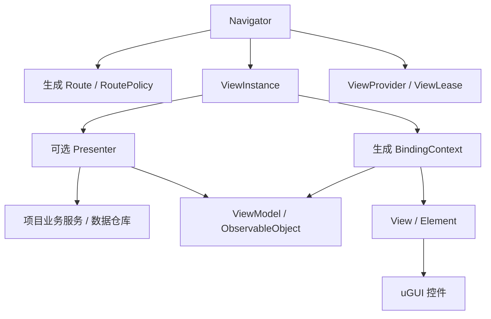
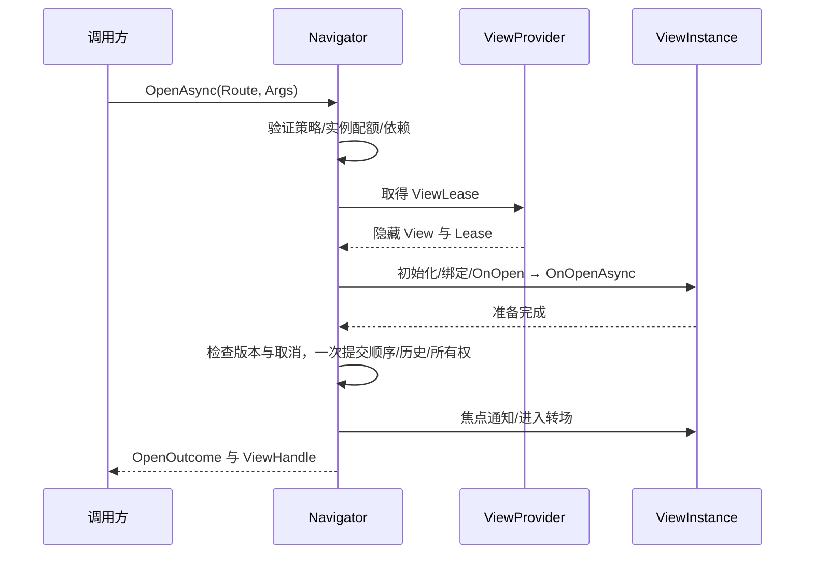

# MUI 完整 UI 框架设计

> 状态：目标架构设计；Lifetime、资源托管、属性/命令绑定、基础 uGUI、增量生成器、检查器及基本 Presenter/导航已有实现，完整框架尚未完成。
> 版本：1.7 · 2026-09-17
> 参考优先级：**FUI 为主要参考，MUFramework 为次要参考。**
> 定位：面向大型 Unity 游戏的完整 uGUI 框架，以 FUI 的架构主线完善工程能力。
> 本文中的接口与示例是 MUI 的拟议契约，不代表 FUI 已有 API；实际落地范围见 [代码架构与实现边界](CODE-ARCHITECTURE.md)。

## 1. 设计方向与参考边界

MUI 以 **ViewModel → 生成 BindingContext → View / Element** 为表现主线，以 **Navigator → Route → ViewInstance → Lease** 为导航和生命周期主线。

主要沿用 FUI 的概念与职责，不再从 Window 继承体系出发重建整个框架。MUFramework 用于补充游戏窗口策略、组件生产工具和项目接入体验。

### 1.1 参考关系

| 设计领域 | 主要依据 | MUI 的决定 |
|---|---|---|
| 数据驱动 | FUI ObservableObject / ViewModel | 保留可观察属性、集合、命令与生成绑定 |
| 控件访问 | FUI View / Element | View 聚合 Element；Element 适配真实 uGUI 控件 |
| 生命周期 | FUI Presenter / ViewInstance | Presenter 处理业务接入，ViewInstance 统一驱动绑定与生命周期 |
| 类型化导航 | FUI Route / ViewHandle | Route 描述页面配方，Handle 指向实例；补充类型化参数和结果 |
| 导航状态 | FUI activeOrder / history / focus | 分开管理显示顺序、历史与焦点 |
| 资源与依赖 | FUI Lease / Owners / Dependencies | 明确持有与释放，补全迟到结果清理和失败回滚 |
| 窗口策略 | FUI RoutePolicy 为主，MUFramework 为辅 | 补充多实例上限、溢出行为、被覆盖时的更新策略 |
| 子界面 | FUI 嵌套投影为主，MUFramework Panel/Widget 场景为辅 | 固定子视图、动态子视图、列表条目统一使用投影所有权 |
| 编辑器 | FUI 校验与生成工具为主，MUFramework 命名/生成体验为辅 | 提供向导、命名规则、批量挂载、绑定清单与可读诊断 |

**不引入与 FUI 平行的 UIWindow/UIStack 生命周期，不把组件字段自动绑定误当成数据绑定，不把两套框架的 API 简单拼接。**

### 1.2 “完善”与复杂度的取舍

完善首先意味着正常、失败、取消、缓存、重入和销毁都有一致语义。不会为了减少实现工作而省略正确性，也不会为了覆盖假想场景而把所有能力放入核心。

| 等级 | 能力 | 实施要求 |
|---|---|---|
| 核心 | 生成绑定、ViewModel、可选 Presenter、Route、Navigator、ViewInstance、Lease、基础 Element | 必须形成可靠闭环 |
| 标准模块 | 虚拟列表、游戏窗口策略、主题、本地化、焦点、常用交互、编辑器、诊断与自动化 | 正式框架能力，按模块交付，不要求普通页面依赖所有模块 |
| 条件扩展 | 多导航区域组合、分屏/多输入用户、多渲染后端、项目恢复/热更新接入、平台无障碍桥接 | 有真实需求和验收环境时再实现，不是核心完成的前置条件 |

文档中的“必须”约束对应模块启用后的行为；条件扩展的规则不意味着项目必须启用该扩展。

### 1.3 明确边界

- 主后端为 **uGUI**。保留 `IView` 等测试与替换边界，不预先设计跨 uGUI/UI Toolkit 的通用布局引擎。
- 默认一个 UIHost、一个 Navigator、一套焦点和输入上下文；不要求每个页面选择 Scope、Surface、Region。
- 复用项目的业务服务、状态仓库、事件系统和 DI。MUI 不强迫项目重构为某种 Domain/Application 架构。
- 框架不处理支付、账号和战斗规则。关闭页面不代表撤销业务交易。
- 表单草稿、字段校验、保存与提交规则由项目的 ViewModel/Presenter 和业务服务实现，不交付独立 Forms 模块，也不作为框架完成条件。框架负责输入控件适配、属性绑定、命令及通用关闭守卫。
- Unity 对象使用 `== null` 判断，不使用 `?.` 或 `??` 代替 Unity 原生对象有效性检查。

## 2. FUI 主线架构



### 2.1 职责

| 类型/模块 | 负责 | 不负责 |
|---|---|---|
| ObservableObject / ViewModel | 表现数据、选择/加载/校验状态、命令入口 | Canvas 排序、资源回收、全局栈 |
| Presenter | 业务服务接入、参数处理、业务订阅、页面生命周期 | 直接找 Button/Transform，修改导航内部状态 |
| BindingContext | 生成的订阅、赋值、双向同步、解绑与换绑 | 业务规则、导航决策 |
| View | 聚合 Element、初始化与释放控件适配、提供视图能力 | 网络请求、历史管理 |
| Element | 封装真实组件属性与事件，管理控件级资源 | 页面资源所有权与跨页状态 |
| ViewInstance | 协调 View、VM、BindingContext、Presenter 的生命周期 | 决定全局顺序和依赖归属 |
| Route | 不可变页面配方：资源、VM/Presenter 工厂、绑定、策略 | 活动实例状态 |
| Navigator | 打开/关闭、历史、焦点、缓存、依赖、操作版本 | 格式化文字、业务请求 |
| IViewProvider / IViewLease | 创建与归还页面资源，接入资源系统 | 页面业务生命周期 |
| Lifetime | 聚合订阅、任务、清理回调 | 通用 DI 容器、业务全局状态 |
| UIHost | 创建服务、主线程与帧驱动、统一退出 | 页面业务逻辑 |

### 2.2 Presenter 可选，职责仍清晰

简单展示页面可以只有 ViewModel 与生成绑定，内部使用 EmptyPresenter，无须手写空 Presenter。

涉及业务订阅、多个服务、异步请求或页面生命周期时使用 Presenter。不是每个页面都必须创建多个只有转发逻辑的文件。

ViewModel 是表现模型，允许像 FUI 一样通过 `[Bind]` 引用 Element 属性契约。这会带来明确的表现层依赖；不将它宣称为完全独立于 UI 的领域模型。真正需要多个 View 复用的业务模型由项目服务单独维护。

### 2.3 目录与程序集

```text
Runtime/
  Core/          可观察对象、ViewModel、Presenter、绑定、Lifetime 与通用 UI 契约
  Resources/     提供方、凭证和预加载契约；不包含具体加载后端
  Navigation/    Route、Navigator、ViewInstance、ViewHandle、依赖与自身缓存
  ChildViews/   固定/动态子视图、父子激活与所有权；不依赖导航
  Modules/      Tab、主题、本地化、对话框、Loading、通知与拖放的纯托管协调
  Rendering/    UGUI 基础控件与可选适配、TMP 适配；资源槽位于 UGUI 内部
Editor/          页面制作、资产校验、Inspector 与各可选模块的编辑器扩展
Generators~/     属性、命令、绑定与 Route 生成器
Tools~/          离线构建与代码格式检查
Samples~/        页面和控件接入示例；具体资源后端位于 ResourceIntegration
```

职责边界先于包数量；只有独立依赖、版本或发布需求时才拆 UPM 包。Runtime 不引用 Editor，核心不依赖某个资源加载库。

异步操作入口以 ValueTask 为主；需要反复观察或共享同一次操作的完成状态时使用 Task，例如列表的 PendingChange。项目需要 UniTask 时只做语义一致的调用适配，不维护另一套打开流程。

## 3. Route、ViewHandle 与类型安全

### 3.1 业务只需要理解两类身份

- **Route**：打开什么页面，以及如何创建它。
- **ViewHandle**：这次打开得到的具体实例，可用于关闭、查询和等待结果。

OperationId、版本号、缓存键、历史条目 ID 属于内部机制，不要求业务手工生成。ViewHandle 必须带 Host 身份或等价校验，旧 Host 和旧缓存激活的 Handle 不能操作新实例。

RouteKey 由显式资源/契约身份与 VM、Presenter 变体信息生成。类型名不作为资源与导航唯一键；相同资源配不同 Presenter/VM 必须可独立缓存。

同一 RouteKey 的结构定义只允许一个版本。要以不同结构/固定策略长期共存，应生成独立变体键；一次打开的可覆盖策略不参与结构身份。资源版本作为内部缓存兼容信息，不向每个页面暴露六套 ID。

### 3.2 参数与结果：在 FUI 基础上增强

FUI 的类型化 Route 是参考主线；MUI 进一步把打开参数和可选结果纳入契约，避免依赖任意 `object param`。

拟议接口：

```csharp
public interface INavigator
{
    OpenOutcome<TResult> Open<TViewModel, TArgs, TResult>(
        Route<TViewModel, TArgs, TResult> route,
        TArgs args,
        OpenOptions options)
        where TViewModel : ViewModel;

    ValueTask<OpenOutcome<TResult>> OpenAsync<TViewModel, TArgs, TResult>(
        Route<TViewModel, TArgs, TResult> route,
        TArgs args,
        OpenOptions options,
        CancellationToken cancellationToken = default)
        where TViewModel : ViewModel;
}
```

- 生成业务入口隐藏常见泛型噪声，例如 `Routes.Inventory`。
- 无参或无结果契约使用 Unit，并生成便捷重载。
- 默认创建 VM；共享表现数据时使用明确的 assigned-VM 重载，VM 类型由 Route 约束。
- 参数推荐命名的不可变对象；null 是否有效由契约声明。
- 结果区分 Completed(value)、Dismissed(reason)、Faulted(error)。
- `WaitForResultAsync` 的取消只取消等待；关闭页面必须显式请求。
- 动态/热更新入口可以使用对象参数，但必须先按生成契约校验，不能绕过类型检查。

### 3.3 RoutePolicy 与 OpenOptions

沿用 FUI 的区分：RoutePolicy 保存页面默认策略，OpenOptions 保存本次打开意图。

| RoutePolicy | OpenOptions |
|---|---|
| Layer、HistoryMode、CoverageMode | Push / Replace |
| AllowMultiple、MaxInstances、OverflowPolicy | 已有实例时 Focus / Rebind / UpdateArgs / Reject |
| CacheMode、CacheCapacity、CacheDuration | 允许的本次策略覆盖 |
| 模态范围、被覆盖更新策略、BackBehavior | 请求来源、追踪上下文 |
| 依赖、转场提供者 | assigned VM 与恢复上下文使用专门参数承载 |

解析后生成不可变策略快照；集合必须只读并防御性复制，不能只给数组属性设置 getter 就称为不可变。

复用活动实例默认保持原 VM、参数和策略并聚焦；如果请求显式携带不同数据，必须声明更新或换绑，否则返回冲突。缓存恢复重新应用本次策略，契约不兼容时重建。

### 3.4 公共 API 的范围

保留 FUI 的 Open/OpenAsync、OpenWithViewModel、Close/CloseAsync、Back、BringToFront、TryGetViewModel、GetState、PreloadAsync、ClearCache 与按 Layer 关闭入口，并统一委托内部实现。命名可在 SDK 定稿时规范，不增加平行的 Window API。

默认不返回 ViewInstance/BindingContext/原生控件。业务拿 Handle、类型化 VM 和结果；复杂表现通过明确接口或受控 ChildViewTemplate 扩展。

吸收 MUFramework 的简单入口 + 完整配置入口：常用路径只传生成 Route 与 Args，复杂路径传受限 OpenOptions。两者使用相同解析与校验流程，不复制生命周期，也不允许一次配置把目标 Route 改成另一个不匹配类型的页面。

Args/Result 的承载不只存在于 Navigator 签名：生成工厂创建类型化 Presenter 分发器和激活上下文，OnOpen(TArgs)/OnOpenAsync(TArgs, token) 收到同一参数；Completion<TResult> 注入到该次激活，内部直接委托分发，不能再转 object[] 反射 Invoke。无 Presenter 的页面可在受控命令上下文请求关闭/完成，VM 不保存全局 Navigator 或某个共享 View 的 Handle。

同一个 VM 投影到多个 View 时，命令执行上下文携带来源投影身份，关闭命令只关闭触发它的页面；不能把最后打开的 Handle 存入共享 VM。普通命令无需上下文参数，需要来源/完成能力时显式声明。

结果等待内部使用可多等待的完成源；每次 WaitForResultAsync 返回独立等待包装，不能多次消费同一个一次性 ValueTask 源。

### 3.5 打开完成前的控制与完成语义

默认 OpenAsync 的调用者通过自己持有的 CancellationTokenSource 取消尚未返回 Handle 的打开请求。需要查看/取消排队中的请求时提供可选 BeginOpen 返回 OpenRequest（OperationId、Cancel、Completion）；不是提前公开尚未成立的 ViewHandle，也不产生第二套打开实现。

OpenAsync 在首次进入转场完成或降级结束后返回。若页面已提交但在转场期间被独立 Close 关闭，返回 ClosedBeforeReady，并附提交状态和可读取结果的 Handle；不能返回“可交互打开成功”，也不能把已提交操作当作提交前取消。

多个请求复用同一活动实例时，它们拿到同一个实例级 TResult。需要各自独立交互结果的 Dialog 必须声明多实例或明确拒绝重复打开，不复用别人的对话结果。

公共失败分层：可预期的策略拒绝、加载失败、取消通过 Outcome 返回；无效 API 参数、契约/代码错误按公开契约抛异常；被框架隔离的生命周期异常同时进入失败 Outcome 和诊断。禁止同一种取消在不同重载中随机返回 null、抛异常或返回成功。

## 4. ViewModel、绑定与命令

### 4.1 标准生成模式

参考 FUI Pure 模式，以 `[ObservableProperty]` 字段为默认，不把 IL 后处理作为必要构建步骤。

```csharp
[ViewContract("SettingsView")]
public partial class SettingsViewModel : ViewModel
{
    [ObservableProperty]
    [Bind("Volume", nameof(SliderElement.Value), bindingMode: BindingMode.TwoWay)]
    private float volume;
}
```

这是设计示意；最终参数命名与命名空间由 MUI SDK 统一。Mixed/自动属性织入属于条件扩展，有明确的构建兼容验证后才启用。

### 4.2 绑定能力

FUI 当前绑定模式为 OneWay、TwoWay、OneWayToSource，MUI 核心沿用。OneTime 和计算属性依赖通知属于 MUI 增强，不能当作 FUI 已有能力；当前已实现 OneTime 每次绑定只执行首次正向写入、不订阅两端变化，以及 NotifyPropertyChangedFor 显式依赖通知，不提供依赖图自动推断。类型化转换器、集合变更和命令事件分别建模。

BindingContext 必须保证：

1. 首次绑定只同步当前 View，不能向共享 VM 的全部视图广播强制刷新。首次同步方向固定：OneWay/TwoWay 由 VM 初始化 View，OneWayToSource 由 View 初始化 VM；若项目需要保留用户输入，必须显式选择状态恢复策略。
2. 重复 Binding/Unbinding 幂等；解绑期间回调不能重新建立半套订阅。
3. 绑定中途失败撤销已注册监听。
4. 换绑失败恢复旧 VM 引用、Presenter 对应关系与旧绑定；恢复也失败时进入确定的故障状态。该保证不包括任意业务数据写入回滚，边界见第 4.5 节。
5. 解绑取消绑定级异步命令，清理事件及输入监听。
6. 双向绑定有来源/等值保护，避免 Slider/InputField 反馈循环。
7. VM 变更在主线程提交；后台结果通过调度器应用。

生成绑定只登记真正需要读回的外部值源。参照 FUI 由 View 汇总外部 Transform 等非事件型属性，在渲染前按需同步；不能让每个 Element 注册一套全局回调。隐藏、解绑、缓存后停止轮询；Visible/KeepVisible 页面是否暂停读回由覆盖更新策略明确决定。

属性通知可以即时更新简单控件；同帧重复变化、计算属性与列表 diff 提供批处理，禁止所有属性强行延迟导致输入体验改变。批处理的刷新阶段和显式 Flush 必须明确。

### 4.3 命令与输入绑定

命令包含 CanExecute、IsExecuting、Error、取消令牌与并发策略：默认执行中拒绝重复；搜索可 RestartLatest，必要时 Queue 或 Parallel。

UI 命令归本次打开的 Lifetime 管理。需要页面关闭后继续的交易或后台工作交给项目业务服务，不由 ViewModel 忽略取消继续持有页面。

输入控件通过双向绑定更新 ViewModel 的表现属性，通过命令触发项目操作。是否采用编辑草稿、何时校验、如何保存和提交由项目决定；框架不要求页面继承表单类型，也不规定统一提交协议。项目需要展示错误或未保存状态时，使用普通可观察属性绑定即可。

框架只提供这些 UI 原语，不强制建立新的全局 Store 或业务流程引擎。

### 4.4 关闭命令不能等待自身结束

命令 Lifetime 与绑定 Lifetime 可以不同步结束：关闭提交后立即禁止新命令，并取消仍运行的其他激活任务；框架不等待当前“请求关闭”命令退出才完成关闭，否则命令 await CloseAsync 会等待自己。

关闭命令使用来源上下文的 RequestClose/Complete 发出一次请求，交互命令的处理到此结束。若业务确需 await 关闭结果，等待阶段不得持有页面清理必需的资源；绑定解绑只撤销订阅与发出取消，不同步 Join 全部命令。

OnCloseAsync 使用独立且有超时的清理令牌，不能沿用已经取消的激活令牌；用户取消 Close 的等待不终止实际清理。关闭期间原激活任务不得继续修改 VM/Element，异步命令完成后的回写必须通过代际检查。

共享 VM 的 CanExecute/IsExecuting 默认由共享命令状态统一决定，来源上下文只区分投影与完成目标。如果需要每个 View 独立的执行状态，使用独立激活命令状态或独立 VM，不让共享字段代表两个不一致的状态。

### 4.5 换绑与参数更新的原子性边界

Rebind 更换当前投影使用的 VM，不重新执行整套 OnOpen/OnClose；通过明确的 OnViewModelChanged 钩子撤销旧 VM 订阅、连接新 VM，保持 Handle 和实例级结果不变。换绑操作与关闭使用同一实例串行规则，暂停输入、使旧绑定任务失效后才切换。

UpdateArgs 是不同操作：默认不支持，页面显式声明参数更新能力时才允许。它不得通过再次 OnOpen 伪装更新；需要异步准备的新状态先在隔离的候选状态中计算，成功后应用。若页面不能保证安全更新，使用 Replace。

框架可以撤销绑定与对象引用，无法自动撤销业务代码对共享 VM、服务或服务器的任意修改。打开准备阶段对借用的共享 VM 默认只读；需要修改时使用独立页面状态/草稿，准备成功后明确提交。不能以“页面加载失败完整回滚”承诺整个业务系统回到原样。

OneWayToSource 初次同步会写 VM，因此不能在共享 VM 的准备阶段无条件执行。先读取并验证为临时值，在导航内部状态提交完成后、开放新页面输入前应用；VM setter 可能触发业务通知，不得在无外部回调的 Commit 段内执行。应用失败按提交后激活故障补偿关闭，不能声称已撤销任意外部副作用。若业务要求共享数据修改整体可回滚，必须提供业务事务或使用私有草稿 VM，框架不模拟跨任意 setter 的原子事务。多个写入者指向同一属性必须有明确优先级，否则校验拒绝。转换器只做纯数据转换，不能隐含网络请求或资源加载。

参数相等默认使用声明的 EqualityComparer<TArgs>；可变引用内容不做通用深比较。调用方传入不可变快照或提供业务键/版本比较器，不通过反射猜测“参数是否真的变化”。

导航参数更新与模型换绑共用保留依赖的资格检查：依赖需仍属于父页面，未进入关闭、参数更新、换绑或取消。参数工厂与比较器回调后立即复核，再允许进入候选准备。导航参数更新在准备前解析并检查共享依赖请求，准备成功后、SetArgs/Commit 前再次校验父实例、拥有关系、依赖身份与参数匹配。后一次校验复用已解析的请求，不重复执行参数工厂；比较器属于受保护的项目回调，之后再做无回调的实例资格复核。正式记录并撤销关系的可选依赖降级允许保留；其他变化使候选在提交前失败并按既有协议释放，旧父参数保持不变。同步路径只直接调用复核，不创建任务。需要改变依赖参数或拥有关系的更新返回 DependencyChangeRequired。这是与第 10.1 节一致的共享契约边界：框架不替单个父页面联合改写其他拥有者的状态。项目应明确选择独立 Route 变体、独立子视图或在既有持有关系结束后重建；Replace 同样不会绕过仍被其他父页面持有的共享参数冲突。单页面隔离候选的准备、提交、回滚与清理仍属于框架职责，不扩展成跨拥有者业务状态事务。

## 5. View、Element 与绑定资产

### 5.1 View / Element 保持为主抽象

View 聚合可寻址 Element。Element 封装 Button、Slider、Text、Image 等组件的属性与事件，向 BindingContext 提供稳定契约。

自定义控件通过自定义 Element 扩展；复杂表现可以增加类型化表现接口，但不要求所有 Element 再套一层通用 ViewAdapter。

业务 Presenter 不直接查 Transform。一次性纯表现操作可通过专用表现服务表达；高频局部动画和输入细节留在 Element 内部。

### 5.2 绑定查找与生成

默认沿用 FUI 的 **Element 名称 + 类型** 查找，不引入 GUID 或序列化引用生成系统作为前置条件。

- View 初始化时遍历本绑定边界内的 Element，建立索引；名字来自节点名称，不能把参数名 path 误解为 Transform 层级路径。
- 遇到 NestedView/List 等容器边界停止向其内部收集，子 View 建立自己的名字空间。
- BindingContext 首次绑定解析并缓存所需 Element，后续属性更新直接使用已缓存引用；不在每帧 Transform.Find。
- 允许同名不同类型的 Element，但某个基类型查找若匹配多个候选必须报告歧义；同名同类型直接报错，不能静默取第一个。
- 节点移动通常不改变名字契约；跨 View 边界移动、改名或改类型须重新校验。工具提供重命名预览和同步声明，不假设生成器能读取 Prefab。
- Source Generator 校验代码契约；Editor 使用生成的 BindingManifest 校验实际 Prefab，职责明确。

MUFramework 的前缀规则仅用于建议节点/绑定名称、挂载 Element、生成初始声明；不再生成第二套 Transform.Find 字段绑定。稳定 ID 或预烘焙索引仅在实际重构/性能数据证明必要时再引入。

`ViewContract` 提供默认 View/资源提示，并非强制 VM 与单个 Prefab 一对一。同一 VM 可以投影到多个兼容 View；兼容意味着这些 View 都满足实际使用的 Element 契约。

### 5.3 Element 生命周期与资源

Element 初始化、重置、释放幂等；监听通过统一 Cleanup/Lifetime 注册。重复初始化不能重复 AddListener。

Image 等控件的 Source 绑定由 uGUI 内部资源槽持有项目交付的凭证：加载新值成功并确认请求代际有效后才替换，随后释放旧 Lease。失败可保留旧值或显示占位，迟到结果只释放。

Unity 控件被外部销毁时，View/Element 必须能识别失效并退出，不因 CLR 引用非空而继续访问原生对象。

## 6. Presenter 与 ViewInstance 生命周期

### 6.1 沿用 FUI 的业务用语与两阶段钩子

常用回调保持 OnCreate、OnOpen、OnClose、OnDestroy；焦点、覆盖、异步钩子按需覆写。无 Presenter 时使用 EmptyPresenter。

**已核对的 FUI 实现**：EnableAsync 先调用 Enable（其中调用 OnOpen），再 await OnOpenAsync；DisableAsync 先 await OnCloseAsync，再调用 Disable（其中调用 OnClose）。同步与异步钩子是两个阶段，不是二选一的重载。

MUI 沿用该钩子顺序，移除上一版“异步默认调用同步、只执行一个钩子”的不同语义。具体为：

| 阶段 | 语义 |
|---|---|
| OnCreate | 每个 Presenter 实例一次，建立实例级状态 |
| OnOpen(args) | 每次激活一次，同步应用参数、创建激活订阅 |
| OnOpenAsync(args, token) | 紧接 OnOpen 执行一次，默认空；完成异步准备，不再次调用 OnOpen |
| OnFocus / OnUnfocus | 焦点实际变化，不等于打开/关闭 |
| OnCovered / OnRevealed | 覆盖状态实际变化，不重复 OnOpen |
| OnCloseAsync(token) | 正常关闭先运行的可选异步结束阶段 |
| OnClose | 无论异步结束是否失败，都继续执行的同步结束阶段 |
| OnDestroy | 最终释放一次，必须能处理准备中失败的实例 |

MUI 有意增强可见性提交：FUI Enable 会在异步 OnOpen 完成之前设为可见；MUI 在两个打开钩子全部成功并提交导航之前保持有效不可见、不可交互。ViewInstance 的局部显示请求与宿主门控分别记录，业务不能通过绑定 Visible 提前显示。

Provider 默认创建到未激活的暂存根下；需要预先测量布局时使用第 24 章的受控暂存方式；Awake 不承担页面业务初始化，OnEnable 不承担导航生命周期。进入动画由提交后的宿主驱动，不由业务偷偷 SetActive 绕过状态机。

同步 Open 仅允许自身及必需依赖全部支持同步准备、资源可同步取得且当前无队列冲突的 Route；否则明确拒绝。不要阻塞等待异步来伪装同步。

打开阶段不执行支付/发奖等不可回滚副作用。已显示通知通过转场完成事件处理，不增加平行的 OnEnter/OnExit 体系。

打开回滚规则：OnOpen 成功但 OnOpenAsync 失败时执行一次同步 OnClose 撤销已建立的激活行为，再统一清理 Lifetime；OnOpen 自身抛错时不能假定初始化完整，依赖 Lifetime 与 OnDestroy 释放部分资源。失败回滚不运行可拒绝的关闭守卫，也不无限等待业务 OnCloseAsync。

### 6.2 内部状态细，业务接口少

```text
Loading → Opening → Open → Closing → Cached / Destroyed
       ↘ Failed
```

可见性、覆盖、焦点、更新暂停、输入门控是附加状态。Navigator 唯一写入全局状态，ViewInstance 唯一驱动组合生命周期。

核心不变量：

- 未提交实例不进入历史、不抢焦点、不接收输入。
- 一次激活至多执行一次 OnOpen、OnOpenAsync、OnCloseAsync、OnClose；同步 Close 清理与正常关闭共用一次性标记，失败回滚不重复调用。
- 缓存复用重新分配 Handle，旧 Handle 不可操作新激活。
- 隐藏不等于关闭；恢复不会重复订阅。
- 交互能力由全部阻塞原因共同决定，动画完成不能无条件开启输入。
- 生命周期异常不阻断框架自身的解绑、任务取消与 Lease 释放。

### 6.3 两级 Lifetime

实例 Lifetime 管理 View、Presenter、实例级资源；激活 Lifetime 管理本次打开的订阅、任务和临时状态。无需递归服务容器才能实现。

关闭进入缓存时结束激活 Lifetime，保留实例；再次打开建立新的激活 Lifetime。允许缓存整组 ViewInstance，贴近 FUI 的复用模型，要求 OnClose 清理与 OnOpen 重置明确。

VM 默认由调用方/页面工厂决定是否继续保留。共享 VM 的存活不归一个 View 随意 Dispose；框架拥有的 VM 与借用 VM 必须在创建契约中区分。

## 7. Navigator 打开、关闭与失败回滚

### 7.1 核心是单 Navigator 的可靠提交



流程：Validate → Prepare → Revalidate → Commit → Transition → Complete。

Commit 是主线程内无 await、无外部回调的内部状态修改段。外部生命周期/事件回调和可能触发通知的绑定写入在提交结束后执行；完成必要激活后才放开输入。回调中的导航按第 7.3.1 节受限入口处理，不能递归看到半提交状态。

提交前失败撤销绑定、依赖和资源；提交后动画失败收敛到最终打开态。提交后关键回调失败走显式补偿关闭，返回 ActivationFailed，不把已经发生的提交伪装成未发生。

### 7.1.1 同步与异步打开执行规则

本节描述允许异步能力的宿主。**完整框架另须支持 7.1.2 的纯同步全生命周期**；仅实现本节的 Open 不算满足完全无异步要求。

```text
Open：
  检查同步契约/队列 → 检查缓存或 Provider 同步能力
  → 同步取得 ViewLease → 初始化/绑定 → OnOpen
  → 完成必需同步子准备 → 提交 → 启动转场 → 返回

OpenAsync：
  排队/检查契约 → 缓存命中或 await Provider.CreateAsync
  → 主线程初始化/绑定 → OnOpen → await OnOpenAsync
  → 等待必需子准备 → 检查取消与版本 → 提交
  → 等待转场完成或降级 → 返回
```

两条路径共用策略解析、实例登记、绑定、提交、回滚和释放机制；不通过同步等待 OpenAsync 复用，也不维护两份独立状态机。同步路径不调用自定义 OnOpenAsync；存在该钩子必须先拒绝，不能因为某次返回已完成 ValueTask 就跳过编译期能力约束。

同步能力包括 Route 自身、全部必需依赖、声明为首帧必需的子视图、同步资源创建、绑定转换器和提交前守卫。任一阶段需要 await 或用户确认，则 Open 返回 RequiresAsync，且不改变已有页面。动态内容在准备时才确定必须异步的，结束临时激活并回滚，返回 RequiresAsync；资源物理清理可有 Pending 标记，不能遗留导航占位。

默认打开能力按 Route 契约判定，即使有可复用活动实例，也不通过 Open 绕过一个 AsyncOnly Route。只需聚焦已有实例时使用 TryGet/BringToFront，不把它伪装成同步重新打开。

| 结果 | 同步 Open | OpenAsync |
|---|---|---|
| 页面/依赖需要异步准备 | Rejected: RequiresAsync | 执行并等待 |
| Provider 当前需要预加载 | Rejected: RequiresPreload | 正常 await 加载 |
| Provider 不支持同步创建 | Rejected: SyncCreationUnsupported | 使用异步入口 |
| 队列忙/同步回调重入 | Rejected: Busy / Reentrant | 按队列规则或重入约束处理 |
| 加载/绑定/业务准备失败 | PreparationFailed，撤销临时状态 | 同样回滚并携带失败阶段 |
| 同步已提交但动画仍在播放 | Succeeded，Readiness = Transitioning | 继续等待转场 |
| 动画完成或已降级 | Succeeded，Readiness = Ready（仍受模态/业务门控） | 同样返回，并附降级信息 |

同步 Open 的成功只保证已提交，返回 Handle 可以关闭/查询；如需等待进入转场完成，使用独立的 WaitUntilReadyAsync。Ready 不是“无条件可点击”，输入还受模态与业务状态控制。进入转场后来失败/被关闭，通过 readiness 结果和诊断报告，不能事后修改已返回的同步 Outcome。

同步入口无取消令牌，因为调用期间不让出主线程；需要可取消等待、远程资源或大对象准备时使用 OpenAsync。两者都可选复用已预加载资源/实例缓存；允许异步能力的宿主在同步打开后仍可选择异步关闭；纯同步宿主必须遵循下节，不能据此启动异步动画或异步释放。

Tab 的 SelectAsync 继续遵守第 10.5 节 latest-wins 协议，不因资源可同步取得而退化成另一套切换逻辑。同步父 View 可以先显示 TabBar 并启动非首帧必需的子内容加载；若要求子内容就绪才显示父 View，该准备必须纳入父 Route 能力检查。

### 7.1.2 完全无异步的全生命周期（必需能力）

项目必须能够不编写 async/await、不实现 Task/ValueTask 方法、不安装异步资源适配器，完成 UI 的创建、显示、交互、更新、关闭和宿主退出。异步为可选扩展，不能把“某次 ValueTask 恰好已完成”当成同步能力声明，也不能先调用异步接口再检查是否完成。

纯同步运行能力由宿主明确选择并向实例、激活、绑定、子视图及标准模块传递。它与 `PreparationMode.Synchronous` 不同：后者目前只描述准备阶段。父子视图沿用同一个生命周期执行器与状态模型；共享同步状态变更原语，异步入口只增加等待与调度，不另建一套页面系统。

| 范围 | 纯同步契约 |
|---|---|
| 资源与 Prefab | 提供独立同步接口，同时承诺成功返回资源可同步归还、失败部分构造可同步回滚；同步接口不继承异步接口。远程资源未驻留或只能异步释放时提前拒绝 |
| Presenter 与 VM | OnCreate / OnOpen / OnClose / OnDestroy 为同步回调；注册时拒绝必需异步钩子、只能异步销毁的自有 VM；借用 VM 不转移所有权 |
| Lifetime | 实例与激活均使用 Synchronous 模式；只登记同步资源，RunAsync / OnDisposeAsync 在登记或执行用户委托前拒绝；Dispose 同步逆序释放并聚合错误 |
| 绑定与命令 | Bind / Unbind / Rebind 提供同步路径；只允许同步命令与同步子准备，不产生待排空异步会话；换绑保留既有所有权与失败恢复规则 |
| 导航 | Open / Close / Back / Replace / UpdateArgs / Rebind / ClearCache / Shutdown 均需同步入口；共享准入、身份、模态、结果和事务规则；队列忙时拒绝，不等待队列 |
| 子视图与 Tab | 准备、提交、替换、停用、恢复、关闭及 Select 提供同步路径；同步切换无在途加载候选，失败维持或恢复旧稳定内容；沿用相同缓存和所有权协议 |
| 列表与虚拟网格 | 同步数据源、单元创建、绑定、复用和回收可独立运行；异步分页、异步模板与远程图标按能力启用 |
| 本地化与主题 | 构造时接收已准备目录，SetCatalog/通知/Dispose 均直接执行，不加载资源；目录准备和持有权由项目负责 |
| 拖放 | 会话沿用来源模式，目标明确同步提交契约，两端生命周期同模式；同步 Drop/Cancel/Dispose 直接收尾，uGUI 不读取完成任务；后台取消意图由所属线程 Pump 处理 |
| 守卫与动画 | 同步守卫只立即允许或拒绝；需要交互确认时由业务完成确认后重新请求，不阻塞。纯同步生命周期默认直接到转场终态，不启动后台等待；跨帧视觉播放如提供，必须使用显式帧驱动且不拖延同步释放 |
| 缓存与维护 | 淘汰、失效、低内存清理及退出均同步收尾；TTL 由宿主帧驱动检查，不能暗中启动 Task.Delay 维护循环 |
| 结果 | 使用同步返回值、可查询状态或事件消费业务结果；不要求调用者等待 Handle 的任务。关闭返回时框架所有清理尝试已完成，不能返回 Cleanup.Pending 冒充完成 |

能力检查必须早于不可逆提交，动态创建候选也必须受同步契约约束；能力不足明确返回 RequiresAsync/Unsupported，且不偷偷排队、不留下后台清理工作。清理回调抛错时仍继续后续清理并报告失败，不能把失败声明为成功释放。

Unity 的 Object.Destroy 是引擎延迟销毁语义，不等于框架异步任务。同步释放可以同步退订、隐藏、清除引用并请求 Destroy；若底层资源卸载必须等待原生对象真正销毁，该适配器不能宣称完整同步释放，不能为实现“同步”改用运行时 DestroyImmediate。

纯同步宿主的公共基础设施同样必须遵循无任务约束：请求排空仅维护直接计数，不创建 TaskCompletionSource；不构造仅供异步预加载使用的批次和 Lifetime；缓存淘汰/清理与闲置内容清理判忙读取直接执行标志及数量。异步模式按需创建完成信号，尚无异步任务时使用明确的空状态，不以预先创建已完成任务作为同步状态占位。以上需同时审查宿主构造、打开、更新、换绑、缓存及退出路径，不能只检查名称带 Synchronous 的文件。模型所有权和 Tab 控制器同步释放也直接记录开始、完成及失败状态，重复调用保留原清理结果；同步预检不通过任务完成状态判忙。只有调用者显式请求异步兼容观察时才允许物化信号，不能让普通 Dispose 为兼容接口主动分配任务。绑定会话同样通过直接清理状态处理同步解绑、换绑与构建失败回滚；CleanupCompletion 只作为显式任务观察入口，在同步清理进行中被读取时按需创建信号并由同一次清理完成，不能重复退订。UIHost 的同步闲置内容清理只检查直接状态，不读取异步任务；子视图转场与槽清理在尚未启动异步操作时保留空值，不预置已完成任务。

**当前实现状态**：已提供 Lifetime 的同步模式/Dispose、独立同步资源提供方契约与持有权、项目侧 Lifetime.Load 接入示例；新增独立同步视图资源契约，常驻 Prefab、借用 View 与具备同步后端的内容挂载已接入。标准绑定已提供同步会话、解绑、换绑与同步命令生成，共用生命周期已提供同步激活/实例清理及模型释放原语；纯同步子视图基本创建、失败回滚、提交、关闭、停用及原实例恢复已接入；静态 NestedViewElement、动态内容槽以及 Tab 的同步选择/守卫/缓存/目录更新/销毁已接入；导航和 Tab 提供自身闲置 UI 内容的同步清理入口；虚拟列表/grid 已接入同步本地数据、物化、回收、重试与定位；子视图同步模型换绑和参数事务已接入；导航内容/实例层已提供同步所有权、激活、释放及 Route 完整同步声明，同步关闭守卫、无 Task 结果读取和 Close/ForceClose/Complete 协议已接入，Navigator.CreateSynchronous 与 UIHost.InitializeSynchronous 已接通同步打开、关闭、结果完成、返回、Replace/CloseOldest、按层/全部批量关闭、顶层参数更新/模型换绑、缓存/闲置内容清理和宿主退出，默认直接结束进入转场，异步操作入口提前拒绝。命令内请求自身关闭交由下一次同步 Pump 派发，不启动任务；直接 Close 仍在调用内完成。同步预加载导航入口及常驻 Prefab 适配已接入，同步 Resources 按需适配已接入，运行验收仍待完成，Unity 运行验收未完成；目前不能宣称所有纯同步能力已经完整可用。具体实现进度以 IMPLEMENTATION-STATUS.md 为准。

### 7.2 Replace 与实例溢出

Replace 先准备新页面，成功后再替换旧页面；准备失败保持旧页面可用。旧页面存在关闭守卫时，在提交前获得许可并检查许可依赖的状态是否变化。

MUFramework 的 MaxInstances/OverflowPolicy 作为 RoutePolicy 增强。默认超限 Reject；CloseOldest 必须采用同样的先准备后替换流程，不能先破坏旧窗口。

Replace 提交后新页面已经生效，旧页面保持必要的退出渲染，清理可继续。旧页面清理失败需要报告和继续释放，不倒退新页面事务。

### 7.3 并发默认行为

核心采用有界的顺序导航请求队列；资源预加载可并发。Close、Cancel、Shutdown 可使正在准备的请求失效，不必等待它正常完成后才能退出。

| 场景 | 默认行为 |
|---|---|
| 同一单实例 Route 重复打开 | 依次处理；首个完成后返回已有实例并聚焦 |
| 显式新 VM/参数与已有实例冲突 | 要求 Rebind/UpdateArgs，否则拒绝 |
| 不同页面连续打开 | 按请求顺序处理，不以 I/O 速度随机决定导航 |
| 打开中关闭 | 取消打开并回滚，迟到结果不附着 |
| 转场中关闭 | 使进入操作失效、收敛动画，再关闭 |
| 已关闭页面重复 Close | 终态仍可确认时 AlreadyClosed，记录已淘汰时 UnknownOrExpired |
| 已有操作等待者取消 | 取消该请求；如已提交，按提交后语义处理 |
| 生命周期回调中再次导航 | 阻塞当前队列的钩子内拒绝普通打开入口；使用只入队的 PostOpen，不递归提交 |
| 队列已满 | 返回 Busy，不无限排队 |

不在核心实现多个业务请求共用一个打开任务。若未来加入共享准备，必须另行定义不同参数及多个等待者取消语义。项目资源后端可自行合并读取；框架不提供共享加载实现。

打开/关闭操作携带 Handle、OperationVersion 与 Host generation；每个异步边界后检查有效性。保护范围包括资源、业务准备、绑定、依赖和转场，不仅是动画。

### 7.3.1 队列、依赖和交互守卫不能相互等待

顺序队列只约束正常导航请求，不意味着所有内部操作都重新排入同一队列：

- 必需依赖由当前打开操作内部递归准备，继承取消与回滚栈，不能 await 排在自己之后的公开 OpenAsync。
- 对必须完成才能释放队列的生命周期钩子，显式传播操作上下文；在该上下文内调用普通 Open/OpenAsync，入口立即返回 Reentrant，而不是推测调用方之后是否 await。上下文需跨 await 保留，不能只用主线程上的临时 bool，也不能误拒绝独立用户操作。
- 钩子需要安排后续页面时使用 PostOpen：仅尝试加入有界队列并返回 Accepted/Busy，不提供可等待的打开完成任务；当前操作退出处理权后才执行。来源实例的激活已失效时默认丢弃并报告。业务应在页面就绪后的独立命令中等待交互导航结果。框架不承诺检测任意 Task 之间的等待环。
- 关闭守卫尽量返回 Allow/Deny/NeedsConfirmation 的数据决策。需要确认框时，Navigator 将请求停放、释放普通处理权，再由标准 Dialog 流程打开确认框；回答后检查原 Handle/版本重新继续。
- Cancel、强制关闭、Shutdown 走控制通道，能使准备操作失效；部分资源构造尚未归还时由迟到清理器接管。
- 同步 Open 在队列忙或回调提交上下文中返回 Busy/Reentrant，不插队破坏顺序。

初版不实现允许任意导航嵌套 await 的通用重入调度器。顺序处理可能产生队首等待，通过取消、合理 Prepare 超时和资源预热控制；确需并发页面准备再作为可测量的后续优化。

### 7.4 取消与迟到结果

- 提交前取消：实际取消子任务与加载，回滚，返回 CancelledBeforeCommit。
- 提交后取消 Open 令牌：页面已经打开，收敛剩余转场并返回已提交结果；关闭另发请求。
- 资源系统不支持中断时，由提供者或操作清理器继续监管迟到结果并释放。
- 不能因为停止等待就宣称资源已经释放。
- Prepare、Transition、Close 配置独立超时。超时使旧操作失效并触发清理，不能强行终止不合作的任意 Task。
- UniTask 适配必须转发取消，禁止仅取消 CompletionSource 而保留后台打开行为。

### 7.5 关闭协议

```text
关闭守卫 → 提交退出历史/输入资格、取消激活任务
→ 保留关闭画面与必要输入屏障 → 退出转场 → 完成视觉退出/释放屏障/重算焦点
→ OnCloseAsync → OnClose → 解绑与激活任务清理
→ 释放依赖 → 缓存或销毁 → 完成关闭结果
```

关闭守卫只针对用户返回/取消等可拒绝请求；Host 退出、账号切换和错误清理可强制关闭。

CloseAsync 对不存在实例返回 NotFound；重复关闭共享既有关闭结果。批量关闭完成一次并携带每个实例结果，不能把一个完成回调调用 N 次。

OnClose 抛错后继续解绑和销毁，通常不把清理不完整的实例放入缓存。父 OnClose 完成后再释放依赖，避免回调访问已销毁依赖。

### 7.5.1 关闭中的视觉状态与输入屏障

Closing 实例退出可导航集合和历史，但在退出动画完成前仍属于渲染序列。不要直接删除 activeOrder 导致尚可见的 Canvas 排序被重新分配；渲染序列可以保留 Closing 项，由状态过滤导航候选，避免再建无约束的平行栈。

模态关闭期间默认保留其输入屏障，下层焦点只记录恢复目标，到退出转场结束才实际放行；关闭按钮的 Pointer 事件持续消费到该次输入结束。否则弹窗还在淡出时下层就可接收点击。

关闭提交时停止业务 Tick 和新命令；纯退出动画继续运行。转场结束或超时降级后完成视觉退出，从渲染序列移除，释放该页模态屏障并根据仍存活页面重算焦点/覆盖；触发关闭的同一次 Pointer 输入仍消费到结束。随后执行 OnCloseAsync → OnClose、解绑及资源清理，依赖仍保留到父 OnClose 完成。慢速或不合作的清理不能继续锁住下层输入；必须等待的业务条件应放在关闭提交前的守卫中。非模态 Overlay 可声明不阻塞下层，不能以统一全屏锁处理所有关闭。

### 7.6 结果与终态

OpenOutcome 区分成功、提交前取消、策略拒绝、准备失败、激活失败、ClosedBeforeReady、Host 已关闭。转场降级作为成功附加信息，不与加载失败混淆。

页面通过类型化 Completion 请求提交 TResult 并关闭；正常结果在受控关闭清理完成后一次性完成，清理超时则在逻辑关闭确定后完成并附清理待完成信息。调用方取消结果等待不关闭页面。

终态查询账本采用容量/TTL，不无限保留旧 Handle。实际清理完成后才登记终态并开始计时；仍在清理的实例继续保留所有权，不因终态 TTL 被提前移除。账本淘汰后返回 UnknownOrExpired；Handle 的结果完成源独立管理，已有等待、之后的等待及直接结果读取均不受账本淘汰影响。

### 7.6.1 结果提交、关闭守卫与回调分级

Completion<TResult> 先暂存候选结果，再请求关闭；仅在关闭提交点接受结果。关闭守卫拒绝则返回 Denied 并清除候选，页面仍可再次选择，WaitForResultAsync 不完成。并发 Complete/Back/Close 由首先成功提交关闭的请求决定终态，后续请求返回 AlreadyClosing，不覆盖已接受结果。

正常完成结果与 CleanupStatus 分开：业务已完成而资源释放超时仍保留该业务结果，并标记 Pending；关键生命周期失败使页面无法正常结束则返回 Faulted。不能用默认 TResult 表示取消，也不能把某个日志订阅者抛错变成业务失败。

诊断、全局事件订阅者异常只记录并隔离；OnOpen/绑定失败属于提交前准备失败；提交后的关键 Presenter/视图激活故障才触发补偿关闭。Replace 一旦已提交，不保证能复活已关闭的旧页面，只恢复仍有效候选或安全入口。提交前“旧页面保持可用”的保证不延伸成提交后无限撤销。

CloseAsync 的调用方取消只结束该调用方等待，返回约定的 WaitCancelled，不撤销共享关闭操作；真实结果仍可通过 Handle/关闭完成源等待。未知或已淘汰 Handle 返回 NotFound/UnknownOrExpired，只有保留终态记录时才声称 AlreadyClosed。

## 8. 层级、覆盖、历史、焦点与模态

### 8.1 沿用 FUI 的三份状态

- activeOrder：视觉顺序。
- history：显式导航记录。
- focusedHandle：当前页面焦点。

依赖和提示可参与显示而不进入历史；Layer 决定视觉层级，不自动等于历史和输入优先级。

uGUI 排序由 Layer + LocalOrder 映射，检查数值范围与 Canvas 嵌套。默认不要求 Surface/Region/ModalGroup 四层排序身份。

### 8.2 游戏窗口策略

标准预设作为策略组合，不建立新的继承树：

| 预设 | 历史 | 常见输入/覆盖行为 |
|---|---|---|
| Screen | 进入历史 | 正常页面导航，可隐藏下层 |
| Dialog | 独立模态处理，历史可配置 | 焦点约束，屏蔽下层点击 |
| Overlay | 不进入历史 | Toast/提示等，通常不抢焦点 |
| HUD | 不进入普通页面历史 | 保持显示，按游戏状态刷新 |

这是对 FUI RoutePolicy 的项目友好封装。MUFramework 的被覆盖 Pause/Hide、多实例溢出策略用于补充预设；不允许任意无效组合无声生效。

只有真实被覆盖时才应用被覆盖策略。隐藏、暂停表现更新、停止业务任务分别声明，不能一项标记改变全部行为。

### 8.3 输入与返回

InputGate 使用可释放令牌记录来源；交互开启必须同时满足无模态阻塞、无转场阻塞和业务允许。

模态负责焦点陷阱、射线遮挡、关闭后的有效焦点恢复。关闭弹窗的点击必须被消费，不能穿透到下层按钮。

返回优先级：输入法/控件临时编辑态 → 子视图临时态 → 顶层模态 → 页面历史 → 项目返回处理。具体平台的输入法行为由适配器验证。

默认单输入用户，支持触摸、鼠标、键盘与手柄；多个本地用户的独立焦点属于扩展。

借鉴 MUFramework 的 SkipBackKey，但改为明确 BackBehavior：Close、Ignore、HandleByPresenter、Block。Ignore 继续查找下一个候选；Block 消费返回且不关闭，避免被误当作忽略。候选先按实际可交互的模态/层级顺序检查，再查询历史；不把记录最近就等同于用户当前看见的最上层。

输入门控分别决定控件可交互性与射线屏障：禁用控件使用 CanvasGroup.interactable=false，同时阻断键盘/手柄提交和命令入口；需要屏蔽下层时保留独立、可命中的 Raycast 屏障。不能把所有 CanvasGroup.blocksRaycasts 一律设为 false，否则点击会穿透；单独把它设为 true 也不会凭空产生可命中的遮罩 Graphic。依赖页和 HUD 是否获焦点独立声明，BringToFront 不能越过当前模态约束。

### 8.4 历史不是磁盘快照系统

核心历史首先沿用 FUI：记录仍活动的显式 Handle，Back 关闭当前历史目标，揭示仍活动的下层 View。缓存保存已关闭实例，它本身不自动生成可返回的历史。

如果项目需要 Back 重建已经关闭的页面，使用可选的会话恢复记录：保存 Route、可保留参数和轻量状态，不保存 GameObject。该恢复能力与核心 Handle 历史、ViewCache 分开实现，不把两种历史混成一个列表。

业务对象已失效、账号已切换时不恢复旧页面。跨进程/跨版本持久化、序列化和迁移由项目负责，UI 只接受恢复后的参数，不要求每个 Args 都实现序列化和迁移。

## 9. 资源 Lease、所有权与缓存

### 9.1 Provider 同步/异步完整契约

同步与异步使用相同的资源身份和所有权规则，但采用独立接口与独立 Lease；纯同步项目不必实现异步方法。以下为当前契约，具体 Prefab 加载与资源后端由项目提供方实现，Provider 不调用 Presenter 或修改 Navigator 状态：

```csharp
public interface IViewProvider
{
    // 查询不加载、不实例化、不转移资源所有权。
    SyncCreateAvailability GetSyncAvailability(ViewResource resource);

    IViewLease Create(ViewResource resource);

    ValueTask<IViewLease> CreateAsync(
        ViewResource resource,
        CancellationToken cancellationToken);
}

public interface ISynchronousViewProvider
{
    SyncCreateAvailability GetSyncAvailability(ViewResource resource);

    ISynchronousViewLease Create(ViewResource resource);
}

public interface IPreloadViewProvider : IViewProvider
{
    ValueTask<IPreloadLease> PreloadAsync(
        ViewResource resource,
        CancellationToken cancellationToken = default);
}

public interface ISynchronousPreloadViewProvider : ISynchronousViewProvider
{
    ISynchronousPreloadLease Preload(ViewResource resource);
}

public enum SyncCreateAvailability
{
    Available,        // 当前支持同步获取并创建
    RequiresPreload,  // 当前不可同步；预加载后可重新查询
    Unsupported       // 该提供者/资源策略不提供同步创建
}

public interface IViewLease : IAsyncDisposable
{
    IView View { get; }
}

public interface ISynchronousViewLease : IDisposable
{
    IView View { get; }
}

public interface IPreloadLease : IAsyncDisposable
{
    ViewResource Resource { get; }
}

public interface ISynchronousPreloadLease : IDisposable
{
    ViewResource Resource { get; }
}
```

ViewLease 决定 Destroy、对象池归还或外部资源句柄释放。Navigator 不直接假设 Object.Destroy 是所有资源系统的正确回收方式。

GetSyncAvailability 是当前能力提示，不是成功保证；Create 必须重新检查资源状态。资源不存在或同步读取失败属于加载失败，不能伪装成 Unsupported。接口不支持同步时，Create 抛出约定的 SyncCreationUnavailable 异常，Navigator 转为明确拒绝结果；其他 Provider 异常按加载失败映射并记录原因。

拥有者取得不同 Lease，底层资源可以共享。Provider 成功返回前负责部分构造清理，返回后所有权转给 Navigator。返回 null 或无效 View 属于 Provider 契约违反，不是普通的“未加载完成”。

#### 9.1.1 能力矩阵

| 资源情况 | Create | CreateAsync |
|---|---|---|
| 本地且提供者原生支持同步加载 | 同步获取并创建，耗时记入同步打开成本 | 可以立即完成，也可按预算调度 |
| 资源已预加载且支持同步实例化 | 同步创建并取得独立 ViewLease | 复用已加载资源，可能立即完成 |
| 必须下载/异步读取且尚未准备 | 返回不可同步的拒绝，不偷偷开始后台打开 | await 加载后在主线程创建 |
| 只支持异步实例化的提供者 | Unsupported | 使用提供者异步创建路径 |
| Navigator 已有兼容实例缓存 | 不调用 Provider，但仍检查页面准备是否需异步 | 不重复加载，继续正常异步激活 |

同步加载不是零耗时，允许提供者声明的本地同步 I/O；禁止用 .Wait()、.Result 或等待异步完成的隐藏桥接来实现同步 Create。具体资源包能否同步由其适配器实测声明，不能根据包名推断。

CreateAsync 不保证一定跨帧，缓存/本地资源允许立即完成。框架必须同时正确处理立即完成、延后完成和取消竞争，不能用强制 yield 一帧掩盖重入问题。

资源加载可以由提供者在允许的线程完成，但 Unity 对象实例化、View 初始化、绑定与导航提交在主线程。实际支持的分帧实例化由适配器声明；“异步 API”不等于任意 Unity 操作可在线程池运行。

#### 9.1.2 预加载与资源释放

PreloadAsync 只加载并持有资源，不实例化、不执行 OnCreate/OnOpen。Navigator 保管 IPreloadLease；View 创建期间保证该预加载持有仍有效，Provider.Create/CreateAsync 为新实例取得独立资源持有，成功后 Navigator 可按策略释放预加载 Lease。

这里采用“独立持有”契约，不隐式消费 PreloadLease，因此失败不会发生所有权转移到一半。资源系统通过同一资源身份复用底层已加载资源。若某个提供者只能转移句柄，适配器必须在内部完成等价的原子持有转换。

预加载结束只意味着资源准备完成，不能保证页面同步可打开：OnOpenAsync、必需子视图、依赖或只支持异步的实例化仍可能阻止同步入口。

清缓存/Host 退出时释放全部未使用预加载 Lease。纯同步宿主提供真正完成清理的 ClearCache/Shutdown；允许异步的宿主提供 ClearCacheAsync/ShutdownAsync 等可等待入口；非等待便捷入口仅表示已提交清理，由清理器观察后续任务，不能宣称所有异步释放已同步完成。

### 9.2 所有权表

| 资源 | 拥有者 | 释放时机 |
|---|---|---|
| 顶层 ViewLease | 活动实例或缓存条目 | 实例销毁/缓存淘汰 |
| BindingContext 的订阅与命令 | 激活 Lifetime | 关闭/换绑/打开回滚 |
| Presenter 实例资源 | 实例 Lifetime | 最终销毁 |
| 子视图 | 父 View/投影槽 | 移除或父销毁 |
| 图片、字体、材质 Lease | Element 资源槽 | 替换、明确的隐藏回收策略或销毁 |
| 共享页面依赖 | Navigator 所有者集合 | 最后一个拥有者释放 |
| 预加载 | 预加载条目 | 实例取得独立持有后按策略释放，或取消/过期 |
| 项目业务任务 | 项目服务 | 业务定义 |

释放顺序中任一步异常都不能跳过剩余清理。异步释放由统一清理器观察，不使用 async void 遗失异常。

### 9.2.1 超时、异步释放与对象隔离

超时使操作失效，不代表用户 Task 已停止。如果仍有代码持有某个 ViewInstance/VM 并可能回写，该实例必须进入待清理隔离区，禁止放回缓存/池复用；待任务收敛后再释放或销毁。迟到的业务副作用仍由项目业务服务治理，操作版本无法撤销外部交易。

只支持框架提供的代际检查回写入口；不合作且无限运行的第三方任务无法由框架保证强制终止。隔离区计入 UI 在途清理容量并告警，达到阈值拒绝新的相关请求，不能声称“所有故障都能自动回到零资源”。

关闭结果区分逻辑关闭与释放状态：正常 CloseAsync 等待受控清理完成；清理超时可以返回 ClosedWithCleanupPending，诊断保留清理责任。页面业务结果仍能完成，后台清理任务继续被观察；不能把超时报告为全部物理资源已释放。

以同步释放为主的资源适配器可以立即完成 ValueTask；必须异步归还的适配器由清理器调度回正确线程。调用释放失败不自动无限重试，Provider 必须声明重试是否安全。

### 9.3 缓存策略

保留 FUI 的 None、KeepAlive、Timed，并提供容量、TTL 和停用 UI 实例的估算大小上限。KeepAlive 表示可跨关闭保留，不等于无限缓存；这里不管理项目资源预算。

缓存键区分资源/VM/Presenter 变体；兼容性检查包含绑定契约与资源版本。缓存恢复必须：

```text
校验兼容/TTL → 分配新 Handle → 应用本次策略
→ 重建激活 Lifetime → 显式换绑或复用 VM
→ OnOpen → OnOpenAsync（如需要）→ 提交 → 转场
```

缓存中不得保留激活级网络等待、业务事件与输入监听。激活 Lifetime 持有的控件资源槽随本次显示结束而释放；项目显式交给实例 Lifetime 的资源可随 View 缓存保留，直到实例淘汰时归还。UI 缓存估算上限不等于资源后端的共享计数或内存预算。Presenter/VM 整组复用必须有状态重置约定，未满足时淘汰重建。

缓存超时在命中时也检查，不能依赖下一次扫描。定时扫描、终态账本、池与日志均有上限。

### 9.4 预加载与内存压力

预加载分资源加载与实例预热，后者按帧预算执行，不在一次资源回调内实例化大量页面。预热不执行 OnOpen 业务逻辑。

平台低内存由项目处理。项目可显式清理 UI 预加载、停用页面和 Tab 缓存；对象池、资源卸载及可重建资产回收归项目资源系统。UI 框架不提供全局回收协调器，活动页面不能被静默关闭。

记录 Lease 数量、对象数和估算内存；估算 CPU/GPU 字节不能当成精确进程内存。真机分析分别观察 Unity、托管、原生与 RSS/PSS。

## 10. 依赖与子视图

### 10.1 页面依赖沿用 FUI 所有权

Owners 表示哪些页面需要该实例，Dependencies 表示当前页面持有的依赖；显式打开形成独立所有权。

多个父页面共享依赖时，关闭其中一个不影响其余拥有者；最后一个父释放且没有显式拥有者才关闭依赖。

RequiredBefore/AttachedAfter 是生命周期与视觉顺序信息。对于必须随父页面成功的依赖，MUI 在父提交前完成全部可失败准备，提交时再按声明顺序安排显示，避免“父已显示但必要依赖加载失败”的半成功。

可选依赖声明降级策略。静态环在生成/资产校验阶段发现，动态环在打开路径检测。失败按实际取得的所有权逆序释放，不关闭原先已由别人持有的页面。

可选声明使用 `RouteDependency<TParentArgs>.Optional(...)`，明确选择“依赖不可用时继续显示父页面”；`Required(...)` 选择“与父页面共同成功”。两者沿用强类型参数工厂、单实例及 Unit 结果约束。同一父页面不能将同一目标同时声明为必需和可选，静态校验直接报告冲突。

- 准备阶段逐项解析参数。可选项失败后，只撤销本次实际取得的关系；目标没有其他父拥有者和显式拥有者时，先完成其真实资源回滚，再继续准备父页面。父页面取消、依赖环/容量错误及回滚失败不会被降级吞掉。
- 完全同步宿主直接回滚，不创建或等待任务。普通异步宿主上的同步 `Open` 若已经取得了必须异步清理的候选，则由外层失败事务接管清理，不能宣称可选项已回滚后继续成功。需要完整同步语义时使用同步宿主。
- 已进入激活阶段的可选依赖发生故障，或被强制关闭时，撤销可选父关系并通知降级；必需父关系仍走父链关闭。普通 `Close` 仍对所有被持有目标返回 `InUse`，不会以“可选”为由绕过拥有关系。
- `GetDependencyFailures(parentHandle)` 返回当前父激活的降级快照，每个声明目标最多保留首个原因；`LifecycleChanged` 的 `DependencyDegraded` 事件携带目标、阶段、句柄与异常，项目据此显示替代内容。准备阶段的降级也可能在父提交前通知，不能把该事件当作父页面已打开。事件回调异常按统一通知机制隔离。
- 首次 Ready 会包含此前的依赖降级。Ready 是一次性结果，进入 Ready 后发生的降级通过事件及快照查询呈现，不改写已经发布的 Ready。参数更新和模型换绑保留可选目标缺席状态，不隐式重试；重新关闭并打开父页面时重新准备。

同步示例 `SynchronousDependenciesDemo.Optional.cs` 演示加载后准备失败的回滚、必需兄弟依赖保留、运行期共享依赖强制退出及降级后的父参数更新。

每个导航候选还维护准备执行边界。异步准备令牌同时关联父请求与候选自身的激活取消；关闭先取消候选，再等待整次准备结束，随后执行生命周期和资源释放。后端忽略取消而迟到交付的凭证仍先归候选，不能因界面已逻辑退出而遗漏接管。同步准备期间的关闭返回阻挡或延后请求，准备状态检查不会创建任务；普通异步宿主在同步准备回调中启动异步关闭时，才按需建立等待信号。

如果退出协调器在准备期间已经撤销可选关系并记录退出原因，依赖自身的取消可以作为该次退出处理：父请求必须仍有效，并等待依赖实际清理完成后才能继续。若父页面还通过另一条必需链间接依赖该目标，则父页面仍属于必须关闭的集合，不能反向等待整条关闭链。资源清理失败仍使父准备失败。该准备边界保证资源归属，不等同于已经实现所有准备/守卫操作的超时隔离。

### 10.1.1 共享依赖不能被任意关闭

普通 Close 对仍被父页面持有的依赖返回 InUse，不能直接销毁；最后一个拥有者释放且没有显式所有权时才能关闭。CloseLayer/CloseAll 也经过所有权检查，并在批量结果中报告保留项。若一次批量关闭同时包含父页面与依赖，先结束父页面再按最新拥有者状态判断依赖。

如果共享依赖同时被显式打开，用户可通过专门的 ReleaseExplicitOwnership 撤销显式拥有关系与独立历史/焦点，不冒充实例已关闭。带非 Unit TResult 的交互 Route 默认不允许作为共享依赖；需要既当独立页面又当依赖时优先使用独立 Route 变体，避免为一个实例引入多套结果会话。实例级结果等待仅在实际关闭时结束。

强制关闭依赖只供 Host 销毁/错误恢复使用，必须同时终结受影响父页面或执行其明确的降级策略，不留下父页面以为依赖仍活着的状态。

依赖声明必须携带类型匹配的参数工厂或约束依赖为 Unit Args，不能让强类型 Route 最终以 null 隐式打开。多个父页面对同一个共享依赖提供不同业务键/参数时拒绝冲突或创建独立变体，不偷偷覆盖已服务其他父页面的 VM。

### 10.2 子视图按复杂度使用

| 场景 | 使用方式 |
|---|---|
| 一组纯显示控件 | Element 组合，不强制单独 VM/Presenter |
| 固定业务子面板 | 嵌套 View + 可观察数据，通常不需要单独导航 |
| 异步/动态子面板 | ChildViewHandle，独立绑定与任务 Lifetime |
| 列表条目 | 列表拥有投影和池；按 ItemKey 与绑定代际复用 |

保留 FUI 的嵌套投影和受控 Handle；MUFramework 的 Panel/Widget 是使用场景参考，不再额外引入一套同义基类。

父页面移除子视图时先取消子任务和 Pointer capture，再解绑与归还资源。业务服务依赖通过工厂/项目 DI 注入，不混入页面依赖图。

### 10.3 静态、动态与手工投影的释放区别

| 投影类型 | 接近 FUI 的入口 | 拥有关系 |
|---|---|---|
| 静态子视图 | NestedViewElement.ViewModel | 父 Prefab 拥有 GameObject，销毁投影只结束绑定/Presenter 与 View 包装，不 Destroy 静态节点 |
| 动态子视图 | DynamicViewElement.Source + ViewModel | Element 拥有实例 Lease；切换成功后归还旧实例，失败保留旧实例 |
| 原型/列表 | ChildViewTemplate / 列表工厂 | 模板或列表拥有池/实例，Handle 调用创建时定义的释放策略 |
| 手工接入现有 View | 显式 Owned/Borrowed 创建选项 | 不根据接口名称猜测 Dispose 是否应该销毁节点 |

FUI 动态 Source 与 VM 是两项独立输入，Source 决定视觉实例是否存在。MUI 保留该分离：VM 为 null 时默认停用绑定，是否显示未绑定内容由明确的 ShowUnbound 策略决定；不把静态 NestedView 与动态内容的 null 行为混在一起。

### 10.4 父子激活传播必须显式实现

GameObject.SetActive(false) 只隐藏 Unity 层级，不会自动取消纯 C# 订阅与 Task。父页面关闭进入缓存时，框架必须递归结束其子视图的激活 Lifetime，而不依赖销毁 Element 才触发清理。

父恢复时按保存的有效子 VM 重建子激活；被覆盖仅隐藏时不执行完整 OnClose。父子有效可见性是“父门控 AND 子局部可见意图”，父恢复不能把业务主动关闭的页签全部打开。

数据在父 OnOpen 的绑定过程中变化时，可创建/同步子视图，但子视图在父提交前同样受隐藏与输入门控。需要异步打开的子视图必须有显式 PrepareAsync 路径由父准备过程 await；同步属性 setter 只提交换绑请求，不能悄悄丢弃异步初始化。

共享 VM、替换子 VM 与父关闭的竞态按父激活代际 + 子绑定代际检查。子 VM 若实现 VM 所有权约定，借用者不释放；由父工厂创建且声明拥有的对象由父统一结束。

### 10.5 标准组合：TabView 与异步子视图容器

该模块处理“父界面保留 TabBar，点击不同 Tab 异步加载不同子界面”的常见场景，是 MUI 标准模块的目标能力，不代表当前 FUI 已具备完整实现。沿用 FUI Element、VM、投影和 Lease，不让每个业务界面自行编写加载与取消状态机。

#### 10.5.1 组成与职责

| 对象 | 责任 |
|---|---|
| TabViewModel / TabItemState | 稳定 TabKey、名称、图标、可用性与选中意图 |
| TabBarElement | 按钮/Toggle 的选择、键盘导航与选中表现，发送 SelectTab 意图 |
| AsyncContentElement | 固定内容边界、候选挂载根、有效可见性/输入门控与状态展示 |
| TabContentController | 本容器内的切换版本、取消、加载状态、投影提交与缓存所有权 |
| TabContentDefinition | TabKey 对应的模板/资源、VM 工厂、必要异步准备和保留策略 |

TabView 是上述对象的标准组合，不是与 View 平行的新窗口基类。Controller 是框架协调对象，不替代子界面的业务 Presenter。AsyncContentElement 也可用于非 Tab 的动态详情切换。

Controller 通过只读状态和语义命令连接父 VM 与 Element，内部对象不直接暴露给业务。子界面不创建顶层 Route，不进入 Navigator 历史、不抢父页面焦点；需要打开独立弹窗时再通过 Navigator。

```text
MainView
├── ContentRegion
│   ├── ContentHost       AsyncContentElement，已提交子视图
│   ├── StagingHost       隐藏/不可交互的候选投影，必要时受控测量布局
│   ├── LoadingOverlay    内容区域内的加载提示
│   └── ErrorOverlay      内容区域内的失败与重试
└── TabBar                TabBarElement，始终高于内容区域
```

TabBar 与内容为兄弟区域；内容切换只操作 ContentRegion。TabBar 不随子 View 被销毁或缓存。加载和错误遮罩不覆盖 TabBar，也不取得全屏输入锁。

同一 Canvas 使用明确的兄弟顺序；子 Prefab 的独立 Canvas/overrideSorting 必须受父内容层级约束，不能自行排序到 TabBar 之上。父页面整体被模态覆盖或关闭时仍遵守全局门控，“Tab 可点击”仅指本地加载不禁用它。

#### 10.5.2 状态与默认配置

一次状态快照包含：SelectedTab、DisplayedTab、Phase、Error、RequestVersion。SelectedTab 表示最新选择意图；DisplayedTab 表示当前内容归属，隐藏旧内容时可以为空。保留以便回退的旧对象使用内部 RetainedContent 记录，不冒充正在显示的内容。

Phase 为 Empty、Loading、Ready、Error、Inactive。切换快照原子更新，TabBar、加载提示和内容读取同一版本，不分别修改多个公开 bool。

| 配置 | 默认与可选行为 |
|---|---|
| PendingDisplay | 默认 LoadingPlaceholder；可选 Blank 或 KeepPrevious |
| LoadingIndicatorDelay | 默认立即展示；可配置短延迟避免缓存命中闪烁；Blank 始终不显示加载字样 |
| PreviousContentInput | 加载期间旧内容不可交互，包括 KeepPrevious 模式 |
| ContentRetention | 默认 ReleaseOnLeave；可选有界 CacheRecent 或显式 KeepSelectedTabs |
| FailureDisplay | 默认内容区错误提示 + Retry；可选 RestorePrevious |
| SameTabSelection | 正在加载或已 Ready 时不重新加载；Error 状态需 Retry 或显式 ForceReload |
| ParentReopen | 保留最后选中键，重新验证有效性并按缓存策略恢复；可配置回默认 Tab |

TabKey 是稳定逻辑标识，不使用位置索引。目标资源/契约版本、业务键或账号上下文不兼容时缓存不能命中。保留策略均受父实例生命周期和UI 实例容量约束，不提供无界“所有页签永久保留”。

#### 10.5.3 切换协议

1. 校验 Tab 存在且可用；相同有效目标按 SameTabSelection 处理，不重启同一个加载。
2. 接受新选择，增加 RequestVersion、取消旧请求并建立关联父激活的取消源。
3. 关闭旧内容交互，按 PendingDisplay 显示占位、留空或旧画面；TabBar 立即反映 SelectedTab。
4. 旧内容暂停激活工作；至多保留一份稳定旧内容作为回退候选。快速切换时不能把半准备的新内容当作稳定旧内容，也不能无限积累旧页。
5. 从兼容缓存取实例或异步取得子 ViewLease，在 StagingHost 创建投影，绑定 VM，完成 OnOpen/OnOpenAsync、必要子准备与布局；“资源加载结束”不等于“可显示”。
6. 每个 await 之后检查父激活代际、RequestVersion、TabKey/内容定义版本与对象有效性。失效的候选只清理，不能显示、修改 Tab 或关闭当前加载提示。
7. 在主线程无 await 地提交候选：绑定归属移至 ContentHost、DisplayedTab = SelectedTab、Phase = Ready，按父门控显示并启用输入。清除本版本加载/错误展示，再派发隔离的提交事件。
8. 旧稳定内容按保留策略缓存或释放。物理异步释放继续由清理器观察，不阻塞新内容可用；仍被不合作任务持有的对象进入隔离区，禁止复用。

隐藏旧内容时 DisplayedTab 置空；KeepPrevious 时保持旧键直到新内容提交。保留旧画面不意味着旧业务继续运行：结束旧子激活的任务和订阅后由容器保留只读视觉快照（可使用脱离激活的冻结显示，不强制 RenderTexture）。该模式须由受控停用接口支持，不能直接调用会隐藏节点的 Disable 再假定旧画面仍可见；恢复时必须重新激活。无论选择多少次，候选提交后只能有一个当前交互内容。

Controller 使用独立于全局导航队列的 latest-wins 切换调度，不让父 Navigator 为子 Tab 的 I/O 一直等待。切换操作结果为 Ready、Superseded、Cancelled、Failed 或 ParentInactive；调用结果另含 Rejected（UnknownTab/Disabled/Denied）与 WaitCancelled（只取消重复调用者的等待）。无效或守卫拒绝的请求不变更现有选择，也不取消有效的在途请求；过期请求也必须确定完成，不能一直挂起。

#### 10.5.3.1 重复请求与资源并发上限

latest-wins 表示提交权归最新选择，不表示无限启动不能取消的 I/O。每个容器有在途加载上限；旧提供者不合作时仅保存最新待启动目标，达到容量前不创建更多候选。候选与隔离区都计入预算，并提供超时/诊断。

重复 SelectAsync 同一个正在准备的 Tab 默认不创建操作，返回该操作的独立等待包装；重复调用的令牌只能取消自身等待，不能取消原请求。创建操作的原始令牌、后续不同 Tab 选择和父失活才有权使该操作失效。这个局部去重规则只属于 TabController，不改变全局 Navigator 不合并业务请求的规则。

A 已显示、切到 B 尚未完成、又选择 A 时，若 A 仍作为稳定回退对象且已完成停用，则取消 B 后重新激活 A，不从池取得同一对象的第二份所有权。A 仍有未收敛任务时不得复用，显示加载/错误状态并遵守隔离规则。RestorePrevious 的异步恢复也带当前版本检查，恢复完成前又选择 C 时不得把选中态改回 A。

父关闭时取消的是最新操作、恢复操作和等待者；完成回调不得同步重入内部状态提交。

#### 10.5.4 快速切换、错误与取消

```text
选择 A → 请求 A(version 1)
选择 B → 取消 A，请求 B(version 2)
选择 C → 取消 B，请求 C(version 3)
B 迟到完成 → 只清理 B，不更新任何当前 UI
C 完成 → 提交 C，隐藏 version 3 的加载提示
```

LoadingOverlay 的延迟显示计时器同样归请求版本管理。旧请求的 catch/finally 不能执行无条件 IsLoading=false；所有状态写入只能通过 Controller 的当前请求校验。

失败处理：

- 默认保持失败目标为 SelectedTab，内容区显示错误与重试；旧稳定内容隐藏并按保留策略处理。
- RestorePrevious 模式尝试重新激活旧稳定内容，成功后将 SelectedTab 与 DisplayedTab 一起恢复到旧键，并通过独立通知报告切换失败；不能 Tab 选中 B 却无说明地显示可操作的 A。
- 没有旧内容，或旧内容恢复失败，回到错误占位，不递归无限恢复。
- Retry 使用当前失败目标的新 RequestVersion，重新检查资源和父状态；不复用已取消的任务。
- 用户切换到其他 Tab 属于 Superseded，不展示错误弹窗；父关闭属于 ParentInactive，不残留加载提示。
- 点击 Tab 无效/被禁用时拒绝选择，不改变当前显示。运行时删除所选 Tab 按父定义的默认有效键回退；没有有效 Tab 则 Empty。

可选子视图关闭守卫：默认普通 Tab 切换不询问；子视图声明守卫时先请求离开许可，未获许可不提交 SelectedTab 变更。是否存在未保存修改由项目判断。确认框等待期间仅保留最新选择意图，拒绝则保留原 Tab；父强制关闭绕过守卫。确认框通过全局 Dialog 流程，不能占住普通 Navigator 队列等待自己。

#### 10.5.5 父子生命周期、缓存与输入

- 父开始正式关闭时立即取消当前切换、使父业务激活代际失效、停止加载计时器与子 Tick；已提交子内容随父退出流程结束生命周期，候选立即回滚。独立关闭操作仍持有清理权限，迟到加载结果无权更新缓存中的父 View。
- 父进入缓存可保留符合预算的子物理实例，但不得保留子激活订阅或运行任务；父销毁时释放全部子缓存、Lease 和 Controller 注册。
- 父仅被覆盖时遵循父更新策略：默认允许准备完成但保持父有效隐藏/禁用门控，不重复 OnOpen，也不越过模态启用 Tab。
- 父重新打开使用新父激活代际。默认不因绑定初始化重复触发两次 Select；缓存命中仍经过重建激活、参数更新与一次状态提交。
- Tab 选择焦点默认停留在 TabBar，内容加载完成不自动抢焦点；键盘/手柄进入内容区时再定位到有效子控件。
- 子缓存恢复必须重置本次选择相关参数。滚动位置、筛选等是否保留由子 VM 状态策略决定，不因复用 Prefab 自动决定。

#### 10.5.6 业务接入与编辑器

业务只声明 Tab 列表、各 Tab 的内容定义/VM 工厂、初始选择和显示策略。框架处理取消、代际、占位、提交和释放；不要求业务重复编写 try/finally 设置加载状态。

```csharp
// 拟议 MUI 语义示例，不是当前 FUI 已有 API。
var outcome = await tabContent.SelectAsync(
    TabKeys.Equipment,
    cancellationToken);

// 界面通过绑定读取只读状态：
// State.SelectedTab / DisplayedTab / Phase / Error
// 重试使用 RetryAsync，父关闭由 Lifetime 自动传播。
```

加载中的 SelectAsync 被新选择替代时返回 Superseded。创建操作的原始外部令牌取消当前未提交切换时返回 Cancelled；重复调用者的令牌仅返回 WaitCancelled，不改变共享切换状态。操作取消时：如果仍有稳定旧内容则按恢复流程回到旧 Tab，否则清空选择/内容进入 Empty；恢复失败进入错误占位，并在取消结果中保留恢复错误，不递归恢复。恢复使用独立于已取消目标的令牌，仍关联父激活并可被后续选择撤销；恢复期间的加载提示也归有效恢复令牌管理。恢复成功仍返回原选择的 Cancelled，不发送切换失败通知。令牌来自父结束时统一走 ParentInactive。提交后的令牌取消只取消后续等待/非必要转场，不撤销已经 Ready 的内容。

编辑器提供 TabView 模板，检查唯一 TabKey、初始键有效、内容模板/VM 契约匹配、Loading/Error 区域边界、TabBar 排序、子 Canvas 越界和缓存上限。绑定检查器显示 SelectedTab 与 DisplayedTab 的差异；运行时检查器展示当前版本、待清理候选与各 Tab 缓存。


## 11. 虚拟列表与标准控件

### 11.1 列表能力必须落实

FUI 的条目复用提供参考，但 MUI 的标准滚动列表必须实现真实视口虚拟化：实例数量主要随视口和 overscan 增长，而不是随总数据量增长。

必需能力：

- 稳定 ItemKey，选择、焦点和异步回包不依赖数组下标。
- 固定/动态高度、网格、多模板、分页、集合 diff 与批量刷新。
- 动态高度测量缓存和位置索引，滚动时不线性扫描全量数据。
- 插入/删除时通过首个可见键 + 偏移保持锚点。
- 复用条目检查 ItemKey + binding generation，避免头像串位。
- 池可收缩，不永久保留历史峰值。
- 焦点移动到屏外条目时先滚动、物化，再设置焦点。
- 加载、空态、错误与重试有标准入口。

树、分组、聊天记录反向分页作为同一列表模块的高级能力，按用例验证；不能仅增加类型名就宣称实现。

### 11.1.1 集合通知与列表分级

FUI ObservableList 提供 Add/Remove/Replace/Update 通知；MUI 沿用基本模型，补充标准批量变更集与 Move/Reset 语义，作为虚拟列表输入。多个变更以一次更新事务应用，校验重复 ItemKey，并定义 Reset 后如何恢复选择/锚点。

保留普通 RecyclingList 给少量固定内容，增加独立 VirtualListElement 给长列表，避免把每个小列表都升级成动态高度索引。固定高度/网格先形成完整闭环，动态高度/多模板后续按相同契约增强。明确名称与性能边界，不能把条目池等同于虚拟化。

当前普通列表入口为 RecyclingListElement：借用 ViewModel 集合，按位置复用 NestedViewElement 模板，原生 LayoutGroup 排布全部条目；同步与异步宿主共用协调过程，同步分支不创建或读取任务。池容量有界，超限明确拒绝；这是小列表能力，不提供视口裁剪、键选择或锚点恢复。已有源码、生成绑定示例及离线编译；同步增删、异步条目等待加载/快切/在途关闭与资源归还已在 Unity 运行验证，故障恢复、缓存复开和原生输入仍待验收。

### 11.2 控件与表现

基础 Element 包含文本、图片、按钮、切换、滑条、输入框、下拉、滚动、进度、遮罩和布局辅助。

自定义 Element 必须声明可绑定属性、命令、资源与清理契约，并可被校验器和检查器识别。键盘/手柄、禁用态、焦点态应与鼠标路径一致。

## 12. uGUI 渲染与游戏适配

- Canvas 按更新频率、批次与交互边界设计，不机械地每个 Element 一个 Canvas。
- 控制 RaycastTarget、LayoutGroup/ContentSizeFitter 重建、Mask、材质实例、字体图集与透明叠加成本。
- 布局与属性更新可批处理；需要当帧测量时提供受控 Flush，防止循环重入布局。
- 安全区、屏幕旋转、窗口尺寸、软键盘遮挡作为持续事件处理，不仅在打开时适配。SafeAreaFitter 可选排除键盘矩形，复用相同的同步布局刷新；平台无法报告区域时通过 SetKeyboardAreaOverride 接入，不猜测高度。当前不自动滚动到输入控件，平台坐标及焦点联动仍需真机验收。
- UIHost 默认使用 Unity 非缩放帧时间；关闭 AutomaticFramePump 后由项目调用 AdvanceFrame 传入帧时长，统一推进请求派发和界面 Tick，避免自动与手动双重驱动。
- 转场定义最终状态、中断收敛状态和清理；不能留下透明为零、错误缩放或永久输入锁。
- 世界空间 UI 继续使用 View/Element 与绑定，可绕过普通页面历史；目标和相机销毁时清理。

不在本阶段引入通用跨后端布局与控件协议。IView 抽象用于生命周期边界、Provider 接入与验证，不承诺 UI Toolkit 等价实现。

## 13. 本地化、主题与可访问性

本地化和主题是标准模块，不在每个页面各自实现。

- 文本使用语义 key + 参数，支持复数、区域格式与 RTL 方向元数据；字体 fallback 由 TMP 和项目配置。
- 项目先准备并持有新语言目录及字体等资源，再调用 SetCatalog 同步刷新文本。布局变化时由界面调用 FlushLayout 或列表的 InvalidateHeightMeasurements 恢复测量与锚点；项目在旧 UI 引用结束后归还旧资源凭证，UI 服务不接管加载与卸载。
- 主题使用语义 Token 管理颜色、字体、间距与控件状态，支持字号与减少动画设置。
- 标准 Element 提供名称、角色、值、状态与阅读顺序；不只用颜色传递错误。
- 基础键盘/手柄可达性与语义信息纳入标准控件验收。
- 平台读屏/原生无障碍桥接属于扩展，按实际平台验证支持范围；具备语义字段不等于完整平台支持。

## 14. 通用交互模块

| 模块 | 行为要求 |
|---|---|
| Dialog | 类型化结果、默认/取消操作、关闭守卫与焦点恢复 |
| Notification | 有界队列、去重、优先级和过期，不污染普通历史 |
| Loading | 按操作令牌聚合进度、延迟显示，释放幂等，阻塞范围明确 |
| Tooltip / ContextMenu | 锚点跟随、边界避让、目标失效关闭、返回与外部点击处理 |
| DragDrop | 语义载荷、源/目标失效取消、Pointer capture 清理、业务提交失败恢复 |

这些服务通过 Navigator/投影/Element 构建，不各自维护独立全局窗口栈。登录流程、支付流程、任务引导等业务流程由项目层组织；需要公共流程模块时独立扩展。

## 15. 生成器与编辑器工具链

### 15.1 以 FUI 生成流水线为标准

| 输入/输出 | 处理方式 |
|---|---|
| ViewModule | 程序集属性，配置纯托管注册入口的命名空间与类名；不创建运行时模块系统 |
| ObservableProperty / OnChanged | 生成属性、变化通知与声明的变化处理 |
| Bind / Command | 生成 BindingContext 的 Element 缓存、订阅、同步、反向写入与解绑 |
| BindingManifest | 生成 Editor 所需类型、目标、绑定方向与源码位置，不默认进入发布运行时 |
| Binding Factory / Registry | 生成子视图工厂与注册入口 |
| ViewRoute | 生成类型化 Route 工厂；变体由项目传入工厂与策略，不自动注册路由 |

项目启动流程显式调用各模块的生成 Initialize 入口，再初始化 UIHost。ViewModule 可声明 `[assembly: ViewModule("Game.UI.Generated", "UIBindings")]`；省略时保留 MUI.Generated 与程序集名派生的注册类名。配置名称必须是有效的非转义 C# 标识符，命名空间按点分隔；空值、关键字和已有同名类型会产生编译诊断。生成注册调用按完整工厂名称排序。重复初始化幂等；禁止相同键不同工厂无声覆盖。Editor Domain Reload 关闭时也必须可重置，不遗留上轮静态注册。

`[ViewRoute(typeof(Args), typeof(Result))]` 为具有 ViewContract 的具体模型生成 `模型名Route.Create`。Presenter 选择优先显式 `PresenterType`，其次当前编译源码中唯一可访问的兼容 Presenter，没有候选时使用 EmptyPresenter；多个候选产生诊断。外部程序集 Presenter 需显式指定。模型工厂由项目传入；Presenter 有依赖构造参数时必须传入工厂，生成器不构建业务服务。Create 可显式覆盖 key、resource、policy、preparation 和估算保留大小以创建变体。尚未提供自动路由注册或自动命名变体。

顶层 Route 使用显式工厂，省略时按路由声明的 TViewModel 精确查找注册工厂，不将基类或派生类的泛型 BindingContext 强转为路由类型。子视图默认按模型实际类型解析工厂，未注册时沿类继承链回退最近注册的基类；GetManifest 与 Create 使用相同规则。新增契约和 Reset 都更新注册代际，使旧绑定缓存失效；同一工厂的重复登记不改变代际。需要同一 VM 配多个子视图 Presenter 时使用显式 ChildViewTemplate/工厂，而不是向全局注册表覆盖一个默认项。

生成器必须处理跨程序集、继承、泛型/嵌套类型、null 契约和重载歧义；不支持的结构明确诊断。为 Args/Result 生成简洁入口，这是 MUI 增强，当前 FUI 仍以 object param 打开。

当前生成器支持具体或抽象模型及带约束的泛型模型，包括非泛型外层内程序集可访问的 public/internal 嵌套模型，并按基类到派生类合并同一程序集源码中的绑定。继承绑定通过声明类型访问公共属性或生成命令，不重复生成成员；父子声明统一执行写入、反向输入和事件冲突检查。遮蔽或重写继承的绑定来源明确诊断。跨程序集通过生成公共属性上的归一化 Bind/BindCommand 元数据合并，包含从 nameof 推断的 ElementType，并校验生成元数据版本；旧生成器构建的基类需重新编译。手写绑定属性需显式声明 ElementType 才能跨程序集解析。嵌套模型的每层外部声明须为非泛型 partial class，生成工厂保留在同一外层作用域，注册使用完整类型路径；私有模型、泛型外层及 record/struct 外层明确诊断。泛型绑定/路由工厂保留模型的类型参数与约束；模块入口只自动登记非泛型模型，闭合泛型由项目调用工厂 Register。泛型 Route 的默认 Key 来自闭合模型 FullName，显式 Key 的唯一性由项目保证；泛型 Presenter 不自动推导，需传入项目工厂。具体模型需有契约或本地生成声明触发生成；运行时工厂的基类回退与编译期绑定合并是不同能力。

名称冲突检查同时纳入基类已有的可访问成员，以及同次编译中 ObservableProperty/Command 将生成的公共属性，避免首次编译时因输入符号尚未包含生成结果而漏检。命令方法必须确实有实现；没有实现的 partial void 不能生成空操作命令，直接报告 MUI001。

`OnChanged("PropertyName")` 标在当前模型的同步实例方法上，目标为当前模型中由 ObservableProperty 生成的属性。支持 `void Changed()`、`void Changed(T value)` 和 `void Changed(T oldValue, T newValue)`，参数类型须与属性完全一致；同值赋值不调用。生成 setter 在 SetProperty 成功返回后依次调用回调，不使用反射或任务；普通通知先执行，批量通知时属性通知可以延后，但回调仍立即执行。参数表示本次赋值，不保证回调执行时属性未被其他订阅者再次修改；业务应避免循环赋值。回调或通知异常直接向赋值调用者传播，不回滚已经写入的值，也不保证后续回调继续执行。手写属性、继承属性、异步方法、重复声明和不匹配的签名明确诊断，不隐式挂全局 PropertyChanged 监听。

`NotifyPropertyChangedFor(nameof(ComputedProperty))` 标在 ObservableProperty 字段上，实际变化并成功完成 SetProperty 与 OnChanged 后发布额外通知。目标为已有公共可读实例属性，可重复声明不同目标；空名、同目标重复、自身通知和未配合 ObservableProperty 均明确诊断。批量通知沿用 ObservableObject 去重，不缓存计算值。只展开字段显式声明，不递归传播手写通知或推断 getter 读取关系；异常遵循 setter 的既有传播语义，不承诺通知原子性。

生成结果确定性、可追踪，运行时不通过全程序集反射扫描补救。AOT/裁剪所需工厂与保留信息由构建收集并在目标平台验证。

### 15.2 页面向导

FUI 现有 Setup 负责目标程序集的生成器安装，Page Wizard 创建 View Prefab 并提供策略片段，Binding Inspector 读取 Manifest 展示绑定、定位节点与源码。MUI 首先实现同样闭环，再扩展骨架生成；不把 FUI 的向导描述成已能生成完整业务代码。

向导生成或关联：View Prefab、ViewModel、绑定声明、RoutePolicy 和必要的 Args/Result。Presenter 按需生成，不强制空壳。

关联已有 View 时，项目选择普通或 Variant Prefab 根资产，指定标题与关闭按钮的 Element 名称，并选择与现有标题一致的文本模板。向导复用 ViewContractValidator，只读验证根 View/RectTransform、所选名称/类型、歧义及嵌套边界；不接受场景对象、模型或 Prefab 子节点。预览校验按资产/模板/名称缓存，项目变化失效，创建前重新校验。新目录只生成业务源码，Page 中记录 PrefabAssetGuid；原资产不复制、不改写，失败回滚只移除本次新目录。生成的 Resource 仍是项目资源键，GUID 是编辑器关联信息，项目必须把该资源键登记到原 Prefab，不会自动按 GUID 运行时加载。节点名称按 C# 字符串字面量转义，支持中文、引号、反斜线和控制字符，不能将名称拼成可执行代码。已有 Prefab 使用自身字体配置，不强制要求新建 TMP 模板的全局默认字体。

页面创建向导提供文本组件选项：基础编辑器内置 uGUI Text，启用 TMP 模块后由独立 MUI.TMP.Editor 注册 TextMeshPro 模板。标题 Prefab 使用 TMPTextElement 时，生成的绑定声明同步使用该类型，关闭按钮标签也使用同一文本方案；不在基础编辑器中反向引用 TMP。TMP 模板使用 TMP Settings 中已保存的默认字体，缺失时在创建目录前拒绝并给出配置提示。项目自定义文本方案可通过 PageTextBackend.Register 注册具体 Element 类型、预检和工厂，Content 必须是公开可读写的实例 string 属性，工厂节点必须挂在向导拥有的层级内。

向导默认勾选完整同步生命周期，生成的 Route 明确声明 supportsSynchronousLifecycle: true，现有同步命令与 OnOpen 骨架不增加 Task。关闭该选项则保持允许异步的路由准备声明。生成后增加异步逻辑时必须调整此声明与宿主模式；勾选不是对后续项目代码的自动证明。目标程序集引用与绑定生成器仍需项目配置；向导在下述检查中报告缺失项，不自动安装字体、导入 TMP 基础资源或修改其他项目资产。

向导从新脚本路径向上查找最近的 asmdef/asmref，通过 Unity 解析引用，并读取当前 CompilationPipeline 编译快照。检查实际传给编译器的 MUI.Core/Resources/Navigation/UGUI 及所选文本 Element 所属程序集引用，以及 RoslynAnalyzerDllPaths 中的 MUI.Generators.dll；仅编辑器程序集、禁用引擎引用、无法解析的引用和已知缺失项会阻止创建。无可用编译快照的空程序集或未启用程序集只显示“未验证”提示，不能据此宣称配置正确。结果按目标路径/模板缓存，项目变化和编译完成时失效，提供手动刷新，创建前再次检查。该检查证明当前编辑器配置可见性，不代替生成代码编译、目标平台/AOT 验收，也不自动修改 asmdef 或 Analyzer 导入设置。

借鉴 MUFramework 的命名与目录规则，支持批量识别组件、挂载 Element、命名检查。项目可在编辑器初始化时通过 ElementNaming.SetRule 注册纯命名函数，传 null 恢复默认；SuggestDefault 可用于组合内置规则。命名函数只接收原名和 Element 类型，不应修改资产或层级。结果仍经过唯一名称建议、用户审核、应用前快照复核和 Undo；整批建议完成前不写入预览，规则异常或场景变化保留原预览。生成文件与手写文件分离，不能覆盖业务逻辑。扫描要有预览、增量合并、Undo、Prefab Undo/保存支持；重复执行不重复挂组件，处理嵌套 Prefab 和容器边界。TMP 与旧 Text/InputField 按实际组件识别，前缀只给建议，不能固定猜成旧版组件。

### 15.3 校验与预览

项目通过 `UIBuildValidation.RegisterCatalog(id, collect)` 显式登记独立导航目录，采集回调只构建路由元数据并使用 `AddPage(route, prefab, manifest)` 提供每个页面，包括可选与必需依赖。Manifest 必须匹配路由模型类型；框架不调用参数/模型/Presenter/资源工厂，也不从任意项目静态字段猜测入口。单次最多 32 个目录、每目录 2048 个页面；不同目录可使用独立的同名路由。

`Tools/MUI/Validate Build Catalogs` 和 Player 构建前处理器共用校验：先检查依赖是否闭合在已登记目录内，再复用 RouteGraphValidator 检查依赖环、同层顺序和声明冲突，检查跨根路由键冲突以及相同资源键/版本映射不同 Prefab，最后逐项复用绑定资产校验。缺失/错误的 Prefab、Manifest 或声明会阻止已登记项目构建；空目录、采集异常和超出报告容量也判失败。报告最多保留 256 个问题，每条最多 2048 字符，不持有项目对象；采集完成后释放临时路由和资产引用，目录不能在校验期间修改。

未登记任何目录时构建给出“未覆盖”警告并继续，不能据此宣称 UI 已通过校验；项目须显式登记实际使用的路由并在 CI 中检查覆盖。此入口核对项目声明的 Prefab 映射，不证明运行时资源提供方使用了相同映射，不验证远程资源可用性、跨平台裁剪或运行时行为。

静态依赖图使用独立的 `MUI.Navigation.Editor` 程序集。项目编辑器入口显式调用 `RouteGraphWindow.Show(root)` 或传入一组根，读取现有 C# 路由声明并复用 `RouteGraphValidator`；不反射全项目静态字段，不执行参数、模型、绑定或资源工厂。窗口提供路由/资源搜索、父拥有者与直接依赖的关系跳转、必需/可选与顺序信息、静态问题以及可复制报告。

窗口只保存可序列化元数据快照，避免在退出播放模式后持有工厂捕获的项目对象。支持最多 32 个根，各根独立校验；每份快照最多收录 2048 个节点、32768 条关系和 256 个校验问题，截断明确标注。快照保留采集时间，不自动冒充实时状态；需要更新时由项目入口重新采集。静态通过不能替代运行时参数比较、资源检查及跨根共享组合校验。当前工具负责只读诊断，路由资产创作与自动发现属于后续工具链接入。

校验项：

- Route 重复、工厂不可访问、参数/结果不匹配。
- Element 缺失/重复、绑定类型错误、双向转换不可逆、嵌套越界。
- Prefab 引用断裂、依赖环、资源变体缺失。
- Canvas 排序范围、相机、输入组件、无效射线目标。
- 本地化 key、缺字、文本溢出、焦点不可达。
- 无界缓存、池与清理配置缺失。

预览使用样例 VM/模拟业务服务，覆盖正常、空、加载、错误、长文本、语言、主题、尺寸和焦点状态。与运行时共用绑定代码，避免预览专用实现。

需要代码/资源独立更新的项目才引入 ContractHash 与兼容检查，不强制普通本地 Prefab 工作流运行版本迁移服务。

## 16. 诊断、自动化与帧调度

### 16.1 运行诊断

检查器至少展示：活动 Route/Handle、显示顺序、历史、焦点、覆盖原因、输入锁、正在执行的操作、依赖拥有者、缓存与 Lease。

导航层提供 `CaptureSnapshot(maxInstances)` 与 `TryGetInstanceSnapshot(handle, out snapshot)`，在所属 UI 线程直接复制账本。实例快照覆盖准备中、已打开、正在退出和仍在清理的条目，包含显示/历史索引、首次就绪、操作标记、在途绑定命令数、显式/父拥有关系与可选依赖降级数。表现重算记录最近上层隐藏及输入覆盖来源句柄，便于沿来源继续查询；退出显示集合时清除来源。宿主快照另含焦点、近期历史、缓存/预加载占位、超时待清理及丢弃事件数量。

快照不持有 View、ViewModel、路由工厂、参数或任务，也不调用渲染器属性、执行项目回调或强制重算表现。同步读取不创建任务。在途命令数量使用会话计数，不能拿只针对当前调用链的自身等待标记代替。`HostVisible`/`HostInteractable` 仅描述导航门控，局部输入锁、Element 可命中和实际渲染仍需渲染器诊断补齐；快照的 `IsPresentationSettled` 为 false 时，显示及覆盖字段可能尚在收敛。

`UIHost` 的 UI Toolkit 检查器提供手动运行快照：保留默认序列化属性编辑，播放模式下显式读取已初始化的导航器，不自动初始化或驱动业务。展示提交版本、同步/异步模式、表现收敛状态、请求数、缓存/预加载占位、超时清理与丢弃事件数；虚拟化实例列表支持路由/句柄筛选，详情展示资源、显示/历史索引、操作、命令、就绪、降级、拥有者及依赖。覆盖来源、焦点、历史与依赖关系均可跳转到同一快照中的实例；未收录的句柄明确提示已关闭或截断，不从另一时刻偷偷补读状态。历史详情最多展示最近 128 条，元数据仍按采集上限保留。每份快照显示时间，重绘不采集，域重载后重新采集；查询失败清空旧结果。该入口尚不提供完整资源凭证归属、耗时追踪或自动化写控制。

实例采集默认上限 256，可设置为 1 至 4096；宿主历史只复制最近同等数量的句柄，单实例父拥有者最多复制 128 个，并保留真实总数及截断标记。直接依赖沿声明上限保留完整列表。被截断或不在当前显示集合中的句柄可单独查询；已经移出账本的终态实例不伪造活动快照，可通过状态与生命周期事件查询。以上为导航元数据，预加载占位不能当作完整 Lease 数量或内存用量。

可回答“为什么看不见”“谁阻止点击”“谁还在持有页面”“哪个迟到结果被丢弃”。日志以 OperationId/Handle 关联资源、绑定、提交、动画与释放。

运行时异常通过 `UIErrors.Report` 进入进程级 `UIErrors.Sink`，由项目接入日志或遥测系统；接收器异常隔离，不影响原有 UI 失败与清理结果。`UIErrors.Reported` 保留为附加观察接口。同一线程的接收器或观察者回调中再次调用 Report 会被忽略，防止递归耗尽调用栈；分发结束后恢复正常报告，不抑制其他线程的独立报告。接收器失败时仍按现有回退规则处理，后续观察者继续接收原始错误。没有项目出口时，uGUI 宿主只登记一次 Unity Console 默认输出；View/Element 在没有宿主时仍有 Unity 回退。Core 不引用 Unity 日志 API，也不持久化、上传或决定项目日志策略。当前主动输出仅为错误，普通状态通过生命周期事件和诊断快照提供；示例与 Editor 日志由其自身负责。

局部输入门控另提供 `InputGate.CaptureSnapshot(maxReasons)`：复制原因而不持有令牌或其拥有者，保留真实阻挡数、是否释放和截断标记。重复原因代表不同持有者，不合并计数；门控已释放后仍能查询，不能因阻挡集合清空就错误报告输入已打开。

UGUI 的 `View.CaptureInputSnapshot(maxBlockerReasons)` 在 Unity 主线程采集已有状态，不初始化 View、不创建 InputGate、不调用 ApplyGates。快照包含宿主/局部门控、层级激活、逻辑释放、画面保留、View 自身可见与输入资格，以及根 CanvasGroup 的实际启用、透明度、交互、射线和忽略父组属性。逻辑释放后仍可读取；Unity 对象已销毁则拒绝读取。快照不持有 Unity 对象，原因上限默认 128，可设为 1 至 4096。

现有 View 检查器增加“输入与可见性诊断”折叠区，显式采集最多 64 个原因并显示时间，不自动轮询或写回属性。该诊断区分 View 门控与根 CanvasGroup，不能把透明度为 0 当作射线禁用，也不能把禁用 CanvasGroup 的属性当作正在生效的局部阻挡。祖先组、Graphic 射线过滤、Selectable、EventSystem 与其他遮挡物尚需单独诊断，当前快照不冒充完整点击命中结果。

记录打开阶段耗时、绑定变化数、列表物化量、缓存命中、池高水位、取消收敛和未完成清理。缓冲区有界，发布模式可采样，参数摘要脱敏。

不以全套分布式 Trace 系统作为第一阶段前提；先做好本地结构化事件与快照，项目需要时再接外部平台。

UGUI 提供显式同步 `UIRaycastDiagnostics.Capture(eventSystem, position, target, maxHits)`：使用独立 PointerEventData 调用实际 EventSystem.RaycastAll，保持排序并跳过已失效对象；复制对象编号、层级路径、射线器类型、排序字段和最近的点击处理对象。可选 target 用于判断目标层级的首次命中及首位命中归属，即使保留结果被截断也统计完整命中数。默认保留 128 条，可设 1 至 4096；路径最多 64 层、每层名称最多 128 字符，截断标记为省略号。限制只约束保留的快照，不限制原生射线临时结果。

查询必须在 Unity 主线程显式调用，拒绝重入、失效或禁用的 EventSystem 及非有限坐标。它不派发点击、不修改焦点、不保留 Unity 对象，也不创建任务，但会执行实际 Raycaster/过滤器回调，不能视为纯元数据读取。异常交由调用者处理；项目回调可能产生的副作用不能由诊断接口消除。快照中的点击处理目标不证明实际点击资格，未模拟按下/拖动状态或自定义输入模块。View 检查器提供播放模式下的手动查询，最多保留 64 条结果，不随重绘查询。


导航提供可选的生命周期时间线：`StartLifecycleTrace(capacity)` 开始新一轮并清除旧记录，容量默认 512、可设 1 至 8192；`StopLifecycleTrace(clear)` 停止并可释放缓冲区；`CaptureLifecycleTrace()` 同步复制按发生顺序排列的记录。记录点位于真实生命周期事件生成处，不依赖外部订阅，也不受通知队列溢出影响。环形缓冲保留最近事件，单独统计旧记录覆盖数与宿主通知丢弃数，默认未启用时不分配追踪缓冲。

追踪记录包含单调时钟、事件序号、Handle、提交版本、路由键、关闭原因、更新/换绑/清理结果及可选依赖降级来源；路由键和异常类型名最多保留 256 字符并标记截断，不保存参数、结果业务值、异常消息、堆栈或项目对象。`ExportText()` 导出已采集记录，清理控制字符，时间相对首条保留事件；该间隔不等于操作耗时。UIHost 检查器提供开始/停止/清除/采集与复制报告，重绘不采集，关闭检查器不会悄悄改变宿主记录状态。

打开请求另记录 OperationStarted/OperationFinished，使用宿主编号加递增 OperationId 关联边界；该编号不因追踪重启而复用。Open/OpenAsync 的有效调用在入口校验后记录开始，覆盖提前拒绝、准备失败、取消、激活失败和成功；BeginOpen 沿用 OpenAsync，不重复记录。受理的异步 PostOpen 从提交后开始记录，耗时包含排队与等待 Pump；同步 PostOpen 从 Pump 实际调用 Open 时开始，不包含提交等待，因来源已失效而跳过的同步请求不伪造执行记录。空路由、错误线程及纯同步宿主调用异步接口等入口契约错误不记录为已受理请求。

请求结束记录包含入口总耗时、状态/拒绝/清理结果及可获得的句柄；失败前没有有效返回句柄时保留无效句柄，不冒充实例身份。同步装饰路径不创建任务，追踪未开启的异步路径直接返回原 ValueTask，不额外包装。追踪停止、清空或重启后，旧在途请求的完成不写入新一轮；环形覆盖或主动停止可使记录只有一端，不能把未看到结束直接判为泄漏。

统一候选准备记录前置依赖、模型创建、资源创建、激活准备（绑定与 Presenter）、后置依赖五个阶段的开始/结束与耗时。阶段通过候选 Handle 定位；直接打开、异步 PostOpen 和打开触发的超限替换沿用同一 OperationId，新建依赖继承原请求编号，已有共享实例不改写准备归属。独立 Replace/ReplaceAsync 也记录请求边界并把编号传入候选阶段。追踪开启前已发起的请求可产生 OperationId=0 的阶段记录，不能为它们伪造开始事件。

未启用追踪时不分配阶段记录作用域；纯同步阶段不创建任务。资源创建只在确实需要凭证时记录，缓存命中不伪造加载阶段。阶段正常返回才标记完成；异常、取消或需要异步能力的提前退出统一标记未完成，具体原因查看请求结果。阶段耗时包含内部等待和失败回滚，父依赖阶段包含子候选阶段，不能直接累加。阶段不是完整操作的成功标记，例如资源阶段完成后仍可能在取消/代际校验失败；停止/重启隔离旧阶段完成记录。

独立替换的开始记录包含源句柄，结束记录包含目标句柄和 RelatedHandle 源句柄，以及替换状态、拒绝原因、目标打开结果和可直接取得的同步源清理结果。异步源清理仅标记未采集，不访问 SourceCleanup 兼容任务，也不为诊断增加等待。Open 触发的超限替换复用原打开请求，不生成嵌套替换请求；其结束记录也包含被替换句柄。请求边界统一用 OperationStarted/OperationFinished，具体入口由 OperationName 区分。

Close/ForceClose/Complete 及其异步入口、显式 WaitForCleanupAsync 记录各自请求编号、句柄、入口耗时和原始 CloseStatus/CleanupStatus。类型化 Close 转发不重复记录，CompleteAsync 的终态查询直接使用内部关闭查询，不生成额外 Close 请求。业务结果值不进入报告。WaitCancelled/Pending 只表示调用者停止等待，ClosedWithCleanupPending/Pending 只表示逻辑关闭及预算超时；请求结束不等于物理资源全部释放。只有项目显式调用 WaitForCleanupAsync 才增加等待，诊断不自动等待、重试或强制清理。记录路由键仅从当前账本读取，终态或未知句柄没有路由键时保持空值。

UpdateArgs/Rebind 及其异步入口记录请求编号、原实例句柄、路由键、总耗时、Status、Rejection、Cleanup 和 RecoveryFailed。诊断不保存参数、新旧 ViewModel、业务结果或异常对象；Applied 与清理失败可以同时出现，恢复失败也不能仅按状态字符串归并成普通拒绝。同步入口直接读取结果，异步追踪只在启用时单次消费原 ValueTask，未启用时直接返回原操作。打开、替换、关闭、更新及换绑共用内部异步观察逻辑，统一线程检查、异常传播和追踪会话隔离。

Back/BackAsync 在执行真实返回策略前记录请求开始；仅选出实际关闭目标后，结束记录才填写该目标句柄与路由键。局部处理、策略阻挡、无目标和重入拒绝保留真实结果，不从焦点猜测关闭对象。关闭目标的选择不额外调用局部处理器或守卫。

CloseLayer/CloseAll 及其异步入口记录范围（指定层或全部）、请求编号、总耗时、BatchCloseStatus、AllClosed 与项目数。逐项结果使用独立 BatchCloseItem 记录类型，携带原批次序号、句柄及 CloseStatus/CleanupStatus，无 Outcome 的项标为未请求；逐项数据是批次返回时复制，时间不表示该项实际完成时间。与普通事件共用环形容量，为汇总保留一格，明细最多保留容量减一的尾部结果，并显式给出省略数量。容量为一时只保留汇总。Completed 不等于 AllClosed，也不等于每项清理成功。

Preload/PreloadAsync 记录请求边界、路由键、总耗时与原始预加载结果，并带 ReusedReservation 标记。同步复用已有驻留占位、异步加入已有占位（含仍在加载或已完成的请求）均为 true；这不代表物理缓存命中，也不保证结果为 Ready，加入者等待取消仍保留复用标记。不会重复发起提供方加载或持有新资源。

Shutdown/ShutdownAsync 与 UIHost 内部请求退出导航器的路径记录请求边界及成功/异常。同步 ShutdownAsync 兼容分支直接转到 Shutdown，仅记录一次，不增加任务；多个异步等待者仍共用原导航退出工作，各自等待请求可以有独立编号。退出完成记录仅说明导航器负责的清理，不包括外层 UIHost 随后释放其拥有的提供方，也不代替 Unity 原生延迟销毁的验证。错误只复制类型名，异常仍按原流程向调用者传播。退出后可读取已有追踪，主动停止或重启仍按会话隔离规则处理。

当前 OperationId 关联已接入的打开/替换/返回/关闭/批量关闭/参数更新/换绑/预加载/导航器退出与清理等待、显式 UI 缓存维护/清理/失效及闲置内容清理请求，以及候选准备阶段；生命周期事件仍按 Handle/提交版本关联，不推断其必然属于最近一次打开。内部定时缓存扫描与组合清理不重复记录独立请求。候选的 Presenter 创建回调、绑定及同步/异步打开回调有嵌套准备阶段记录；Presenter 工厂仍包含在模型创建阶段。进入转场、实际播放的退出转场、实例清理和 ViewResourceRelease 分别记录开始、结束与耗时；请求已返回但实际清理仍在进行时保留发起请求编号，新的异步回调不继承已经结束的请求。关闭追踪后不创建新的阶段记录，重启不会接收旧会话的结束记录。实例清理阶段包含生命周期钩子、依赖与内容释放；ViewResourceRelease 仅计时导航持有的 View Lease 的 Dispose/DisposeAsync，不包含先前的实例生命周期清理，正常归还才标记完成，失败保留异常类型并继续原有收尾。关闭进入缓存或未取得凭证不产生该阶段；缓存淘汰记录路由键及无效句柄，关联发起清理的请求，不复用旧激活身份。该计时不代表后端实际卸载、Unity 原生销毁或图形资源内存已经收敛，控件和子视图内部的独立凭证也不在此阶段逐项记录。

### 16.2 自动化

提供 QueryState、FindElement、InvokeCommand、SetInput、WaitForCondition、CaptureSnapshot 与 ExportTrace。

可选 `MUI.UGUI.Automation` 程序集提供项目显式创建的本地 `UIAutomation(view, mode)` 会话；项目 asmdef 使用时显式引用它，类型仍位于 `MUI.UGUI` 命名空间。基础 `MUI.UGUI` 仅保留控件输入适配契约与状态枚举，不承担条件轮询、截图或 PNG 编码。`QueryState` 读取已有输入状态，`FindElement<T>` 只查询已建立的 View 绑定索引，缺失/歧义按契约报错，不自动初始化或跨嵌套 View 边界扫描。调用限制在创建会话的 Unity 主线程；纯同步模式派发时要求 View 当前激活为同步模式，未就绪、门控阻挡和同一会话派发重入分别报告状态。索引内元素被移动到其他 View 后不能通过旧会话操作。

`InvokeCommand(buttonName)` 检查 Element、所属 View 与原生 Selectable 资格后调用真实 Button.onClick，继续经过现有绑定的生命周期和 CanExecute 检查；Accepted 仅表示已接受派发，不代表绑定命令存在、执行成功或异步完成。`SetInput` 按 string/bool/float/int 操作原生 InputField（含 TMP）/Toggle/Slider/Dropdown（含 TMP）：拒绝只读文本框、非有限数字及越界选项，保留原生赋值事件、互斥组和限幅。文本赋值遵循对应组件自身语义：uGUI InputField 执行原生字符校验；当前 TMP_InputField 的 text 赋值不执行逐字输入校验或字符数限制，不能作为键盘输入验收。下拉框自动化只选择真实选项，不接受 TMP 的 -1 占位值。相同值可以不触发事件；业务回调可以随后覆盖输入，因此调用后仍需读取真实状态。错误向调用者传播，不把已经发生的项目回调伪装成可回滚事务。

自动化本身不创建任务；AsyncAllowed 模式允许原有绑定启动异步业务，Synchronous 模式沿用框架同步契约，不能强制阻止项目私自登记的异步 UnityEvent 监听器。入口不伪造点击命中、不修改焦点、不派发编辑结束，不覆盖输入法/指针按下/拖动的系统级验收。标准 uGUI 和 TMP 输入控件通过 `IUIAutomationInput<T>` 接入。自定义 Element 可实现此契约并使用 `SetInput<T>`：暴露实际 Selectable，会话校验元素与控件均属于当前 View，再直接调用同步适配方法；适配器负责值校验与原生事件，不得自行启动异步工作或直接修改模型。UGUI 不反向依赖 TMP。截图与追踪导出通过下述显式入口提供。没有安装远程写接口或自动启动服务。

`WaitForCondition(condition, timeout, cancellationToken)` 立即检查一次并返回调用方拥有的 `UIAutomationConditionWait`；宿主每帧显式 `Poll()`，每次最多检查一次，不阻塞、不创建任务或后台计时器，也不自动注册更新。两种生命周期模式共用该入口。结果区分 Pending/Satisfied/TimedOut/Cancelled/Failed，记录最近一次轮询耗时及条件异常；终态固定并释放条件和取消令牌引用。零超时允许一次即时检查；后续轮询到期不再执行条件，条件执行跨过正超时期限也判超时。超时不能中断项目同步代码，条件必须短小且只读。取消只结束等待，不取消业务操作；View 关闭不会自动结束等待，以支持查询关闭后的导航或模型结果。调用方停止驱动时应 Dispose。会话拒绝在条件内派发交互或嵌套创建等待，句柄拒绝重入自身 Poll；不能据此阻止项目条件私自执行副作用。

`CaptureSnapshot(maxPixels, maxBlockerReasons)` 同步采集整个 Game View，并附带紧邻采集前的 View 输入状态、帧号、UTC 时间与尺寸。调用方必须在帧渲染完成后调用；框架不启动协程或等待任务，不尝试在 Update 中强行完成渲染。按 [Unity 2022.3 截图契约](https://docs.unity3d.com/2022.3/Documentation/ScriptReference/ScreenCapture.CaptureScreenshotAsTexture.html)，渲染中调用的像素结果不可靠。当前入口不提供单 View 裁剪、额外显示器或双眼选择，也不保证元数据与渲染内容构成原子快照。采集前检查播放状态、图形设备、屏幕尺寸及像素预算，采集后再次检查实际纹理尺寸；默认且最大 16777216 像素，预算约束单次保留纹理，不承诺限制原生瞬时分配或调用方累计持有量。

返回的 `UIAutomationSnapshot` 由调用方拥有，必须在创建它的 Unity 主线程 Dispose；只借用 Texture，显式 `EncodePng()` 返回调用方拥有的字节数组，编码失败报错，不自动缓存、写文件或上传。正常采集失败会请求销毁已分配纹理；Dispose 释放托管持有权，Unity 原生销毁仍遵循帧末时序。像素包括 Game View 中其他界面与可见文本，项目导出前负责敏感内容策略。

`ExportTrace(navigator)` 采集调用方明确指定的导航器现有追踪并返回文本，不自动启动记录或推断它属于当前 View；沿用导航器现有容量、裁剪、异常类型与业务参数排除规则。

操作走真实 Element/命令资格校验；不直接写 Navigator 字典伪造成功。执行后读取状态和必要截图验证。

远程连接和授权由项目开发工具实现，UI 框架只提供本地调用入口。截图与日志避免输出账号敏感信息。

### 16.3 主线程与退出

Unity 对象操作、绑定应用、导航提交和输入在主线程。后台只处理数据与提供者明确支持的工作；每次异步返回后检查线程和操作有效性。

帧驱动负责请求队列、按需业务更新、绑定批处理、列表可见区域更新、缓存扫描和诊断；不得每帧全量反射扫描绑定。

UIHost 退出：拒绝新请求 → 取消准备 → 强制关闭活动页面 → 清理缓存与订阅 → 监管迟到释放 → Disposed。重复退出幂等，后续操作返回明确错误。

账号切换由项目清理对应 Navigator/Lifetime 与表现数据；基础实现可以关闭重建，不需要先构建递归 SessionScope 服务系统。

### 16.4 吸收 MUFramework 的统一更新驱动

提供按需注册的 IViewTick 与低频 Tick 接口，适合倒计时、HUD 数字和持续表现。UIHost 使用 unscaled clock 驱动，未注册的静态页面不承担空 Update 回调。

- 每个对象只能有一个驱动来源，不能父 View 与 MonoAdapter 同时更新同一子对象。
- 迭代使用可复用快照或延迟变更列表，更新中打开/关闭不会破坏遍历；调用前再次检查 Handle/激活代际，不能更新已回收的旧节点。
- Hide/Pause 对 Tick 的影响由 RoutePolicy 决定，暂停不等于解绑全部业务数据。
- 低频计时保留余数并限制补帧次数；业务倒计时以绝对截止时间计算，不能靠每秒减一积累误差。
- 每个更新回调隔离异常，单个页面失败不阻断其他页面。

生命周期通知采用类型化事件，包含 Route、Handle、原因和提交版本，按订阅者隔离异常。借鉴 MUFramework 可观测的全局事件意图，但不引入字符串 + object[] 的窗口消息总线；业务通信优先共享 VM、项目事件或明确服务。

### 16.5 动画适配与预加载输入

借鉴 MUFramework 动画适配器“停止旧操作、完成至多一次”的防护，在 FUI ITransitionProvider 模型下实现每实例/每操作的转场对象。不得让两个 View 共用有可变播放状态的同一动画实例。

Stop、取消、超时与正常完成竞争时，只有匹配的操作版本可提交终态；忽略旧回调但仍释放旧操作资源。预加载默认不获取阻塞用户交互的 InputGate，只有显式前台操作可以声明输入阻塞。

## 17. 错误处理与默认策略

### 17.1 故障矩阵

| 故障 | 处理 |
|---|---|
| 参数/策略非法 | 拒绝请求，不创建实例 |
| 加载/绑定/OnOpen 失败 | 回滚临时实例、订阅、依赖与 Lease，已有页面保持可用 |
| 提交前操作失效 | 不提交迟到结果，释放归属资源 |
| 提交后关键通知失败 | 补偿关闭故障页面，恢复可恢复的前序状态或安全入口 |
| 进入动画失败 | 收敛到打开终态，解除对应门控，报告降级 |
| 用户关闭守卫拒绝 | 保持页面与历史 |
| 退出动画/OnClose 失败 | 继续其余清理，通常销毁而非缓存 |
| Lease 释放失败 | 继续清理其他资源，记录释放责任，按 Provider 安全策略处理 |
| 缓存不兼容/过期 | 淘汰并重新创建 |
| Host 失效 | 拒绝新请求、取消准备、清理存活资源 |

系统错误提示使用最少依赖的本地资源，防止显示错误时再次依赖失败资源。错误处理防递归，禁止吞掉异常后声称成功。

### 17.2 默认行为

| 项目 | 默认 |
|---|---|
| 架构入口 | 生成 Route + Navigator |
| Presenter | 无业务生命周期需求时 EmptyPresenter |
| 后端 | uGUI |
| 页面实例 | 单实例；重复打开已有实例时聚焦，显式冲突数据需声明处理 |
| 打开队列 | 顺序、有界；关闭/取消可使当前准备失效 |
| 历史 | Screen 进入，Overlay/HUD 不进入，Dialog 明确配置 |
| 缓存 | None；启用 KeepAlive/Timed 也受容量约束 |
| 缓存整组实例 | 允许；激活订阅必须清理，重新打开重置状态 |
| 命令并发 | 执行中拒绝重复 |
| 同步入口 | 仅同步可完成契约；返回 Handle 不表示异步动画已结束 |
| 未知旧 Handle | UnknownOrExpired，不编造精确终态 |
| 资源失败 | 向调用者报告；自动重试策略由项目后端决定 |

提供可直接运行的有限默认预算；项目可配置缓存容量、队列长度、超时、每帧工作预算。缺少自定义 Profile 不导致项目无法构建，但无限值与明显冲突配置必须校验。

## 18. UI 扩展与项目集成边界

框架扩展必须直接服务于界面创建、显示、输入、组合或编辑工作流，不能因为项目需要某项基础服务就把其实现加入 UI 框架。

| UI 扩展 | 何时需要 | UI 层承担的工作 |
|---|---|---|
| 多 Navigator/导航区域 | 分屏、独立工具窗口、独立导航流 | 各 Host 隔离身份、历史、焦点和输入 |
| 多渲染后端 | 存在第二个真实项目需求 | 根据控件与渲染差异实现适配，不以空 Adapter 宣称支持 |
| 多输入用户 | 本地多人游戏 | 分用户焦点、模态范围、Pointer capture 和返回 |
| 平台无障碍桥接 | 明确平台/产品目标 | 提供 UI 语义与动作接入，并在平台验证读屏和焦点 |

| 项目系统 | 项目负责 | UI 接入边界 |
|---|---|---|
| 跨启动状态恢复 | 状态存储、权限校验、版本迁移和恢复流程 | 项目传入已验证的页面参数，通过正常导航重建界面；UI 不保存业务状态或实现通用恢复引擎 |
| 热更新 | 程序集与资源更新、版本管理、迁移和回退 | 项目使用显式工厂重新注册，按正常生命周期关闭和重建 UI；框架不管理下载、程序集卸载或活跃业务状态迁移 |
| 跨区域业务事务 | 多区域操作的一致性、补偿及最终决策 | 使用独立 Host 的结果与生命周期入口；UI 不实现跨任意业务操作的全局事务协调器 |
| 依赖注入 | 服务构造、作用域和注册容器 | 将已有服务传入工厂/Presenter，不让项目单例持有过期页面 |
| 资源系统 | 下载、加载合并、共享计数、缓存、重试、预算和卸载 | 实现同步或异步提供方契约；UI 在不再使用时归还持有权 |
| 远程开发工具 | 连接、认证、传输、命令授权及服务运行 | 显式调用本地 UI 查询/交互入口；框架不启动网络服务 |

实际发布仍须验证项目适配后的 AOT、资源取消与释放语义；接口存在不代表具体项目接入已通过验收。

## 19. 质量、性能与验收

本节是未来实施的验收标准，不代表已编写或运行测试。

### 19.1 核心正确性

- 打开失败不留下窗口占位、焦点、输入锁和依赖持有。
- Replace 准备失败时旧页面保持可交互。
- OnOpen → OnOpenAsync、OnCloseAsync → OnClose 的阶段顺序准确，每个钩子至多一次，失败回滚不重复结束。
- 缓存恢复使用新 Handle、新参数和新策略。
- 共享依赖只在最后一个所有者释放后关闭。
- Cancel/Close/Shutdown 后迟到结果不附着并被清理。
- 重复 Close、NotFound、关闭中等待都能确定完成。
- 绑定失败/换绑失败回滚，Element 回收无遗留监听。
- 生命周期重入不观察半提交状态；受限钩子跨 await 调用普通打开入口明确返回 Reentrant，PostOpen 仅排队且受容量/来源代际约束；独立用户请求不被误判。依赖准备不排队等待自身，关闭确认框可完成。
- 共享 VM 初次读回不在 Commit 内触发 setter；应用失败按提交后故障处理，不虚报外部副作用回滚。
- 模态视觉退出后即释放自身屏障，慢速 OnCloseAsync 不锁住下层；触发关闭的 Pointer 不穿透。
- 父关闭进入缓存时子视图订阅与任务结束；父恢复不覆盖子局部隐藏意图。
- 共享 VM 的关闭命令只操作来源 View，借用 VM 不被某个 View 释放。
- CanvasGroup 和键盘/手柄交互门控一致；预加载不无故阻塞输入。
- 终态记录淘汰不影响已有结果等待者完成。

### 19.1.1 Tab 异步子界面验收

- A → B → C 快速切换且按任意顺序完成，仅最新有效目标显示；旧完成/异常/计时器不能影响新加载态。
- Blank 不显示旧界面或加载提示；LoadingPlaceholder 显示占位；KeepPrevious 保留旧画面但不能交互。
- TabBar 始终位于子内容之上，本地加载不禁用 Tab；父模态/关闭门控仍然生效。
- 加载完成但绑定/OnOpenAsync 失败时不显示半成品；错误与重试保持选中/显示语义一致。
- 正在加载时父关闭/缓存/重新打开，旧代际结果不附着，Lease 有明确释放责任。
- 重复点击同一 Tab 不重复加载；重复等待取消返回 WaitCancelled 且不取消原操作；无效/禁用/守卫拒绝返回 Rejected，不影响已有选择或有效加载；Retry 建立新请求。
- 缓存命中不重复打开、重复订阅；资源版本/业务键不匹配重建；容量淘汰与父销毁释放正确。
- RestorePrevious 重新激活失败时显示错误占位，不出现无尽回退；关闭守卫拒绝不改变选中状态。
- 默认不抢 TabBar 焦点；子 Canvas 无法越过 Tab 层级；旧加载遮罩无法遗留拦截输入。

以上是设计验收条目，本次未新增或执行测试。

### 19.1.2 同步/异步加载验收

- 纯同步独立项目不实现任何异步接口即可完成打开、关闭、返回、替换、参数更新、VM 换绑、Tab 切换、虚拟列表/网格复用、缓存清理与宿主退出；成功及失败路径均无框架后台任务。
- 纯同步路径不调用异步方法试探完成状态，不阻塞等待，不依赖 SynchronizationContext 调度清理；异步能力混入时在执行委托/提交候选前拒绝。
- 同步失败回滚、资源释放异常、重复释放与回调重入必须保持恰好一次清理，并保留可诊断错误；原生 Destroy 请求与物理销毁时刻分开验收。

- 同步资源 + 同步页面：OnCreate/OnOpen、绑定与提交次数准确，返回时可查询有效 Handle。
- 异步页面、异步必需依赖或需要确认的守卫：Open 明确拒绝，不能偷跳钩子或阻塞等待。
- 缓存命中不绕过异步生命周期，预加载后仍重新检查页面和资源能力。
- CreateAsync 立即完成、延后完成、取消后迟到三条路径结果一致，实例化与绑定在主线程。
- 同步加载/绑定失败后旧界面保持可用；部分构造由 Provider 清理，已返回 Lease 由框架清理。
- 同步成功不冒充动画已完成；异步等待转场被关闭时返回 ClosedBeforeReady。
- 动画可以异步结束而 Prefab 同步创建；异步释放不被 .Wait() 强制同步。
- 清缓存、退出、取消创建与预加载并发时，无资源持有丢失或重复归还。

本节为未来验收要求，本次仅补充设计，未执行实现测试。

### 19.2 性能目标

| 指标 | 验收方式 |
|---|---|
| 列表规模 | 100 到 10000 条数据，视口不变时实例数量主要不随总量增长 |
| 列表/绑定热路径 | 预热后的分配与 CPU 记录，目标零框架自有热路径分配，例外逐项说明 |
| 打开延迟 | 分冷/热资源、冷/热实例，记录加载、实例化、绑定、布局和转场 P50/P95/P99 |
| 长期内存 | 相同开关循环后 Lease/任务/实例计数收敛；结合 Unity 与真机进程数据 |
| 缓存/队列/日志 | 不突破配置容量，超限有可观察行为 |
| 输入与模态 | 连点、开关动画中断、键盘/手柄无穿透或永久输入锁 |
| 多语言/尺寸 | 文本变长、字体切换、键盘遮挡后布局与滚动锚点正确 |

不预设未经真机验证的统一毫秒预算。目标设备、分辨率、资源与构建配置固定后建立项目基线。

### 19.3 验证层次

纯逻辑状态机与所有权 → 生成器与资产校验 → PlayMode 真正输入/渲染 → 目标平台 AOT/资源/低内存 → 性能长稳与视觉回归。

在 await 前后注入取消与失败，在生命周期与释放回调中注入异常。测试关注不变量和故障结果，不以镜像实现的测试数量代替可靠性。

启用的模块才进入相应发布门禁；核心通过不代表所有平台扩展已验证。支持矩阵明确 Unity/C#、脚本后端、资源适配与平台范围。

## 20. 标准使用示例

以下为拟议 MUI API，沿用 FUI 的 VM/绑定/Route 工作方式并增强 Args/Result，不可直接复制到现有 FUI 项目编译。

### 20.1 设置页

```csharp
[ViewContract("SettingsView")]
public partial class SettingsViewModel : ViewModel
{
    [ObservableProperty]
    [Bind("Volume", nameof(SliderElement.Value), bindingMode: BindingMode.TwoWay)]
    private float volume;

    [ObservableProperty]
    [Bind("Status", nameof(TextElement.Content))]
    private string status;
}
```

只展示本地表现状态时无需手写 Presenter；接入音频设置仓库时添加 Presenter，负责从服务读取、订阅和提交设置。Element 只负责 Slider/Text 的表现，不直接保存项目设置。

### 20.2 背包选择页面

```csharp
// InventoryArgs / InventoryResult 是项目定义的类型化参数与结果。
var opened = await navigator.OpenAsync(
    Routes.Inventory,
    new InventoryArgs(initialTab, selectionMode: true),
    OpenOptions.Push,
    cancellationToken);

if (!opened.IsSuccess)
{
    HandleOpenFailure(opened);
    return;
}

var result = await opened.Handle.WaitForResultAsync(waitCancellation);
if (result.IsCompleted)
{
    selectionService.Accept(result.Value.SelectedItem);
}
```

数据流：Presenter 读取业务服务 → VM 更新条目 → BindingContext 更新列表 → 列表按可见区域复用投影 → Element 加载图片 Lease。

选择完成后页面提交类型化结果并关闭；取消结果等待不隐式关闭。列表条目异步返回检查 ItemKey/代际；关闭时结束激活任务、解绑，按资源槽策略释放或随缓存保留图片，符合策略才缓存 ViewInstance。

## 21. 实施顺序

| 阶段 | 交付 | 验收重点 |
|---|---|---|
| 1. FUI 风格表现闭环 | ObservableObject、ViewModel、Element、View、生成 BindingContext、可选 Presenter | 设置页双向绑定，解绑与换绑可靠 |
| 2. FUI 风格导航闭环 | Route、ViewHandle、ViewInstance、Navigator、Lease | 打开/关闭/取消/Replace/异常回滚 |
| 3. 游戏窗口与资源完善 | 策略预设、多实例限制、覆盖更新、依赖、缓存、资源适配 | 不残留状态，缓存策略一致，共享依赖正确 |
| 4. 生产级组件与工具 | 异步 Tab/内容容器、虚拟列表、页面向导、资产校验、检查器、自动化 | Tab 快切与取消、复杂背包、真实 Prefab 工作流 |
| 5. 标准体验模块 | 主题、本地化、输入与常见交互 | 项目语言/设备/分辨率与体验验收 |
| 6. 按需 UI 扩展 | 明确选中的输入、平台语义或渲染适配 | 对应 UI 需求与目标平台报告；项目基础系统不在框架内实现 |

类型化 Args/Result 与生命周期契约在阶段 1 前冻结，阶段 2 实现；不是后续再通过兼容补丁加入的模糊接口。

FUI 为结构参考，不代表整段源码可不经检查直接复用。所有实际复用还需检查许可证、版本、Unity 兼容、取消行为、资源所有权和本文验收条件。

## 22. 本版对过重设计的调整

| 原版倾向 | 本版决定 |
|---|---|
| 通用多后端 UI 平台 | uGUI 为主，保留 FUI 的 View/Element 边界 |
| 强制 Scope/Surface/Region 树 | 默认一个 UIHost/Navigator，Lifetime 只解决存活与清理 |
| 新 PageDefinition/ViewAdapter 体系 | Route/ViewHandle/ViewInstance/View/Element 为主概念 |
| 每页完整 MVVM + Presenter | VM + 生成绑定为基础，Presenter 按业务需求启用 |
| 多套细粒度基类回调 | 沿用 OnCreate/Open/Close/Destroy，附加能力按需 |
| 导航业务请求自动合并 | 默认顺序队列，复用已有实例；资源读取可合并 |
| 所有组合都用完整子框架 | 普通 Element 组合、业务嵌套投影分层使用 |
| 框架自研全局 Store/DI/流程引擎 | 接入项目已有业务设施 |
| 跨版本恢复与平台桥接混为框架扩展 | 状态恢复由项目负责；平台 UI 语义桥接按需实现 |

保持不变的要求：类型安全、完整回滚、取消传播、明确释放、真实虚拟化、绑定校验、可观测性与有界资源。

## 23. v1.2 源码复核决策

本轮是源码与设计一致性审查，未运行 Unity、生成器或真机测试；没有把源码检查当作已验证的运行效果。

| 项目 | 当前参考实现 | 本版决定 |
|---|---|---|
| 绑定目标 | FUI 按节点名/Element 类型索引，容器形成边界 | 核心沿用，移除稳定 GUID 前置要求，补充歧义诊断 |
| 生成流水线 | FUI Observable/Binding/Manifest/Factory/Route | 明确全流程、模块初始化与默认 Presenter 选择 |
| 生命周期 | FUI 同步钩子 + 异步钩子依次执行 | 沿用顺序，纠正 v1.1 二选一描述；隐藏提交是 MUI 有意增强 |
| 参数与结果 | FUI Route 约束 VM，打开参数仍是 object | 类型化 Args/Result 是 MUI 增强，补齐分发器/来源命令上下文 |
| 历史 | FUI 保存存活 Handle | 核心沿用；重建已关闭页面属于独立恢复能力 |
| 子视图 | FUI 静态/动态/模板各有资源归属 | 明确借用与拥有、父子关闭传播和异步准备 |
| 列表 | FUI 回收列表，不是完整视口虚拟化 | 保留小列表，独立增加 VirtualListElement 与批量集合契约 |
| 更新驱动 | MUFramework 统一 Update/UpdatePerSecond | 吸收按需 Tick，保证唯一驱动和回收代际校验 |
| 窗口策略 | MUFramework 覆盖、多实例上限、SkipBackKey | 吸收到 RoutePolicy，明确真实覆盖判断与 BackBehavior |
| 编辑器 | MUFramework 可扩展命名/目录/生成规则 | 用于 Element 与声明骨架辅助，不复制路径字段绑定 |
| 配置 API | MUFramework 简单入口与配置覆盖 | 沿用易用性，仍通过 FUI Route 和不可变快照统一执行 |
| 动画与事件 | MUFramework 动画适配、版本保护、生命周期事件 | 结合 FUI Transition，补一次完成、异常隔离与结构化事件 |

不照搬的实现细节：Unity 对象 ?.；无界终态字典；实例状态变化导致可变哈希/伪 null 等价；同名绑定静默取第一个；全程序集反射注册；字符串窗口消息；双重 Widget 更新；只取消等待却把实际任务误报为已经终止。

内部 ViewInstance 使用稳定引用身份，字典键使用不可变 Handle，不用销毁状态改变 GetHashCode。FUI 的抽象和职责是主要参考，实现仍须满足本文约束。

## 24. v1.3 设计成熟度与验证决策

### 24.1 当前判断

该方案是以 FUI 为主的完整 uGUI 框架候选架构，不是已经实现或已经证明最优的框架。架构层可作为实现基线；公共 API 的准确签名、资源适配与调度细节仍需通过垂直原型定稿。

不继续以增加模块数量作为优化方式。只有真实用例、故障实验或性能数据证明存在缺口，才扩大核心抽象。

### 24.2 实现前必须用原型闭合的五条链路

| 链路 | 验证内容 | 失败时调整范围 |
|---|---|---|
| 设置页 | Generator 安装、属性/命令、双向绑定、Inspector、解绑 | 绑定 API 与生成器，不扩展导航平台 |
| 异步模态 | 打开取消、转场中关闭、关闭守卫确认框、来源命令与关闭结果 | 请求/生命周期/输入屏障 |
| 背包与子详情 | 异步 Tab 快切/占位、万条虚拟列表、动态资源、父缓存、共享 VM 和子激活 | 集合通知、投影生命周期、缓存 |
| 共享依赖与 Replace | 两个拥有者、失败回滚、旧界面保留、超限替换 | 所有权和提交顺序 |
| 长稳与超时 | 相同开关循环、非合作任务隔离、异步释放、低内存 | UI 清理容量、持有权归还和诊断 |

验证必须含真实 Prefab、目标 Unity 版本、所选资源系统及至少一个实际目标平台。没有这些证据，不宣称零分配、零泄漏或所有平台通用。

### 24.2.1 v1.6–v1.7 一致性复核范围

本轮收敛的是协议边界，不新增平台功能：

| 原歧义 | 修订结论 |
|---|---|
| 禁用输入是否等于关闭射线阻挡 | 控件禁用与独立模态屏障分离，防止 blocksRaycasts=false 导致穿透 |
| 绑定回滚是否恢复任意共享数据 | 只保证对象关系/订阅回滚，共享业务修改使用隔离状态显式提交 |
| Complete 被关闭守卫拒绝怎么办 | 候选结果不完成，允许再次操作，提交点决定最终结果 |
| 依赖被普通 Close/批量 Close 命中 | 遵守拥有者规则；带结果的共享依赖默认禁止，独立页面使用 Route 变体 |
| Tab 重复选择/恢复与新选择竞争 | 重复等待与操作取消分离，恢复也验证版本，在途任务有上限 |
| 父关闭取消代际是否阻断自身清理 | 业务激活代际失效，关闭操作保留独立清理权限 |
| 共享 VM setter 是否属于无回调提交 | 移至内部提交后、输入开放前，失败按激活故障处理 |
| 慢速关闭钩子是否继续阻塞下层 | 视觉退出后释放页面屏障，异步清理独立继续 |
| 是否能自动检测任意导航 await 死锁 | 使用显式钩子上下文与入口拒绝，后续导航采用只入队的 PostOpen |
| Tab 结果是否覆盖所有入口分支 | 补齐 Rejected 与 WaitCancelled，并区分操作令牌和等待令牌 |

需加入第 19 章故障验收：模态关闭穿透；共享 VM 准备失败；结果候选被拒绝后重试；共享依赖直接/批量关闭；A→B→A 快切；重复 Tab 等待取消；不合作加载超出并发预算；回退 A 期间选择 C。

该检查是文档语义与边界审查，未编译 SDK 草图或执行 Unity 测试。没有发现需要更换 FUI 主线架构的依据；不能据此给出“设计绝对无误”的结论。

### 24.3 优化标准

同时评价业务页面代码量、排障可见性、异常正确性、帧成本、内存上限、生成器维护成本和团队学习成本。某个设计仅在功能更多但其他指标恶化时，不能自动称为更优。

可冻结的主线：View/Element、生成 BindingContext、可选 Presenter、Route/ViewHandle、Navigator、Lease、父子视图所有权。需要验证后冻结的细节：双阶段钩子开发体验、顺序队列等待成本、隐藏准备对布局的影响、每种适配器的释放时机。

隐藏准备不保证 inactive uGUI 布局已测量完成。提交前需要测量的 View 使用不可见、不可交互但允许布局工作的暂存方式，由宿主统一配置；不得为了计算尺寸短暂闪现，也不得假定 SetActive(false) 下所有控件都完成了布局。该能力通过真实字体/布局/动画原型验证。

设计的完成条件是上述链路可实现且语义一致；框架的完成条件是它们在目标环境通过验证。两者不能混为一谈。

## 附录 A：参考源码与用途

以下为本次本地参考路径，便于追溯设计；不是 MUI 的运行依赖。

| 参考 | 用途 |
|---|---|
| [FUI Presenter 指南](/Users/mzbswh/Desktop/FUI-main/Packages/com.fujisheng.fui/Documentation~/zh-CN/presenter.md) | 业务接入与生命周期职责 |
| [FUI Binding 指南](/Users/mzbswh/Desktop/FUI-main/Packages/com.fujisheng.fui/Documentation~/zh-CN/binding.md) | 属性、命令与生成绑定 |
| [FUI Navigator](/Users/mzbswh/Desktop/FUI-main/Packages/com.fujisheng.fui/Runtime/Navigation/Navigator.cs) | 活动顺序、历史、焦点与所有权 |
| [FUI 导航操作](/Users/mzbswh/Desktop/FUI-main/Packages/com.fujisheng.fui/Runtime/Navigation/Navigator.Operations.cs) | 打开/关闭、版本与回滚 |
| [FUI RoutePolicy](/Users/mzbswh/Desktop/FUI-main/Packages/com.fujisheng.fui/Runtime/Navigation/Config/RoutePolicy.cs) | 固定策略与本次选项的区分 |
| [FUI BindingContext](/Users/mzbswh/Desktop/FUI-main/Packages/com.fujisheng.fui/Runtime/Core/BindingContext/BindingContext.cs) | 解绑、换绑与异步命令清理 |
| [FUI ViewInstance](/Users/mzbswh/Desktop/FUI-main/Packages/com.fujisheng.fui/Runtime/Core/Infrastructure/ViewInstance.cs) | 同步/异步钩子顺序、换绑、可见性与清理 |
| [FUI Element 索引](/Users/mzbswh/Desktop/FUI-main/Packages/com.fujisheng.fui/Runtime/Rendering/UGUI/View/View.Elements.cs) | 名称/类型索引与容器边界 |
| [FUI 生成入口](/Users/mzbswh/Desktop/FUI-main/Packages/com.fujisheng.fui/FUI.Generators~/Generators/BindingSourceGenerator.cs) | 五类代码生成流水线 |
| [FUI 子视图工厂](/Users/mzbswh/Desktop/FUI-main/Packages/com.fujisheng.fui/Runtime/Core/Infrastructure/ViewInstance.Factory.cs) | VM 工厂注册与继承回退 |
| [FUI NestedViewElement](/Users/mzbswh/Desktop/FUI-main/Packages/com.fujisheng.fui/Runtime/Rendering/UGUI/Elements/NestedViewElement.cs) | 静态子节点投影所有权 |
| [FUI DynamicViewElement](/Users/mzbswh/Desktop/FUI-main/Packages/com.fujisheng.fui/Runtime/Rendering/UGUI/Elements/DynamicViewElement.cs) | Source/VM 分离与替换资源 |
| [MUFramework 更新驱动](/Users/mzbswh/GitHubRepository/MUFramework/Assets/MUFramework/Runtime/Core/UIManager.Update.cs) | 快照更新与低频驱动 |
| [MUFramework 动画与窗口生命周期](/Users/mzbswh/GitHubRepository/MUFramework/Assets/MUFramework/Runtime/Core/Base/UIWindow.cs) | 动画代际、完成防重与交互控制 |
| [MUFramework 窗口配置](/Users/mzbswh/GitHubRepository/MUFramework/Assets/MUFramework/Runtime/Core/WindowOpenConfig.cs) | 游戏窗口策略补充 |
| [MUFramework 命名规则](/Users/mzbswh/GitHubRepository/MUFramework/Assets/MUFramework/Editor/Binding/DefaultUIBindingNamingRule.cs) | 编辑器节点识别与生成体验 |

## 附录 B：实现前确认的项目参数

Unity/C# 版本、目标平台与脚本后端；实际资源系统及其取消/释放语义；现有业务服务和 DI；本地化与输入设备范围；目标设备性能基线；是否确实需要多导航区域、跨启动恢复或热状态迁移。

这些参数影响具体适配，不改变“FUI 为主、MUFramework 为辅”的架构方向。

### 控件接口继承的绑定查找

生成器查找 Element 属性、命令事件和 Interactable 时支持父接口成员。当前接口同名声明优先，更具体的父接口声明遮蔽祖先；菱形继承共享的同一成员只保留一份。互不派生的接口各自声明同名成员时视为歧义，不按遍历顺序任选。可以显式指定声明成员的 ElementType，或在组合接口中提供明确的统一声明。此能力适用于接口契约，不改变类的最近同名成员查找规则。

### TMP 字体的职责边界

框架负责文本显示及 FontAsset 属性绑定，不接管字体加载、图集、回退字体与共享材质资源管理。常规字体随 Prefab 配置，动态字体由项目本地化和资源系统提供。界面可通过 Lifetime 托管通用资源凭证，但资源系统负责共享计数和最终卸载，且必须覆盖仍引用字体的原生对象生命周期。专用 TMP 字体资源槽不是框架必交付项。
